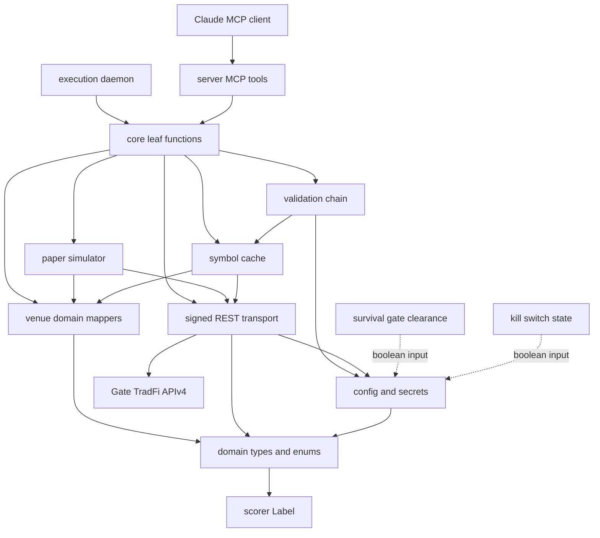
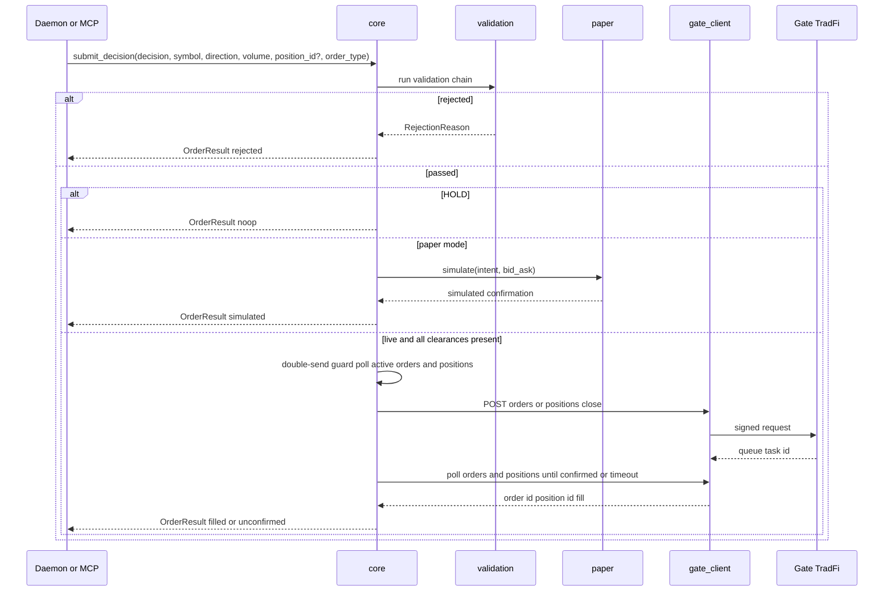
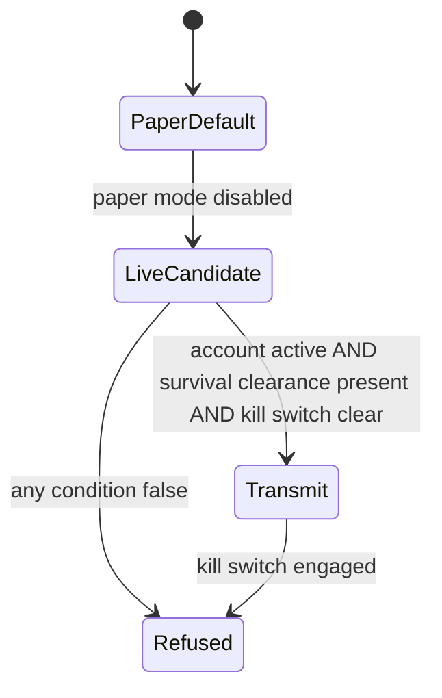

# Design Document

## Overview

**Purpose**: This feature delivers a vetted, leaf-level execution adapter for the **Gate TradFi CFD venue** to the reactive CFD execution layer (exploration §11–§14). It turns a thresholded Edge signal — expressed in the canonical BUY/HOLD/TRIM/SELL vocabulary plus a long/short direction — into an actual position, and reads back positions, account assets, and history with venue-authoritative values.

**Users**: the **execution-daemon** (in-process, via importable leaf functions) and Claude (via MCP tools) place and manage orders; **survival-gate** and **decision-trace-telemetry** consume the readouts the adapter surfaces.

**Impact**: introduces a new MCP server `src/mcp/broker/` (registered as the 11th server in `.mcp.json`) and a daemon-callable Python interface. It is the **most conservative node** in the chain (P7): it validates and rejects, never sizes, scores, upsizes, or computes survival math. v0.1 is **paper-only** — no live real-money path is enabled until survival-gate clearance + a kill switch are present (§11.5).

### Goals
- Map BUY/HOLD/TRIM/SELL + direction to the correct Gate venue action against verified endpoints, honoring the async submit→poll→reconcile lifecycle.
- Enforce, before any transmit, a one-way validation chain (symbol/category/trade_mode/volume/hours/activation/live-send gating) that can only reject.
- Surface venue-authoritative readouts (positions, account assets incl. stop-out level, symbols, fills/swap/forced-liquidation history) without self-computing PnL, liquidation distance, or sizing.
- Run paper/dry-run by default with full validation and a simulated confirmation priced from venue bid/ask.
- Expose both an MCP tool surface and importable leaf functions the daemon calls in-process.

### Non-Goals
- Survival/liquidation-distance computation, sleeve-cap enforcement, kill-switch **state** ownership (→ `survival-gate`).
- Position sizing, conviction scoring, the order-trigger decision, the directional-side decision (→ `execution-daemon` / `reactive-signal-model`).
- Decision-trace/telemetry emission (→ `decision-trace-telemetry`).
- Live real-money transmission (gated until survival-gate + kill switch are proven green, §11.5).
- A multi-provider broker abstraction; order queuing (dropped, R6.2); an HG envelope validator (broker is deterministic, not envelope-emitting).

## Boundary Commitments

### This Spec Owns
- Venue transport + APIv4 SIGN auth; rate-limit-aware request execution.
- Ticker-only symbol identity, the authenticated per-symbol metadata cache (leverage, trade_mode, volume bounds, swap rates, price precision), and category restriction.
- The pre-transmit validation chain and the conservative "reject, never upsize" contract.
- The P9 decision → venue-action mapping and the async submit→poll→reconcile lifecycle, including the double-send guard.
- In-adapter paper simulation and live-send gating **refusal** (consuming external clearances).
- Structured readouts: open positions, account assets (incl. stop-out level), tradable symbols, order/position history (fills, realized swap, forced-liquidation flags).
- Structured error reporting and surfacing of fill prices, swap, and rate data.

### Out of Boundary
- Liquidation-distance / margin-level / sleeve-cap math, and the kill-switch & survival-gate-clearance **state** (owned by `survival-gate`; consumed here as boolean inputs).
- Position sizing, order-trigger timing, and the long/short decision (owned by `execution-daemon` / `reactive-signal-model`; supplied to the adapter as inputs).
- Telemetry/decision-trace persistence (owned by `decision-trace-telemetry`; the adapter only returns fill/rate data in its result).
- Selecting which of several same-symbol positions a TRIM/SELL applies to (the caller supplies the `position_id`).
- **Real-time trading-halt / forward-gap detection.** The adapter exposes only pre-trade session/tradability (`SymbolInfo.status` open/closed, `trade_mode`) and **post-hoc** outcomes (`HistoryRecord.close_reason = forced_liquidation` via `get_history`); `Position` carries **no halt field**, so the adapter is **confirmed not a live market-state sensor / not the halt-detection source**. Intraday-halt and gap-proximity sight is owned by `survival-gate`'s `gap-risk-veto-filter` (§12.2/§12.3). The `missing-trading-status → HALTED` fail-safe is a **consumer** rule (survival-gate / execution-daemon); the adapter itself only rejects on venue-reported closed/disabled (R6.1, R1.11).

### Allowed Dependencies
- **External**: Gate TradFi APIv4 (`https://api.gateio.ws/api/v4/tradfi/*`).
- **Internal**: `src.calibration.scorer.Label` (P9 vocabulary — import only).
- **Libraries**: `mcp` (FastMCP), `httpx`, `python-dotenv` (house stack). Secrets via repo-root `.env` (`GATE_API_KEY`, `GATE_API_SECRET`).
- **Forbidden**: importing `survival-gate`, `execution-daemon`, or `decision-trace-telemetry` (dependency direction is downstream→broker, never the reverse, per P7 and the roadmap build order).

### Revalidation Triggers
- Any change to the Gate `/tradfi` request/response shapes, the async lifecycle, `position_id`/`close_type` semantics, or field names (TradFi is a moving product, ~v4.106).
- The leverage-vs-symbol field interaction or any new leverage-setter endpoint.
- Rate-limit header/limit confirmation against a live `/tradfi` response.
- The **live-send gating contract** with `survival-gate` (the clearance-signal shape must match when that spec lands).
- Any change to the `Label` enum in `src/calibration/scorer.py`.
- If the venue introduces a real-time halt state distinct from `status` open/closed (a true `HALTED` signal on a symbol or position), revisit the broker ↔ survival-gate halt-detection seam — today the broker is confirmed **not** the source.

## Architecture

### Existing Architecture Analysis
- House MCP servers (`src/mcp/massive`, `src/mcp/polygon`) are single-module: `mcp = FastMCP("<name>")`, `@mcp.tool()` functions returning `dict` and never raising, `mcp.run()` entrypoint, secrets read fresh from `.env`. Registered in `.mcp.json` via `uv run --directory src/mcp/<name> python server.py`.
- **Deviation introduced**: this server splits a pure `core.py` (importable leaf functions) from a thin `server.py` (MCP wrappers), because the execution-daemon must call operations in-process, not via MCP. No other server needs this today; the split is the minimum required by the dual-surface requirement.
- Reused patterns preserved: FastMCP tool surface, dict returns that never raise, fresh-secret reads, `.mcp.json` uv-run shape, `importlib`-loaded unit tests.

### Architecture Pattern & Boundary Map

Selected pattern: **layered ports-and-adapters**, single dependency direction (each layer imports only from layers above it):

`types → config → gate_client → {mappers, symbol_cache} → validation → paper → core → server`



Key decisions: survival-gate clearance and the kill switch enter as **boolean inputs** (dashed) — the adapter consumes them to gate live transmit but owns neither. The daemon and Claude reach the same validated path through `core`.

### Technology Stack

| Layer | Choice / Version | Role in Feature | Notes |
|-------|------------------|-----------------|-------|
| Runtime | Python ≥3.11, `uv` | Server process + daemon-importable package | Matches all `src/mcp/*` |
| MCP interface | `mcp` ≥1.0.0 (FastMCP) | `@mcp.tool()` wrappers in `server.py` | House standard |
| Transport | `httpx` ≥0.27 | Signed REST to Gate APIv4 + 429 backoff | Already in stack |
| Secrets | `python-dotenv` | `GATE_API_KEY`/`GATE_API_SECRET` from repo-root `.env` | Read fresh per call |
| Vocabulary | `src.calibration.scorer.Label` | BUY/HOLD/TRIM/SELL (P9) | Import only, never redefine |

## File Structure Plan

### Directory Structure
```
src/mcp/broker/
├── pyproject.toml        # New: requires-python >=3.11; mcp, httpx, python-dotenv; tool.uv.package=false
├── README.md             # New: consumer doc (tools, env, paper-only posture)
├── types.py              # Domain types/enums: Direction, OrderType, RejectionReason, OrderIntent,
│                         #   OrderResult, Position, AccountAssets, SymbolInfo, HistoryRecord (reuses Label)
├── config.py             # Env/secrets + runtime mode: paper flag, survival-gate clearance + kill-switch inputs,
│                         #   settlement currency, stocks category id
├── gate_client.py        # Signed REST APIv4 (HMAC-SHA512 SIGN) over httpx; rate-limit headers + 429 backoff;
│                         #   returns raw venue JSON only
├── symbol_cache.py       # Authenticated /tradfi/symbols/detail cache (≤10/call); ticker-only map (ignores
│                         #   symbol_desc); leverage/trade_mode/volume-bounds/swap/precision; freshness+refresh
├── mappers.py            # Pure venue<->domain mappers; Label+Direction -> venue side/endpoint/volume
│                         #   (side enum guard 1=SELL/2=BUY); raw JSON -> typed readouts
├── validation.py         # Ordered pre-transmit predicate chain -> RejectionReason | None (never mutates)
├── paper.py              # Paper simulator: validated intent + ticker bid/ask -> simulated confirmation (no POST)
├── core.py               # Importable leaf functions (the daemon interface): submit_decision, get_positions,
│                         #   get_account_assets, list_tradable_symbols, validate_symbol, get_history;
│                         #   async submit->poll->reconcile; double-send guard
└── server.py             # FastMCP("broker"); thin @mcp.tool() wrappers over core; coerce to dict; never raise
```
> Dependency direction (left→right in the Architecture map) is enforced: `core` may import any layer above it; nothing imports `core` except `server` (and the external daemon). `validation`/`paper`/`mappers` must stay free of transport-construction side effects.

### Modified / Removed Files
- `.mcp.json` — add a `broker` entry: `{"command":"uv","args":["run","--directory","src/mcp/broker","python","server.py"],"cwd":"."}` (tool-level grants per T2 when consumers reference it).
- `.env.example` — add `GATE_API_KEY=` / `GATE_API_SECRET=` (and a note that the CFD execution venue is `gate`, distinct from the pre-existing `BROKER_PROVIDER=schwab` block).
- `tests/unit/mcp/test_broker.py` — New: leaf-function unit tests with a mocked transport (no live venue).
- `tests/contract/test_broker_contracts.py` — New: MCP tool output-shape / golden tests.
- `tests/fixtures/gate/*.json` — New: recorded venue responses for deterministic mocked tests.
- `src/mcp/broker_mcp/` — stale cruft (main repo only; absent from this worktree). Canonical dir is `src/mcp/broker/`; ensure the stale stub is not resurrected at merge.

## System Flows

### Order submission (async submit → poll → reconcile, with double-send guard)

Gating notes: `core` first gathers one pre-transmit snapshot (assets/status, positions, symbol session) into `ValidationContext` — that single positions read serves both the 1.8 check and the 7.4 guard. HOLD short-circuits before any transmit (1.4). The double-send guard (7.4) correlates the retained queue-task-id before any live re-send. An unconfirmed async outcome is surfaced as `unconfirmed`, never assumed filled (9.2).

### Live-send gating (4-condition AND)

v0.1 stays in `PaperDefault` — no enabled path reaches `Transmit` (8.1). All four conditions are required simultaneously for any live transmit (8.3–8.5).

## Requirements Traceability

| Requirement | Summary | Components | Interfaces | Flows |
|-------------|---------|------------|------------|-------|
| 1.1 | BUY → open/increase long (side 2) or short (side 1) | core, mappers | `submit_decision` | Order submission |
| 1.2 | TRIM → partial close by position_id | core, mappers | `submit_decision` | Order submission |
| 1.3 | SELL → full close by position_id | core, mappers | `submit_decision` | Order submission |
| 1.4 | HOLD → structured no-op | core | `submit_decision` | Order submission |
| 1.5 | Only market/trigger (+TP/SL); reject others | validation | chain | Order submission |
| 1.6 | Volume bounds (min/max, ≤~100 lots) regardless of margin | validation, symbol_cache | chain | — |
| 1.7 | Async — confirm by reading orders/positions | core, gate_client | `submit_decision` | Order submission |
| 1.8 | TRIM/SELL with no position → reject, no new position | validation, core | chain | Order submission |
| 1.9 | Act only on caller `position_id` for same-symbol multiples | core, mappers | `submit_decision` | — |
| 1.10 | Account inactive → reject all order/close ops | validation, config | chain | Live-send gating |
| 1.11 | trade_mode disallows action → reject | validation, symbol_cache | chain | — |
| 2.1 | Positions readout: id/symbol/dir/vol/avg-price/margin/uPnL | core, mappers, gate_client | `get_positions` | — |
| 2.2 | Report venue uPnL; no self-computed mark | mappers | `get_positions` | — |
| 2.3 | No positions → empty set, not error | core | `get_positions` | — |
| 3.1 | Assets: equity/used/free margin/level/balance | core, mappers, gate_client | `get_account_assets` | — |
| 3.2 | Expose stop-out level + fields; do not compute liq distance | mappers, core | `get_account_assets` | — |
| 3.3 | Per-symbol swap rates + realized swap | symbol_cache, mappers | `get_account_assets`, `get_history` | — |
| 4.1 | Map/validate by US ticker only; ignore symbol_desc | symbol_cache | `validate_symbol` | — |
| 4.2 | Restrict to US-stock CFD category; reject others | symbol_cache, validation | chain | — |
| 4.3 | Symbol not in validated set → reject | validation | chain | Order submission |
| 5.1 | Reject disabled/sub-floor-leverage names | validation, symbol_cache | chain | — |
| 5.2 | Control exposure via volume; no per-order leverage param | mappers | `submit_decision` | — |
| 5.3 | Compute used-margin/exposure = notional ÷ leverage | mappers, symbol_cache | `submit_decision` | — |
| 6.1 | Session closed → reject + report next open time (no queue) | validation, symbol_cache | chain | Order submission |
| 7.1 | Never autonomously increase requested volume | validation, core | chain | — |
| 7.2 | Any rule violation → reject, not silent modify/clamp | validation | chain | Order submission |
| 7.3 | No sizing/scoring/trigger decisions | core | `submit_decision` | — |
| 7.4 | Double-send guard: poll before resend; no duplicate position | core, gate_client | `submit_decision` | Order submission |
| 8.1 | v0.1 paper-only; no enabled live path | config, core | `submit_decision` | Live-send gating |
| 8.2 | Paper: full validation + simulated confirmation from bid/ask | paper, validation | `submit_decision` | Order submission |
| 8.3 | Live only if paper off AND active AND clearance AND kill clear | config, core | `submit_decision` | Live-send gating |
| 8.4 | Kill switch engaged → reject live transmissions | config, core | `submit_decision` | Live-send gating |
| 8.5 | Missing any clearance → refuse to transmit | config, core | `submit_decision` | Live-send gating |
| 9.1 | Auth failure → structured error, no transmit | gate_client | all | — |
| 9.2 | Venue error/unreachable → structured result, no raise; unconfirmed surfaced | gate_client, core, server | all | Order submission |
| 9.3 | Surface actual fill price/volume (via history) | core, mappers | `get_history` | — |
| 9.4 | Emit no telemetry itself | core | all | — |
| 9.5 | Respect rate-limit signals; back off; discover limit at runtime | gate_client | all | — |
| 10.1 | History: fill price/vol, realized PnL, realized swap, close reason | core, mappers, gate_client | `get_history` | — |
| 10.2 | Close reason flags normal vs forced liquidation; no interpretation | mappers | `get_history` | — |
| 10.3 | Venue-supplied history values; no self-computed substitution | mappers | `get_history` | — |
| 10.4 | Empty window → empty set, not error | core | `get_history` | — |

## Components and Interfaces

| Component | Layer | Intent | Req Coverage | Key Dependencies (P0/P1) | Contracts |
|-----------|-------|--------|--------------|--------------------------|-----------|
| types | Types | Domain types/enums; reuse `Label` | all | scorer.Label (P0) | State |
| config | Config | Secrets + runtime mode + clearance inputs | 1.10, 8.* | types (P0), `.env` (P0) | State |
| gate_client | Transport | Signed REST; rate-limit/429; raw JSON | 1.7, 9.1, 9.2, 9.5 | httpx (P0), config (P0) | Service, API |
| symbol_cache | Domain | Authenticated symbol metadata; ticker map | 1.6, 3.3, 4.*, 5.*, 6.1 | gate_client (P0), mappers (P1) | Service, State |
| mappers | Domain | Pure venue↔domain + action mapping | 1.1–1.3, 1.9, 2.2, 3.*, 5.2, 5.3, 10.* | types (P0) | Service |
| validation | Policy | Ordered reject-only chain | 1.5,1.6,1.8,1.10,1.11,4.2,4.3,5.1,6.1,7.1,7.2 | symbol_cache (P0), config (P0) | Service |
| paper | Simulation | Simulated confirmation from bid/ask | 8.2 | mappers (P0), gate_client (P1) | Service |
| core | Operations | Importable leaf funcs; lifecycle; double-send guard | 1.*, 2.*, 3.*, 7.*, 8.*, 9.2–9.4, 10.* | validation (P0), paper (P0), gate_client (P0) | Service |
| server | Interface | Thin MCP tool wrappers; never raise | all (surface) | core (P0), mcp (P0) | API |

### Operations layer

#### core (leaf functions — the daemon interface)

| Field | Detail |
|-------|--------|
| Intent | Orchestrate validation → (paper sim \| live transmit) → poll/reconcile → typed result; the in-process API the daemon imports |
| Requirements | 1.1–1.4, 1.7–1.9, 2.*, 3.*, 7.3, 7.4, 8.*, 9.2–9.4, 10.* |

**Responsibilities & Constraints**
- Routes a P9 `Label` + `Direction` to the right operation; runs the validation chain before any transmit; HOLD is a no-op (1.4).
- Immediately before validation, gathers a single consistent pre-transmit snapshot — account assets/status, open positions, and the target symbol's cached metadata + session status — into `ValidationContext`. The **same** positions read feeds both the 1.8 position-exists check and the 7.4 double-send guard (one read, no second fetch); the snapshot defines the staleness window for 1.10 / 6.1 / 8.3.
- Owns the async submit→poll→reconcile loop (1.7) and the double-send guard (7.4): before any live re-send, correlate the retained queue-task-id against active orders/positions and refuse to create a duplicate.
- Performs no sizing/scoring/trigger logic (7.3) and emits no telemetry (9.4); returns fill/rate data for downstream consumers only.
- Returns structured results, never raises (paired with `server`); an unconfirmed async outcome is reported as `unconfirmed` (9.2).

**Dependencies**
- Inbound: execution-daemon (in-process import), `server` (MCP) — P0.
- Outbound: validation, paper, symbol_cache, mappers, gate_client, config — P0.

**Contracts**: Service [x] / API [ ] / Event [ ] / Batch [ ] / State [ ]

##### Service Interface
```python
def submit_decision(
    decision: Label,                 # BUY | HOLD | TRIM | SELL (imported from scorer)
    symbol: str,                     # US ticker
    direction: Direction,            # LONG | SHORT (caller-supplied; reactive layer)
    volume: float | None = None,     # contract volume; required for BUY
    position_id: str | None = None,  # required for TRIM/SELL
    order_type: OrderType = OrderType.MARKET,
    trigger_price: float | None = None,  # required when order_type is TRIGGER
    take_profit: float | None = None,
    stop_loss: float | None = None,
) -> OrderResult: ...

def get_positions() -> list[Position]: ...
def get_account_assets() -> AccountAssets: ...
def list_tradable_symbols() -> list[SymbolInfo]: ...
def validate_symbol(symbol: str) -> SymbolInfo | RejectionReason: ...
def get_history(since: int | None = None, until: int | None = None) -> list[HistoryRecord]: ...
```
- Preconditions: `GATE_API_KEY`/`SECRET` present for any authenticated call; `volume` for BUY, `position_id` for TRIM/SELL, `trigger_price` when `order_type` is `TRIGGER`.
- Postconditions: returns a typed result; on any validation failure returns `OrderResult(status="rejected", reason=...)`; never raises.
- Invariants: never increases `volume` (7.1); never opens a position on a TRIM/SELL miss (1.8); never transmits live unless all four clearances hold (8.3).

**Implementation Notes**
- Integration: daemon imports `core` directly; `server` wraps it. Both share this one validated path.
- Double-send correlation: a live POST returns a queue-task-id; `core` retains it and, before any resend, correlates it against `/tradfi/orders` (and the resulting position). A matching task-id / order means do not retransmit (7.4). v0.1 is paper-only, so this path is exercised by the paper simulator's modeled task-id, not a live POST.
- Validation: lock the chain order, the snapshot→validate ordering, and the double-send correlation in unit tests.
- Risks: `close_type` 1/2 semantics confirmed on first authenticated close; poll timeout surfaces `unconfirmed`.

### Policy layer

#### validation (ordered reject-only chain)

| Field | Detail |
|-------|--------|
| Intent | Pure ordered predicate chain run before any transmit; first failure short-circuits to a structured reason |
| Requirements | 1.5, 1.6, 1.8, 1.10, 1.11, 4.2, 4.3, 5.1, 6.1, 7.1, 7.2 |

**Responsibilities & Constraints**
- Predicates (in order): account active (1.10) → symbol in validated set (4.3) → category (4.2) → tradable/not sub-floor leverage (5.1) → trade_mode allows action (1.11) → order type is market/trigger, with a `trigger_price` present when TRIGGER (1.5) → volume within bounds (1.6) → session open (6.1) → live-send clearances when live (8.3). For TRIM/SELL: position exists (1.8).
- Never mutates the request (7.1, 7.2): the only outcomes are pass-through or a `RejectionReason`.

**Contracts**: Service [x]
```python
def evaluate(intent: OrderIntent, ctx: ValidationContext) -> RejectionReason | None: ...
```
- Postconditions: `None` ⇒ all checks passed; otherwise the first failing reason (with `next_open_time` populated for 6.1).
- Invariants: deterministic; pure (no I/O — `core` populates `ctx` with the single pre-transmit snapshot per its Responsibilities; `validation` never fetches).

### Transport layer

#### gate_client (signed REST)

| Field | Detail |
|-------|--------|
| Intent | Execute signed APIv4 `/tradfi` requests; parse rate-limit headers + back off on 429; return raw venue JSON |
| Requirements | 1.7, 9.1, 9.2, 9.5 |

**Contracts**: Service [x] / API [x]

##### API Contract (consumed venue endpoints)
| Method | Endpoint | Request | Response | Errors |
|--------|----------|---------|----------|--------|
| GET | /tradfi/users/mt5-account | — | leverage, stop_out_level, status | 401, 429 |
| GET | /tradfi/users/assets | — | equity, margin_level, balance, margin, margin_free | 401, 429 |
| GET | /tradfi/symbols/detail | symbols (≤10) | leverage, min/max_order_volume, trade_mode, swap rates, precision | 401, 429 |
| GET | /tradfi/symbols/{s}/tickers | — | bid_price, ask_price, last_price | 429 |
| POST | /tradfi/orders | side, volume, symbol, price_type, price_tp/sl | queue task id | 400, 401, 429 |
| GET | /tradfi/orders, /tradfi/positions | — | order_id/position_id, state, fill | 401, 429 |
| POST | /tradfi/positions/{id}/close | close_type, close_volume | queue task id | 400, 401, 429 |
| GET | /tradfi/orders/history, /tradfi/positions/history | window | fills, realized_pnl, swap, position_status | 401, 429 |

- Preconditions: valid `GATE_API_KEY`/`SECRET`; SIGN computed per APIv4.
- Postconditions: returns parsed JSON or a structured transport error (auth/unreachable/rate-limited) — never raises (9.1, 9.2); honors `X-Gate-RateLimit-*` + 429 backoff with runtime-discovered limit (9.5).

### Domain layer

#### symbol_cache & mappers (summary)
- **symbol_cache**: builds and refreshes the ticker→metadata map from authenticated `symbols/detail` (≤10/call). Identity is by US ticker only; `symbol_desc` is never used for identity (4.1). Holds leverage, trade_mode, volume bounds, swap rates, precision; exposes a freshness policy and refresh-on-miss. Covers 1.6, 3.3, 4.*, 5.*, 6.1 inputs.
- **mappers**: pure functions. `Label`+`Direction`→(endpoint, `side`, `volume`) with the side-enum guard (1=SELL/2=BUY) (1.1–1.3, 5.2); used-margin = notional ÷ leverage (5.3); raw JSON→`Position`/`AccountAssets`/`SymbolInfo`/`HistoryRecord` reporting venue-supplied PnL/swap with no self-computed substitution (2.2, 3.2, 10.3); close-reason flags normal vs forced liquidation without interpretation (10.2).

### Simulation & Interface (summary)
- **paper**: given a validated `OrderIntent` and current bid/ask, returns a structured simulated confirmation without invoking the venue order-create operation (8.2). Used whenever paper mode is on; the validation + mapping path is identical to live.
- **server**: `mcp = FastMCP("broker")`; one `@mcp.tool()` per `core` leaf function; coerces typed results to `dict`; catches and structures any error so a tool call never raises (9.2). `if __name__ == "__main__": mcp.run()`.

## Data Models

### Domain Model (value objects — `types.py`)
- `Direction(Enum)`: `LONG`, `SHORT`. `OrderType(Enum)`: `MARKET`, `TRIGGER`.
- `OrderIntent`: decision (`Label`), symbol, direction, volume, position_id?, order_type, trigger_price?, take_profit?, stop_loss?.
- `RejectionReason`: code (enum: `INACTIVE_ACCOUNT`, `UNKNOWN_SYMBOL`, `OUT_OF_CATEGORY`, `UNTRADABLE`, `TRADE_MODE_BLOCKED`, `BAD_ORDER_TYPE`, `VOLUME_OUT_OF_BOUNDS`, `MARKET_CLOSED`, `NO_POSITION`, `LIVE_SEND_BLOCKED`), message, `next_open_time?`.
- `OrderResult`: status (`filled`|`simulated`|`unconfirmed`|`noop`|`rejected`), order_id?, position_id?, fill_price?, fill_volume?, reason?, raw?.
- `Position`: position_id, symbol, direction, volume, avg_open_price, used_margin, unrealized_pnl (venue-supplied).
- `AccountAssets`: equity, used_margin, free_margin, margin_level, balance, stop_out_level (no derived liquidation distance — 3.2).
- `SymbolInfo`: ticker, category, leverage, trade_mode, min/max_order_volume, price_precision, buy/sell_swap_rate, status, next_open_time.
- `HistoryRecord`: kind (order|position), fill_price, fill_volume, realized_pnl, realized_swap, close_reason (`normal`|`forced_liquidation`).

> All venue numeric fields arrive as strings; mappers parse at the boundary and validate types (HG-23 is presence-only — P13; this adapter validates its own types).

## Error Handling

### Strategy
- **Boundary parsing**: `gate_client` + `mappers` validate/parse venue JSON at ingress; malformed responses become structured errors, not exceptions.
- **Conservative rejections** (business-rule, akin to 422): the validation chain returns a typed `RejectionReason`; the request is never silently modified (7.2).
- **Transport errors** (auth 401, unreachable, 429): `gate_client` returns a structured transport error; `core` wraps it into `OrderResult`/readout error; `server` guarantees the tool returns a dict (9.1, 9.2).
- **Async uncertainty**: a placed-but-unconfirmed order is surfaced as `unconfirmed` after the poll timeout; the double-send guard prevents a duplicate on the next attempt (7.4, 9.2).

### Monitoring
- The adapter emits no telemetry itself (9.4); it surfaces fill price/volume, swap, and rate-limit state in results so `decision-trace-telemetry` can record slippage downstream.

## Testing Strategy

### Unit Tests (mocked transport; the P14 inner ring)
- **Decision routing & mapping**: BUY→buy/sell-to-open per direction (1.1), TRIM→partial close (1.2), SELL→full close (1.3), HOLD→no-op (1.4); side-enum guard (1=SELL/2=BUY); used-margin = notional ÷ leverage (5.3); no per-order leverage param sent (5.2).
- **Validation chain** (assert order + first-failure short-circuit): bad order type (1.5), volume below min / above max / >100 (1.6), TRIM/SELL with no position (1.8), inactive account (1.10), trade_mode block (1.11), unknown symbol (4.3), out-of-category (4.2), sub-floor leverage (5.1), market closed → reason carries next_open_time (6.1); never upsizes (7.1); rejects-not-clamps (7.2).
- **Gating & paper**: live blocked unless all four clearances (8.3), kill-switch engaged blocks (8.4), missing clearance refuses (8.5); paper returns simulated confirmation priced from bid/ask with no POST (8.2).
- **Readouts**: positions fields + venue PnL not self-computed + empty set (2.1–2.3); assets fields + stop-out exposed + no derived liq distance + swap rates (3.1–3.3); ticker-only mapping ignores symbol_desc (4.1); history fills/PnL/swap + forced-liquidation flag + venue values + empty window (10.1–10.4).
- **Transport**: auth failure structured (9.1), venue error/unreachable structured + unconfirmed surfaced (9.2), 429 backoff + runtime limit discovery (9.5), no telemetry emitted (9.4).

### Contract / Golden Tests
- Each MCP tool returns the documented dict shape against recorded Gate fixtures (`tests/fixtures/gate/`).

### Integration (opt-in, `integration_live`, requires `GATE_*`)
- The P12/P14 authenticated round-trip: read `symbols/detail` + `assets` + `mt5-account`, then a paper order→poll→close cycle; cross-checked against `gate-local-mcp` read-only to confirm field names and the async/position-id lifecycle before the adapter is trusted.

## Security Considerations
- `GATE_API_KEY`/`GATE_API_SECRET` live only in repo-root `.env` (gitignored), read fresh per call so rotation needs no restart; never logged, never returned in results.
- APIv4 SIGN (HMAC-SHA512) computed per request in `gate_client`; signing inputs are not surfaced.
- v0.1 ships with no enabled live path (8.1); the four-condition live gate is the structural guard against premature real-money transmission (§11.5).

## Performance & Scalability
- Symbol-detail caching: ~45 authenticated calls cache all 441 names; a freshness window + refresh-on-validation-miss avoids re-fetching per order while keeping `trade_mode`/status current. Stale-cache risk (a now-disabled symbol) is bounded by the refresh policy — documented as a consistency note.
- Rate limits discovered at runtime from `X-Gate-RateLimit-*` headers; the daemon's polling cadence must stay within the observed limit; 429 triggers backoff rather than immediate retry (9.5).
