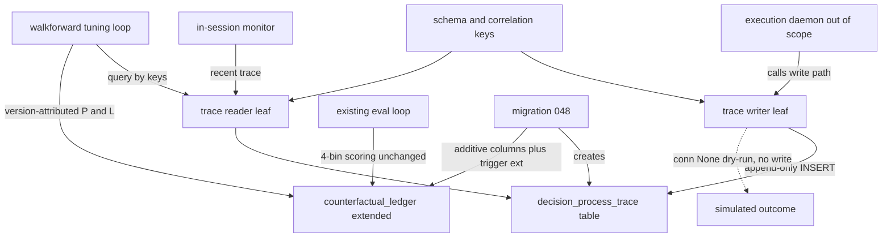

# Design Document

## Overview

**Purpose.** Decision-Trace Telemetry gives the reactive CFD layer's after-market tuner and in-session monitor a durable, replayable record of *how the model behaved* (process side, §14.8) and adds a model-version dimension to the existing `counterfactual_ledger` *outcome* side (§14.6), so forward P&L is attributable per-version-per-window without disturbing the established 4-bin sector-ETF-excess scoring.

**Users.** `walkforward-tuning-loop` (reads trace + version-attributed ledger; its temporal firewall depends on the version+window dimension), the `in-session-monitor` (reads recent trace for anomaly judgment, §15), and the existing eval loop (continues scoring the 4-bin label, now version-aware). The `execution-daemon` is the *writer's caller* (it invokes the write path; it does not own it).

**Impact.** Adds one append-only table (`decision_process_trace`), one additive migration extending `counterfactual_ledger` with three nullable version columns + an extended guard trigger, and one leaf writer/reader module. No existing component is modified in behavior; the eval-loop scorer is a pure function and is provably unaffected (see Architecture).

### Goals
- A durable, append-only, replayable per-decision **model** trace (R1, R2, R6).
- A **correlation-key contract** (`run_id`, `code_version`, `param_version`, `walk_forward_window`) joining the trace, the per-spec LLM-action audits, and the ledger (R3, R5).
- An **additive** `counterfactual_ledger` version dimension that preserves existing scoring (R4).
- Async-safe fill capture without violating append-only (R1.4 ↔ R2). **R1.4 is read as the trace *surface*** — the expected-vs-actual fill is captured by a linked `fill` record, not by mutating the decision row.
- Inner-ring test surface: pure-unit for writer logic; `integration_live` for trigger + migration (R9).

### Non-Goals
- The LLM-action/reasoning audit (owned per-spec by `walkforward-tuning-loop` + `in-session-monitor`, P11) — R7.1.
- The emission **calls** (owned by `execution-daemon`) — R7.2.
- Analysis, tuning, calibration aggregates, and the 4-bin scoring logic itself — R7.3, R7.4.
- Firewall *enforcement* (this spec provides the attribution; the consumer enforces) — R5.2.

## Boundary Commitments

### This Spec Owns
- The `decision_process_trace` table schema, its append-only guard trigger, and the indexes on its correlation keys.
- The additive `counterfactual_ledger` migration (three nullable version columns) and the guard-trigger extension that keeps them insert-set-only.
- The **correlation-key contract** — the canonical key set every trace/fill/ledger/LLM-audit row joins on.
- The leaf **write path** (`write_decision_trace`, `write_fill_outcome`) and the **read/replay surface** (`query_trace`), including `conn=None` dry-run.

### Out of Boundary
- LLM-action/reasoning audit content (tuner + monitor own their own append-only records, joined via the correlation keys).
- The decision logic, the order/fill mechanics, and the *calls* into the write path (all `execution-daemon`).
- Calibration/Brier computation, walk-forward analysis, promotion gating (tuner).
- The 4-bin label scoring (existing eval loop — extended additively, never reimplemented).

### Allowed Dependencies
- Postgres (the project DB) and the repo's numbered-migration **convention** (`db/migrations/NNN_*.sql`, applied by hand via `psql`/`mcp__postgres` — there is **no migration-runner framework**, per `db/README.md`).
- The repo's direct-psycopg write convention (`src/shared/regime_sidecar/persistence.py`, `src/supervisor/emitter.py`) — `_dsn()` + `.transaction()` + `conn=None` dry-run.
- The existing `counterfactual_ledger` (migs 003/011/030) and its `counterfactual_ledger_guard()` trigger — extended, not rewritten.
- **Must not** depend on MCP for writes (the daemon writes the DB directly, §14.10), on account/survival state, or on the daemon's internal types.

### Revalidation Triggers
- Any change to the **correlation-key contract** (added/renamed/retyped key) → tuner, monitor, and the per-spec LLM-audits must re-check their joins.
- Any change to the `counterfactual_ledger` immutable-column set or scoring columns → eval-loop + tuner re-check.
- Migration-number reassignment (currently **048**) if the `survival-gate` fork also adds a migration.
- A change from "fill = separate linked row" to any in-place update model → re-check R2 append-only guarantees downstream.

## Architecture

### Existing Architecture Analysis
- **`counterfactual_ledger`** (migs 003/011/030): append-only via `counterfactual_ledger_guard()` (BEFORE UPDATE OR DELETE) — DELETE always rejected; UPDATE rejected unless only window-close completion fields change (`IS DISTINCT FROM` checks on the immutable set). Post-030 columns: `summary_code`, `conviction`, `gics_sector`, `benchmark_etf`, `window`, `measurement_date`, return columns, `envelope_id`. **No version column.**
- **Eval-loop scorer** (`src/calibration/scorer.py`, shim `src/eval/scorer.py`): a **pure function** `Label × excess_return_pct × margin_pct → Verdict`; it does **not** read the ledger. Postmortem queries stratify on existing columns via idempotent indexes. ⟹ adding nullable columns cannot break scoring (R4.2) — confirmed in `research.md`.
- **Direct-write convention**: `_dsn()` from env; `write_*(rows, conn=None)` → own-connection when `conn is None`, `.transaction()` for atomicity, `conn=None` = dry-run. Reused verbatim.
- **JSONB precedent**: `parameters.value`, `counterfactual_retrievals.archetype_distribution`, `veto_lifecycle.m3_refreshes` — flexible payload alongside typed columns is idiomatic.

### Architecture Pattern & Boundary Map

Pattern: **append-only event store (single table, `kind`-discriminated) + additive outcome-ledger extension + a leaf writer/reader**. Dependency direction: `schema (types)` → DDL migration → `writer` / `reader` → (downstream) `execution-daemon` imports the writer. Nothing imports upward.



Key decisions (not restated from the diagram): the daemon is the only writer-caller but lives out of scope; the reader is consumer-agnostic (filters by correlation keys only); the ledger extension and the trace table ship in **one migration (048)** so the version dimension and the trace land atomically.

### Technology Stack

| Layer | Choice / Version | Role in Feature | Notes |
|-------|------------------|-----------------|-------|
| Data / Storage | PostgreSQL (project DB) | `decision_process_trace` table + JSONB payload + ledger extension | reuses append-only guard-trigger + JSONB conventions |
| Backend / leaf | Python 3.11 + psycopg (per repo) | `write_decision_trace` / `write_fill_outcome` / `query_trace` | direct-psycopg, `conn=None` dry-run; non-MCP (§14.10) |
| Infrastructure / Runtime | Numbered `.sql` migration convention (no runner — `db/README.md`) | migration 048 (idempotent, additive) | hand-applied via `psql`/`mcp__postgres`; no down-migration (repo convention); tests apply the `.sql` via `_dsn()`/psycopg |

## File Structure Plan

### Directory Structure
```
src/reactive/telemetry/          # reactive CFD layer telemetry (Decision-6 leaf placement; sibling to the reactive signal model / daemon)
├── __init__.py
├── schema.py                    # row dataclasses + the correlation-key contract (typed); no I/O
├── trace_writer.py              # write_decision_trace() + write_fill_outcome(); direct-psycopg, conn=None dry-run, atomic
└── reader.py                    # query_trace() replay/read surface; filter by correlation keys
```

### New Files
- `db/migrations/048_decision_trace_telemetry.sql` — create `decision_process_trace` + its guard trigger + indexes; ALTER `counterfactual_ledger` ADD the three nullable version columns; CREATE OR REPLACE the ledger guard to add them to the immutable set.
- `src/reactive/telemetry/schema.py` — `CorrelationKeys`, `DecisionTraceRow`, `FillOutcomeRow` (type-hinted); the single source of the key contract.
- `src/reactive/telemetry/trace_writer.py` — append-only writers; `conn=None` dry-run; `.transaction()` atomicity.
- `src/reactive/telemetry/reader.py` — `query_trace(filters)` returning rows joined/filterable by correlation keys.
- `tests/unit/reactive/telemetry/test_trace_writer.py` — pure-unit: row shaping, dry-run no-write, correlation-key presence.
- `tests/integration/test_decision_trace_migration.py` — `integration_live`: append-only DELETE/UPDATE rejection; migration preserves ledger scoring + columns.

### Modified Files
- None in behavior. The migration *extends* `counterfactual_ledger` and its guard function additively; no `src/` file's logic changes (the scorer is a pure function untouched).

> Decision-6 note: placement under `src/reactive/telemetry/` co-locates with the reactive layer (daemon + signal model). Confirmable at task time; the boundary is unaffected by the exact path.

## System Flows

Async decision→fill (the R1.4 ↔ R2 resolution): the decision row is appended at decision time; the fill confirms later (async order, §11.4) and is appended as a **separate linked row** — never an update.

```mermaid
sequenceDiagram
    participant D as execution daemon
    participant W as trace writer
    participant T as decision_process_trace
    D->>W: write_decision_trace(decision row, kind decision)
    W->>T: INSERT kind decision (trace_id assigned)
    Note over D,T: order is async; fill confirms later (poll)
    D->>W: write_fill_outcome(fill row, parent_trace_id, kind fill)
    W->>T: INSERT kind fill linked to parent
    Note over T: both rows append-only; join by parent_trace_id + correlation keys
```

Declined/missed entries (R1.6) append a `kind='decision'` row with the declined flag set in `trace` and no subsequent fill row. Safe-mode/flatten exits (cross-spec seam, `research.md`) append a `kind='decision'` exit row (gate-link = Survive/safe-mode) plus a `kind='fill'` row for the close.

**Late-fill attribution + temporal firewall (§14.6, R5).** A decision in walk-forward window *N* whose async fill lands in window *N+1* writes the `fill` row with **its own `event_ts`** (the later landing time) but the **decision's `walk_forward_window`** — attribution follows the decision. The firewall is a **consumer predicate on `event_ts ≤ IS-boundary`**: a late fill (its `event_ts` in the forward window) is therefore held *out* of in-sample fitting even though it attributes to the decision's window. This closes the §14.6 leakage the decision→fill split would otherwise open; this spec *provides* `event_ts` + window, the tuner *enforces* the predicate (R5.2).

## Requirements Traceability

| Requirement | Summary | Components | Contracts |
|---|---|---|---|
| 1.1–1.3, 1.5 | decision row capture (gate link, signals, probability, liq/stop-out) | trace_writer, schema, migration | Batch/State |
| 1.4 | expected-vs-actual fill (async) | trace_writer (`write_fill_outcome`), schema (`FillOutcomeRow`) | Batch |
| 1.6 | declined/missed entries traced | trace_writer, schema | Batch |
| 2.1, 2.2 | append-only (reject modify/delete) | migration (`decision_process_trace_guard`) | State |
| 3.1, 3.2 | correlation keys present + queryable | schema (`CorrelationKeys`), migration (typed cols + indexes), reader | State/Service |
| 4.1–4.4 | ledger version dimension, additive, scoring + append-only preserved | migration (ALTER + guard ext) | Batch/State |
| 5.1, 5.2 | `event_ts` + window for firewall (provide, not enforce); late fill held out via `event_ts ≤ boundary`, attributed to the decision's window | schema, migration, reader; System Flows | State |
| 6.1, 6.2 | replay/read filterable by keys | reader (`query_trace`) | Service |
| 7.1–7.4 | model-trace-only boundary | Boundary Commitments (enforced by absence) | — |
| 8.1, 8.2 | durable rows; JSONB payload stable to new fields | migration (JSONB `trace`), trace_writer | State |
| 9.1–9.3 | inner-ring tests + build order | tests (unit + integration_live) | — |

## Components and Interfaces

| Component | Layer | Intent | Req | Key Deps | Contracts |
|---|---|---|---|---|---|
| `schema` | Types | correlation-key contract + row types | 3.1, 1.4, 8.2 | none | State |
| `migration 048` | Data | trace table + guard + ledger extension | 2.1–2.2, 4.1–4.4, 5.1, 8.1 | counterfactual_ledger (P0) | Batch/State |
| `trace_writer` | Leaf | append-only writes; dry-run | 1.x, 8.1 | schema (P0), Postgres (P0) | Batch |
| `reader` | Leaf | replay/read by keys | 6.1, 6.2, 5.1 | schema (P0), Postgres (P0) | Service |

### Telemetry leaf

#### schema
**Responsibilities & Constraints**: the single definition of `CorrelationKeys` and the two row types; pure types, no I/O. `kind ∈ {decision, fill}`; a `fill` row carries `parent_trace_id`.

```python
from dataclasses import dataclass

@dataclass(frozen=True)
class CorrelationKeys:
    run_id: str            # uuid
    code_version: str
    param_version: str
    walk_forward_window: str | None

@dataclass(frozen=True)
class DecisionTraceRow:
    trace_id: str          # CLIENT-minted UUID (caller supplies; enables the fill link + ON CONFLICT idempotency)
    keys: CorrelationKeys
    event_ts: str          # ISO8601 / unix; time of THIS event (decision time); pinned, not wall-clock at write
    trace: dict            # JSONB: gate_link, signal_values, probability, decision, liq_proximity, stop_out, declined
    # kind == 'decision'

@dataclass(frozen=True)
class FillOutcomeRow:
    trace_id: str          # CLIENT-minted UUID for the fill row
    parent_trace_id: str   # the decision row this fill resolves (= that decision's client-minted trace_id)
    keys: CorrelationKeys   # NOTE: walk_forward_window = the DECISION's window (attribution follows the decision), not the fill's
    event_ts: str          # when the fill actually landed — may be a LATER walk-forward window than the decision
    trace: dict            # JSONB: expected_price, actual_fill_price, slippage, fill_volume, counterparty_price
    # kind == 'fill'
```

#### trace_writer
**Responsibilities & Constraints**: append-only INSERTs only; never UPDATE/DELETE. `conn=None` ⟹ dry-run (validate + shape, no write), mirroring `emit_recommendation`. Atomic via `.transaction()`. Owns the write path, **not** the calls (the daemon calls it).

**Contracts**: Batch
```python
def write_decision_trace(rows: list[DecisionTraceRow], conn=None) -> int: ...   # returns rows written (0 on dry-run)
def write_fill_outcome(rows: list[FillOutcomeRow], conn=None) -> int: ...
```
- Preconditions: every row carries a **client-minted `trace_id`** + complete `CorrelationKeys`; `fill` rows carry a resolvable `parent_trace_id` (the decision's `trace_id`).
- Postconditions: rows are durable + immutable; on dry-run nothing is written but the shaped row is returned for test/preview.
- Invariants: writer issues no UPDATE/DELETE; no MCP; no account/survival reads.
- Idempotency: INSERT uses `ON CONFLICT (trace_id) DO NOTHING`, so a re-sent write (same client-minted `trace_id`) is a no-op — this is the only reason the client-minted id counts as an idempotency key (addresses the broker G10 double-send residual). The caller owns the id, so the writer need not return it (return value = rows actually written).

#### reader
**Contracts**: Service — `query_trace(filters: dict) -> list[dict]` where filters ⊆ {run_id, code_version, param_version, walk_forward_window, since, until, kind}. Read-only; consumer-agnostic; provides window/timestamp for the consumer-enforced firewall (R5.2).

**Implementation Notes (leaf)**
- Integration: daemon imports `trace_writer` directly (non-MCP); tuner/monitor import `reader`.
- Validation: reject rows missing correlation keys at the boundary (fail-fast).
- Risks: high-frequency append on the fast clock → keep INSERT minimal (typed keys + one JSONB); JSONB expression index added later only if a hot in-`trace` field needs filtering (deferred per the single-table decision).

## Data Models

### Logical
Two row *kinds* in one append-only relation, joined to outcomes and audits by the correlation keys. A `fill` row references its `decision` row (`parent_trace_id`). The ledger gains the same version keys so a forward-P&L row attributes to the exact `(code_version, param_version, walk_forward_window)`.

### Physical (migration 048)
```sql
-- decision_process_trace: append-only, single-table, kind-discriminated
CREATE TABLE IF NOT EXISTS decision_process_trace (
    trace_id            UUID PRIMARY KEY,                                       -- CLIENT-minted (caller supplies; enables fill link + ON CONFLICT idempotency)
    kind                TEXT NOT NULL CHECK (kind IN ('decision','fill')),
    parent_trace_id     UUID NULL REFERENCES decision_process_trace(trace_id),  -- set on 'fill' = the decision's trace_id
    event_ts            TIMESTAMPTZ NOT NULL,                                   -- time of THIS event (decision time, or fill-landing time for kind=fill)
    run_id              UUID NOT NULL,
    code_version        TEXT NOT NULL,
    param_version       TEXT NOT NULL,
    walk_forward_window TEXT NULL,
    trace               JSONB NOT NULL,
    created_at          TIMESTAMPTZ NOT NULL DEFAULT now()
);
CREATE INDEX IF NOT EXISTS idx_dpt_run            ON decision_process_trace (run_id);
CREATE INDEX IF NOT EXISTS idx_dpt_version_window ON decision_process_trace (code_version, param_version, walk_forward_window);
CREATE INDEX IF NOT EXISTS idx_dpt_event_ts       ON decision_process_trace (event_ts);
CREATE INDEX IF NOT EXISTS idx_dpt_parent         ON decision_process_trace (parent_trace_id);

-- strict append-only: block BOTH delete and update (stricter than the ledger, which allows window-close updates)
CREATE OR REPLACE FUNCTION decision_process_trace_guard() RETURNS TRIGGER AS $$
BEGIN
    RAISE EXCEPTION 'decision_process_trace is append-only — % not permitted', TG_OP;
END; $$ LANGUAGE plpgsql;
DROP TRIGGER IF EXISTS decision_process_trace_no_modify ON decision_process_trace;
CREATE TRIGGER decision_process_trace_no_modify
    BEFORE UPDATE OR DELETE ON decision_process_trace
    FOR EACH ROW EXECUTE FUNCTION decision_process_trace_guard();

-- counterfactual_ledger: additive model-version dimension (nullable; preserves scoring + existing columns)
ALTER TABLE counterfactual_ledger
    ADD COLUMN IF NOT EXISTS code_version        TEXT,
    ADD COLUMN IF NOT EXISTS param_version       TEXT,
    ADD COLUMN IF NOT EXISTS walk_forward_window TEXT;
CREATE INDEX IF NOT EXISTS idx_counterfactual_version_window
    ON counterfactual_ledger (code_version, param_version, walk_forward_window);
-- extend counterfactual_ledger_guard(): CREATE OR REPLACE starting from migration 030's
-- CURRENT 19-column immutable blacklist (NOT 003's older 11-column body), then add the three
-- new columns with NULL-safe IS DISTINCT FROM so they are insert-set-only. The replace swaps the
-- whole body, so it must reproduce 030's full immutable set + the 3 additions; window-close
-- completion fields (legacy evaluation_window_end/system_return/baseline_return + HIGH-4
-- measurement_date/*_return_pct) stay mutable.
```

## Error Handling
- **Writer validation (fail-fast)**: missing correlation key, unknown `kind`, or a `fill` with an unresolvable `parent_trace_id` → reject before INSERT with a structured error; no partial write (`.transaction()` rolls back).
- **Append-only violation**: any UPDATE/DELETE → DB exception from the guard trigger (defense-in-depth: the writer never issues them; the trigger guarantees it even if a future caller tries).
- **DB unreachable**: surface a structured write failure (the daemon decides retry); never silently drop a trace.
- **Monitoring**: write failures are operationally visible (consistent with `system_errors` precedent); the trace itself is the observability substrate for the tuner.

## Testing Strategy

### Unit (pure, <1s, no DB) — R9.1
- `write_decision_trace(conn=None)` returns the shaped row and writes nothing (dry-run).
- Row shaping rejects a row missing any correlation key (fail-fast).
- A `fill` row requires `parent_trace_id`; a `decision` row forbids it.

### Integration (`integration_live`, real Postgres) — R9.2
- Insert a `decision` row → DELETE rejected; UPDATE (any column) rejected — append-only proven (2.1, 2.2).
- Apply migration 048 to a ledger fixture with existing rows → existing columns + a representative 4-bin scoring query return identical results; new columns are NULL on legacy rows (4.2).
- Ledger guard extension: UPDATE of a new version column post-insert is rejected; window-close completion fields still update (4.4).
- Insert `decision` then linked `fill`; `query_trace` by `(code_version, param_version, walk_forward_window)` returns both, joinable by `parent_trace_id` (1.4, 3.2, 6.1).
- Late-fill firewall: a `decision` in window N + a linked `fill` whose `event_ts` falls in window N+1 → `query_trace(until=N_boundary)` excludes the late fill (predicate on `event_ts`), while the fill still attributes to the decision's window (5.1, 5.2, 1.4).
- `ON CONFLICT (trace_id) DO NOTHING`: re-writing a row with the same client-minted `trace_id` is a no-op (idempotency).

### Build order (R9.3)
Inner-ring (unit + the two integration_live suites) lands **before** any version-attributed outer-ring scoring is wired against the ledger.

## Migration Strategy
Single idempotent migration **048** (expand-then-contract, no down-migration, per repo convention): create table+trigger+indexes, then ALTER the ledger additively + replace its guard. Legacy ledger rows keep NULL version columns (back-compatible). **Coordination:** if the `survival-gate` fork also adds a migration, renumber one (flagged in `spec.json.notes`).
