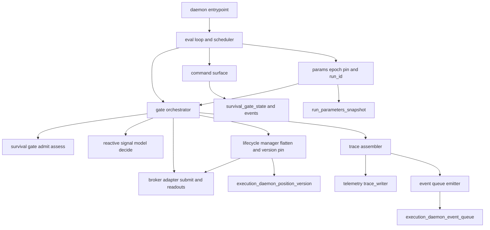

# Design Document

## Overview

**Purpose**: The Execution Daemon is the persistent, non-LLM **fast-clock process** that *runs* the reactive CFD layer. It is the only component that drives the four foundation leaf modules — the **broker adapter** (Route), the **reactive signal model** (Edge), the **survival gate** (Survive), and the **decision-trace store** (the trace) — on a single-threaded evaluation loop, enforcing the §13 lexicographic chain **Survive ⊳ Preserve ⊳ Edge ⊳ Return**, driving the paper-mode order lifecycle, and assembling the complete per-decision telemetry record (the previously-floating `run_id`/`walk_forward_window` injection seam).

**Users**: the **Operator** (starts / monitors / halts it, reads telemetry); the **reactive CFD trading system** (the automated flow); the **downstream consumers** — the (un-built) `walkforward-tuning-loop` (drains the event queue, reads the trace, writes versioned params the daemon hot-swaps) and the (un-built) `in-session-monitor` (commands through the daemon's exposed safety seams).

**Impact**: introduces a genuinely **new process shape** for the repo (`src/reactive/daemon/`) — there is no persistent process today; everything else is a per-call MCP server or a slash command. It adds two append-only tables (migs 051/052) and a daemon entrypoint, but **adds no new decision logic**: it orchestrates and emits only. v0.1 is **paper-only**.

### Goals
- A single-threaded persistent loop that enforces §13 per tick and never lets Edge/Return override Survive.
- Complete, correlatable telemetry: every decision and fill recorded with the full four-key correlation contract.
- Honor the load-bearing dependency contracts (persist-then-act, `assess` cadence, op-state freshness, double-send guard, resize-on-advisory).
- Manage the full version-pinned position lifecycle with atomic hot-swap.
- Stay a **leaf executor + event emitter** (P1) — never dispatch an agent, never recompute a dependency's value.

### Non-Goals
- Live real-money routing (paper/dry-run only, §11.5).
- The Survive / Edge / Return / sizing **logic** (owned by the dependencies).
- Parameter fitting/tuning + calibration (`walkforward-tuning-loop`); the trace schema + write primitives (`decision-trace-telemetry`, landed); the in-session supervisory LLM loop (`in-session-monitor`).
- Any dispatch or orchestration of LLM workers.

## Boundary Commitments

### This Spec Owns
- The **persistent single-threaded evaluation loop** + the cadence/boundary scheduler.
- The **§13 orchestration** wiring: `survival.assess`/`admit` → `reactive.decide` → size-by-hint → `broker.submit_decision`, including persist-then-act ordering and resize-on-advisory.
- The **telemetry row assembly**: minting `trace_id`, stamping `event_ts` at decision time, **injecting `run_id` + `walk_forward_window`**, mapping the decision substrate + survival fields into the trace, linking decision↔fill by `parent_trace_id`.
- The **paper-mode order lifecycle** driver (submit→poll→reconcile) over the broker's sync leaf funcs, incl. the double-send guard handling and `unconfirmed` surfacing.
- The **flat-before-close action** + the verify-flat handshake (the *action*; the gate owns the *rule*).
- The **version-pinned position lifecycle** + **atomic hot-swap** (whole-object pointer-flip), and the per-epoch `run_id` mint + joint param-snapshot pin.
- The **after-market event queue** (emit + the drain contract) and the **command-surface** seams (kill-switch / safe-mode / versioned-config-select).
- Two new append-only tables: `execution_daemon_event_queue` (mig 051), `execution_daemon_position_version` (mig 052).

### Out of Boundary
- Survive / Edge / sizing computation; the kill-switch / safe-mode **state logic** (gate owns it — the daemon persists transitions + exposes the command seam).
- The trace table DDL + write primitives (`decision-trace-telemetry`, landed — the daemon passes its own `conn`).
- Parameter fitting + calibration; the `walk_forward_window` **advance** (forward contract — owned by the un-built `walkforward-tuning-loop`).
- The in-session supervisory LLM loop itself; any agent dispatch.

### Allowed Dependencies
- **In-process leaf imports** (never via MCP): `broker-cfd-adapter` `core` (`submit_decision`, `get_positions`, `get_account_assets`, `get_history`, `validate_symbol`), `reactive-signal-model` `signal_model.decide`, `survival-gate` `gate.admit`/`assess`/`check_capitalization`.
- **Landed write/read API**: `src/reactive/telemetry/{trace_writer,reader,schema}` — the daemon passes its own `conn`.
- **P2 machinery**: `parameters` / `parameters_active` / `run_parameters_snapshot` (reactive + survival namespaces, pinned by value, REPEATABLE READ).
- **Reused tables**: `survival_gate_state` / `survival_gate_events` (the daemon persists what the gate emits).
- **Convention**: per-module `_dsn()` + psycopg3 caller-passed `conn`; the append-only-guard trigger pattern (mig 003/048).
- **Forbidden**: importing `walkforward-tuning-loop` / `in-session-monitor`; any MCP call from the loop; any LLM dispatch. Dependency direction is downstream→daemon→deps only (the daemon never imports its consumers).

### Revalidation Triggers
- Any signature/shape change to a consumed dependency entry point (`submit_decision` result, `ReactiveDecision`/`DecisionSubstrate`, `AdmitDecision`/`AssessDirective`/`SurvivalEvent`, the telemetry `CorrelationKeys`/row shapes).
- The daemon **concurrency model** changing from single-threaded (breaks op-state freshness — survival-gate revalidation).
- `walkforward-tuning-loop` landing — the `walk_forward_window` advance + the event-queue drain contract become live (replaces the v0.1 bootstrap).
- `run_parameters_snapshot` / `parameters_active` shape change (P2).
- Migration-number coordination: the daemon's tables must remain ≥ 051 (049/050 reserved by `survival-gate`, 048 landed).

## Architecture

### Existing Architecture Analysis
The four dependencies are pure/leaf and **all synchronous** (the broker's "async submit→poll→reconcile" is venue order-semantics, driven by a blocking poll, not Python coroutines). The repo has **no persistent process** and **no connection pool**; every writer declares a local `_dsn()` and takes a caller-passed `conn`. The telemetry writer's `conn=None` is a **dry-run** path (used directly as the daemon's inner-ring test seam). Param pinning already exists as `run_parameters_snapshot` (one row per run, whole resolved map, REPEATABLE READ); reactive + survival params share that machinery via distinct namespaces. The append-only-guard trigger is the house event-log pattern.

### Architecture Pattern & Boundary Map
Selected pattern: a **single-threaded blocking evaluation loop** (process + scheduler) wrapping a **§13 gate-orchestrator**, with three supporting services (trace-assembler, lifecycle-manager, command-surface) and an event-queue emitter. One owned psycopg3 connection is serialized through the loop. Rationale: mandated by survival-gate's op-state-freshness guarantee (single-threaded read-modify-write), matches the all-sync deps, and is the smallest correct shape (P1 leaf, no asyncio, no pool).



Dependency direction (strict, left→right): `types → config → db → params → {trace_assembler, event_queue, lifecycle, commands} → orchestrator → loop → entrypoint`. Each layer imports only leftward; the orchestrator imports the dependency leaf modules; nothing imports a consumer spec.

### Technology Stack
| Layer | Choice / Version | Role in Feature | Notes |
|-------|------------------|-----------------|-------|
| Backend / Services | Python ≥3.11 (stdlib + project libs) | the persistent loop + orchestration leaf | imports broker/reactive/survival cores in-process |
| Data / Storage | Postgres (append-only) | `execution_daemon_event_queue` + `execution_daemon_position_version`; reuses `decision_process_trace`, `survival_gate_*`, `run_parameters_snapshot` | one owned psycopg3 conn; local `_dsn()` |
| Infrastructure / Runtime | new `docker compose` service (or supervised `python -m src.reactive.daemon`) | launches/supervises the long-lived process | restart policy; **new process shape** (no precedent) |
| Messaging / Events | DB-table event queue (drained by SELECT) | after-market hand-off to the tuning loop | append-only-guard trigger; no file-queue |

## File Structure Plan

### Directory Structure
```
src/reactive/daemon/
├── __init__.py
├── __main__.py          # process entrypoint: build conn + config, run the loop; restart-safe
├── config.py            # _dsn() (house convention) + DaemonConfig: paper flag, assess_max_latency, poll timeout, cadence
├── db.py                # owned psycopg3 connection lifecycle; per-cycle conn.transaction() helper
├── types.py             # EvalTick, EpochContext (run_id, code/param version, walk_forward_window, pinned snapshots), CommandRequest
├── params.py            # per-epoch pin: REPEATABLE-READ resolve of parameters_active (reactive + survival namespaces) -> run_parameters_snapshot row + run_id mint; bootstrap walk_forward_window
├── trace_assembler.py   # ReactiveDecision + survival fields + broker fill -> DecisionTraceRow / FillOutcomeRow; trace_id mint, event_ts, run_id+window inject, substrate->signal_values / binding_constraint->gate_link / derive liq_proximity,stop_out,declined; parent linking
├── event_queue.py       # emit decision/lifecycle events to execution_daemon_event_queue; defines the drain contract (SELECT + watermark) consumers use
├── lifecycle.py         # flat-before-close action + verify-flat handshake; version-pin association (open/close) into execution_daemon_position_version; atomic hot-swap (whole-object pointer flip); global-tightest survive across versions
├── commands.py          # command-surface: apply kill-switch / safe-mode-grade / versioned-config-select ONLY through gated paths; reject direct position/value mutation
└── orchestrator.py      # the §13 walk: assess/admit -> decide -> size-by-hint -> submit_decision; persist-then-act; resize-on-advisory; declined-trace; never-upsize
tests/unit/reactive/daemon/
├── test_orchestrator.py # §13 ordering, reject-kills-order, resize-on-advisory, declined-trace, never-upsize (synthetic dep fixtures)
├── test_trace_assembler.py # full 4-key correlation, run_id/window inject, trace_id mint, event_ts-at-decision, decision<->fill link, idempotency, substrate mapping (against trace_writer conn=None dry-run)
├── test_lifecycle.py    # flatten-in-window, verify-flat-failure escalation, version-pin, atomic hot-swap, global-tightest survive
├── test_commands.py     # gated-path-only, reject direct mutation, kill-switch blocks opens / allows exits
├── test_params.py       # joint snapshot pin, run_id mint per epoch, window bootstrap
└── test_loop.py         # single-eval-at-a-time, assess cadence, fail-toward-minimum-exposure on dep error
tests/integration/
└── test_daemon_persistence.py # migs 051/052 apply; append-only guard rejects UPDATE/DELETE; decision+fill round-trip via real conn
```

### Modified / New Files
- `db/migrations/051_execution_daemon_event_queue.sql` — **NEW** append-only `execution_daemon_event_queue` + guard (mig-003/048 pattern). (≥051: 049/050 reserved by survival-gate.)
- `db/migrations/052_execution_daemon_position_version.sql` — **NEW** append-only `execution_daemon_position_version` (open/close + version pin) + guard.
- `docker-compose.yml` — **MODIFIED**: add a daemon service (paper mode) alongside `postgres`, with a restart policy. Keeps launch P1-clean.
- `.env.example` — **MODIFIED**: daemon config keys (paper flag, `assess_max_latency_seconds`, poll timeout).

## System Flows

**Per-tick evaluation (single-threaded; persist-then-act):**
```mermaid
sequenceDiagram
    participant L as Loop
    participant P as Params
    participant S as Survival gate
    participant R as Signal model
    participant B as Broker
    participant A as Trace assembler
    participant D as DB
    L->>P: ensure epoch (pin snapshot, run_id, window)
    L->>S: assess(state, op_state fresh, params, clock)
    S-->>L: AssessDirective (next_op_state, directives, events)
    L->>D: persist op_state transition + events (persist-then-act)
    alt order contemplated
        L->>S: admit(order, state, op_state, params, clock)
        S-->>L: AdmitDecision (ALLOW | REJECT+advisory)
        alt ALLOW
            L->>R: decide(features, direction, snapshot)
            R-->>L: ReactiveDecision (decision, P, sizing_hint, substrate)
            alt actionable and within survival size
                L->>B: submit_decision(... volume<=advisory, paper)
                B-->>L: OrderResult (filled|simulated|unconfirmed|rejected)
            else HOLD or sub-threshold
                Note over L: declined
            end
        else REJECT
            Note over L: record binding_constraint; resize if advisory then re-admit
        end
    end
    L->>A: assemble decision trace (+ fill if confirmed)
    A->>D: write_decision_trace / write_fill_outcome (own conn)
    A->>D: emit event(s) to event queue
```
Key decisions: `assess` runs **every tick regardless of orders**; the op-state transition is **persisted before** any directive executes or any order is admitted (persist-then-act); op-state is read **fresh** each call; a REJECT with an advisory max triggers a single resize-and-re-admit, never a transmit of the original volume.

**Version-pinned lifecycle + hot-swap (paper: intraday-flat ⇒ exercised only by synthetic multi-version fixtures):**

```mermaid
stateDiagram-v2
    [*] --> Pinned: startup pin snapshot + run_id
    Pinned --> Open: position opened, tag (code_version, param_version)
    Open --> Open: hot-swap adopts new version (whole-object flip); open positions stay on opening version
    Open --> Flatten: closure within flatten lead OR safe-mode FLATTEN
    Flatten --> VerifyFlat: execute gate flatten directives
    VerifyFlat --> Closed: flat confirmed -> record close
    VerifyFlat --> Escalate: not flat -> FLATTEN-grade + flat_verify_failed
    Escalate --> Closed
    Pinned --> Pinned: hot-swap with no open positions -> new run_id + snapshot
```


## Requirements Traceability

| Requirement | Summary | Components |
|-------------|---------|------------|
| 1.1, 1.2, 1.3 | single-eval loop; assess cadence; margin-material trigger | `loop` |
| 1.4 | pinned param object per cycle | `params` |
| 1.5 | fail toward minimum exposure on error | `loop`, `orchestrator` |
| 2.1, 2.2, 2.3 | admit-before-decide-before-submit; size by hint capped | `orchestrator` |
| 2.4 | never recompute/override/upsize | `orchestrator` |
| 2.5 | HOLD/sub-threshold → declined | `orchestrator`, `trace_assembler` |
| 3.1 | paper-only, no live path | `config`, `orchestrator` |
| 3.2, 3.3 | submit→poll→reconcile; unconfirmed surfaced | `orchestrator` |
| 3.4 | double-send guard | `orchestrator` |
| 3.5 | resize-on-advisory | `orchestrator` |
| 4.1, 4.2, 4.3 | decision trace; 4-key correlation; run_id+window inject; trace_id mint; event_ts at decision | `trace_assembler`, `params` |
| 4.4 | fill linked to decision, window-attributed | `trace_assembler` |
| 4.5 | idempotent on trace_id | `trace_assembler` (adopts writer ON CONFLICT) |
| 4.6 | reconstructable substrate + derived gate fields | `trace_assembler` |
| 5.1 | persist-then-act | `orchestrator`, `loop`, `db` |
| 5.2, 5.3 | op-state read fresh; kill-switch seen on every admit | `loop`, `orchestrator` |
| 5.4 | persist gate events + transitions append-only | `commands`, `db` (survival_gate_*) |
| 6.1, 6.2, 6.3 | flatten in window; verify-flat; escalate on failure | `lifecycle` |
| 7.1, 7.2 | kill-switch blocks opens, allows exits | `orchestrator`, `commands` |
| 7.3 | deterministic reflex before any LLM input | `loop`, `commands` |
| 7.4 | reflect tightened safe-mode; no self-loosen | `commands` |
| 8.1 | atomic whole-object hot-swap | `lifecycle`, `params` |
| 8.2, 8.3 | version-pin at open; manage under opening version | `lifecycle` |
| 8.4 | global-tightest survive across versions | `lifecycle`, `orchestrator` |
| 9.1 | emit drainable events | `event_queue` |
| 9.2, 9.3 | command seams; gated-only; reject direct mutation | `commands` |
| 9.4 | adopt validated config via hot-swap | `commands`, `lifecycle` |
| 10.1 | no agent dispatch | all (architectural invariant) |
| 10.2, 10.3 | no self-computed values; obtain from deps | `orchestrator` |

## Components and Interfaces

| Component | Layer | Intent | Req Coverage | Key Deps (P0/P1) | Contracts |
|-----------|-------|--------|--------------|------------------|-----------|
| `loop` | runtime | single-threaded eval loop + scheduler | 1.x, 5.x, 7.3 | orchestrator (P0), params (P0) | Service |
| `orchestrator` | control | the §13 walk | 2.x, 3.x, 5.1, 7.1, 10.x | survival/reactive/broker (P0), trace_assembler (P0) | Service |
| `trace_assembler` | persistence | substrate→row assembly + write | 4.x, 2.5 | trace_writer (P0) | Service, State |
| `lifecycle` | control | flatten + version-pin + hot-swap | 6.x, 8.x | broker (P0), params (P0) | Service, State |
| `commands` | control | gated supervisory command surface | 5.4, 7.2, 7.4, 9.2-9.4 | survival_gate_state (P0) | Service |
| `event_queue` | persistence | emit + drain contract | 9.1 | db (P0) | Event, Batch |
| `params` | config | epoch pin + run_id + window | 1.4, 4.2, 8.1 | run_parameters_snapshot (P0) | State, Service |

### Control — `orchestrator`
| Field | Detail |
|-------|--------|
| Intent | Enforce the §13 walk, drive the paper lifecycle, never recompute |
| Requirements | 2.1–2.5, 3.1–3.5, 5.1, 7.1, 10.1–10.3 |

**Responsibilities & Constraints**: obtain a survival admit verdict before requesting any decision or placing any order; on ALLOW, obtain the directional decision and size with the advisory hint capped by survival limits; on REJECT, record the binding constraint and (size breach) resize ≤ advisory and re-admit once; HOLD/sub-threshold → declined trace, no order. Never recompute/override/upsize a dependency value (P7). Drives submit→poll→reconcile; surfaces `unconfirmed`; honors the double-send guard.

**Contracts**: Service.
```python
def run_tick(ctx: EpochContext, state: AccountState, op_state: OperationalState,
             clock: ClockState, order: ProposedOrder | None) -> TickResult: ...
```
- Preconditions: `op_state` freshly read this tick; `ctx` carries the pinned snapshots + `run_id` + `walk_forward_window`.
- Postconditions: at most one order submitted; a trace recorded for every decision incl. declined; never mutates a dependency's verdict; persist-then-act ordering preserved (Req 5.1 — op-state transition persisted before any submit).
- Invariants: identical inputs → identical control path (deterministic orchestration); no MCP call, no LLM dispatch (10.1).

### Persistence — `trace_assembler`
| Field | Detail |
|-------|--------|
| Intent | Turn a decision/fill into a complete, correlatable trace row and write it |
| Requirements | 4.1–4.6, 2.5 |

**Responsibilities & Constraints**: assemble a `DecisionTraceRow` from a `ReactiveDecision` + survival fields: mint client-side `trace_id`, stamp `event_ts` at decision time, inject `run_id` + `walk_forward_window` (Req 4.2 — the model supplies only `code_version`+`param_version`), map `feature_values`→`signal_values` / `binding_constraint`→`gate_link`, derive `liq_proximity`/`stop_out`/`declined`. For a confirmed fill, assemble a `FillOutcomeRow` with `parent_trace_id` = decision's `trace_id`, the fill's own `event_ts`, and the **decision's** `walk_forward_window`. Idempotent via the writer's `ON CONFLICT (trace_id)`.

**Contracts**: Service + State.
```python
def assemble_decision(ctx: EpochContext, decision: ReactiveDecision,
                      gate: AdmitDecision, at: str) -> DecisionTraceRow: ...
def assemble_fill(ctx: EpochContext, parent_trace_id: str,
                  fill: OrderResult, at: str) -> FillOutcomeRow: ...
def persist(rows, conn) -> list[str]: ...  # delegates to write_decision_trace / write_fill_outcome (own conn)
```
- Preconditions: `ctx.run_id`, `ctx.code_version`, `ctx.param_version` non-null; `walk_forward_window` may be a bootstrap label.
- Invariants: every emitted row carries the complete 4-key `CorrelationKeys`; re-persist of an existing `trace_id` is a no-op (Req 4.5).
- **Inner-ring seam**: tested against `write_decision_trace(rows, conn=None)` (dry-run) — no live DB.

### Control — `lifecycle`
| Field | Detail |
|-------|--------|
| Intent | Flat-before-close action + version-pinned position lifecycle + atomic hot-swap |
| Requirements | 6.1–6.3, 8.1–8.4 |

**Responsibilities & Constraints**: when closure is within the flatten-lead window with open levered exposure, execute the gate's flatten directives, re-check the flat post-condition, and on failure escalate per the gate (FLATTEN-grade) + record `flat_verify_failed`. Tag each opened position with the `(code_version, param_version)` in effect at open; continue managing it under its opening version after a hot-swap; never retroactively re-manage. Hot-swap reads the whole versioned param object once and flips it as a single unit. While multi-version positions coexist, survival constraints apply at the **globally tightest** level.

**Contracts**: Service + State (writes `execution_daemon_position_version`).

### Control — `commands`
| Field | Detail |
|-------|--------|
| Intent | The only path supervisory commands enter; persists gate transitions |
| Requirements | 5.4, 7.2, 7.4, 9.2–9.4 |

**Responsibilities & Constraints**: expose seams for engage-kill-switch, set-safe-mode-grade, select-validated-config. Apply a command **only** through those paths; reject any command that would directly mutate a position or a survival/edge value (Req 9.3). Reflect a tightened safe-mode grade; never self-loosen (Req 7.4 — loosening only via the explicit operator/after-market path). Persist every gate transition + event to `survival_gate_state`/`survival_gate_events` (append-only). The deterministic reflex (kill-switch/safe-mode) applies before and independently of any supervisory input (Req 7.3).

### Runtime — `loop`
**Responsibilities & Constraints**: a single-threaded blocking loop; at most one evaluation at a time, completing the op-state read-modify-write before the next (Req 1.1); invoke `assess` at least every `assess_max_latency_seconds` and on every margin-material event (1.2, 1.3); on a dependency error or malformed input, fail toward minimum exposure — reject opens, never block a true exit or reduce/flatten (1.5). Owns the cadence + walk-forward-boundary scheduler from a monotonic clock.

### Config — `params`
**Responsibilities & Constraints**: at startup and at each hot-swap, resolve `parameters_active` (reactive + survival namespaces) under a single REPEATABLE-READ transaction into a `run_parameters_snapshot` row, mint the epoch `run_id`, and source the `walk_forward_window` (v0.1 bootstrap label tied to the epoch). Expose the pinned snapshots by value; never re-resolve mid-cycle (P2). Build item: a small Python snapshot-resolver mirroring `/research-company` §1.5 (no Python precedent exists).

## Data Models

**`execution_daemon_event_queue`** (mig 051; append-only, guard trigger): `event_id` (PK), `run_id`, `event_type` (decision | fill | lifecycle | command | safe_mode | kill_switch), `payload` (JSONB), `created_at`, `drained_at` (nullable — the single mutable column the tuning loop sets on drain). INSERT-only on all other columns; UPDATE permitted only to set `drained_at` (state-guard, mig-034 whitelist pattern).

**`execution_daemon_position_version`** (mig 052; append-only, guard trigger): `record_id` (PK), `run_id`, `venue_position_id`, `code_version`, `param_version`, `event` (opened | closed), `event_ts`, `created_at`. INSERT-only; the open/close pair reconstructs a position's version-pinned lifetime.

**Reused (not owned)**: `decision_process_trace` + `counterfactual_ledger` version dims (telemetry, mig 048); `survival_gate_state` / `survival_gate_events` (survival, migs 049/050); `run_parameters_snapshot` / `parameters_active` (P2, mig 034/004).

## Error Handling

### Error Strategy — fail toward minimum exposure
- **Dependency error / malformed input during an evaluation**: reject any opening order; never block a true exit or a reduce/flatten directive; record the failure as an event (Req 1.5). Mirrors survival-gate's fail-direction.
- **Blocking-poll timeout** (slow venue): surface the order as `unconfirmed`, do not assume filled (Req 3.3), continue the loop; the `assess` cadence is the hard upper bound on monitor latency.
- **Persist failure before act**: if the op-state transition cannot be persisted, do not execute the directive or admit the order (persist-then-act is a hard gate, Req 5.1); record to the event queue.
- **Programmer errors** (contract violations) raise — surfaced in tests, not at runtime.

### Monitoring
Every decision, fill, lifecycle transition, and command is emitted to `execution_daemon_event_queue` and (decisions/fills) to `decision_process_trace`. Op-state transitions persist to `survival_gate_state`/`_events`. No separate logging contract beyond these append-only records.

## Testing Strategy

### Unit Tests (inner-ring, no LLM/MCP/live-DB — `tests/unit/reactive/daemon/`)
- **`trace_assembler` (4.x):** against `write_decision_trace(conn=None)` dry-run — full 4-key correlation present; `run_id`+`walk_forward_window` injected; `trace_id` minted + `event_ts` stamped at decision time; fill linked by `parent_trace_id` and attributed to the decision's window; idempotent re-persist; substrate→`signal_values` / `binding_constraint`→`gate_link` mapping; derived `liq_proximity`/`stop_out`/`declined`.
- **`orchestrator` (2.x, 3.x, 5.1, 7.1, 10.x):** admit-before-decide-before-submit ordering; REJECT kills the order + records the constraint; size-breach REJECT → resize ≤ advisory + single re-admit (no original-volume transmit); HOLD → declined trace, no order; never-upsize; kill-switch engaged → opens blocked, true exit allowed; persist-then-act (op-state persisted before submit).
- **`lifecycle` (6.x, 8.x):** flatten within lead window + verify-flat-failure → FLATTEN escalation + `flat_verify_failed`; version-pin at open; open position stays on opening version after a hot-swap; whole-object atomic swap; globally-tightest survive across two coexisting versions.
- **`commands` (5.4, 7.2, 7.4, 9.2-9.4):** command applied only through gated paths; direct position/value-mutation command rejected; tightened grade reflected, no self-loosen.
- **`params` (1.4, 4.2, 8.1):** joint reactive+survival snapshot pin by value; `run_id` minted per epoch; bootstrap window label; no mid-cycle re-resolve.
- **`loop` (1.x, 1.5):** single-eval-at-a-time; `assess` invoked within the cadence bound and on a margin-material event; dependency-error → fail-toward-minimum-exposure.

### Integration Tests (`integration_live`, real Postgres — `tests/integration/test_daemon_persistence.py`)
- Migrations 051/052 apply cleanly; an UPDATE/DELETE on `execution_daemon_event_queue` (except setting `drained_at`) and on `execution_daemon_position_version` is rejected by the guard.
- A decision row then a linked fill row round-trip via a real owned `conn`; re-insert of the same `trace_id` is a no-op (idempotency).

## Open Questions / Risks
- **`run_id`/snapshot write path is markdown-orchestrated today** — `params` must build a Python REPEATABLE-READ resolver mirroring `/research-company` §1.5 (no Python precedent). Inner-ring tested.
- **`walk_forward_window` advance is a forward contract** — `walkforward-tuning-loop` is un-built; v0.1 bootstraps the window from the epoch. Revalidation trigger when that spec lands (also lights up the event-queue drain contract).
- **Version-pinned lifecycle is paper-moot** — §16.1 intraday-flat means no overnight holds exercise it; its inner-ring coverage is synthetic multi-version fixtures (operator-accepted, 2026-05-30).
- **New process shape** — launch/supervision (docker compose service vs supervised script) is greenfield; must stay P1-clean. Confirm the compose-service approach at implementation.
- **Migration coordination** — 051/052 must not collide; verify against `db/migrations/` at author time (049/050 reserved by survival-gate).
