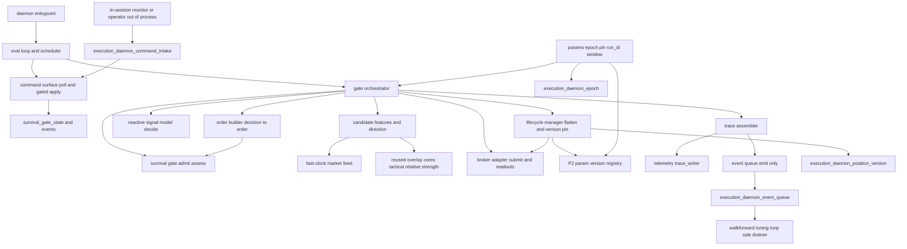

# Design Document

> **Revision 2 (2026-05-30)** — design follow-up after `/kiro-validate-gap` Refresh 2: closes the **command-transport** gap (the v1 design exposed only in-process command seams; the out-of-process `in-session-monitor` had no channel to reach the daemon) and folds in two forward contracts that the now-landed consumer specs resolved (`walk_forward_window` registry-sourcing; event-queue single-drainer). All v1 decisions otherwise stand.
>
> **Revision 2.1 (2026-05-30)** — `/kiro-validate-design` GO-with-conditions: (1) the epoch/`run_id` now uses a **daemon-owned `execution_daemon_epoch` table** instead of reusing `run_parameters_snapshot` — keeps the LLM `/research-company` run lifecycle + P6 orphan reconciler uncontaminated (Issue 1, operator chose option b); (2) the **Phase-1/Phase-2 build split** is encoded (§Build Phasing) — `reactive.decide` landed 2026-05-30, so Phase 2 is now blocked on **`survival-gate` impl only** (Issue 2); (3) a **command-intake write-authorization** note added (Issue 3).
>
> **Revision 2.2 (2026-05-30)** — operator catch (escalated): the order path had **no decision→order translation step** — no component built a survival-legal `ProposedOrder` from the model's `ReactiveDecision`, and the protective **stop-loss was unowned by all four specs** (survival *requires* it, reactive emits none, broker places-not-computes). Adds a new **`order_builder`** component (P9 intent translation, survival-capped volume, **daemon-computed ATR-based protective stop-loss** — operator-chosen owner 2026-05-30, survival + reactive both disclaim it — position targeting) and **corrects the inverted §13 walk** (Req 2.1/2.3 put `admit` before `decide`, impossible since `admit` consumes the built order): the gate is now `assess` clears Survive → `decide` → `order_builder` → per-order `admit` → `submit`. Requirements touched (Req 2 sequencing + new Req 11) → both reset for re-approval.
>
> **Revision 2.3 (2026-05-30)** — adversarial advisor review (post-R2.2) found the order-path gap was **wider**: (B1) `order_builder` read a **phantom `substrate.atr`** (it is `substrate.feature_values["atr"]`, possibly `None`); (B2) the seam **upstream** of `order_builder` was unowned — nobody fetched market data, computed the `FeatureSet`, or selected `direction`. Per **§12.3** the **directional side is the `tactical-overlay` relative-strength** (the reactive stack is the decider; the slow-layer veto is housed in `survival-gate` §12.6) — so it is owned by the architecture, not open. R2.3 adds a **`candidate`** component (fetch fast-clock feed → `compute_features` → tactical-relative-strength `direction` → `decide`) + new **Requirement 12**; fixes `order_builder` (real ATR path; **stop-loss as a price level** = reference price ∓ ATR×mult; **flatten-then-flip forbidden in v0.1**, clamp ≤ held; **SHORT-open = `BUY` + `Direction.SHORT`**); and derives the §13 "new-exposure-permitted" branch from **op-state**, not an `assess` return. Requirements + design reset for re-approval.
>
> **Revision 2.4 (2026-05-30)** — a **second** adversarial advisor review (post-R2.3) returned **NO-GO** on three blockers + one seam, each confirmed against landed code — the same shape-divergence class, one layer up, now in the fresh `candidate` surface:
> - **BL-1** — the `tactical-overlay` `classify()` emits a **4-valued bin** `{positive, negative, neutral, unavailable}` (`src/overlays/tactical/bin_classifier.py:105-145`), but `Direction = Literal["LONG","SHORT"]` has **no neutral member** (`src/reactive/types.py:58`). R2.3's `candidate` had **no path** for the `neutral` (normal in-regime, mixed momentum) or `unavailable` bins — `None` only covered "bad data."
> - **BL-2** — `decide(features, direction, snapshot: ParamSnapshot, …)` (`src/reactive/signal_model.py:212`) requires a reactive `ParamSnapshot` (`src/reactive/params.py:30`) as its 3rd arg; R2.3's `candidate` returned `(FeatureSet, Direction)` and the §13 `decide(…)` call **sourced the snapshot from nowhere**.
> - **BL-3** — `ProposedOrder` was declared in **no `types.py`** — it read as a survival-owned type, contradicting `order_builder`'s "Phase-1 buildable now" claim (you cannot inner-ring test against a type that doesn't exist).
> - **CN-4** — `candidate` discarded the **reference price** `order_builder` needs: `close = ticker_closes[-1]` is computed inside `compute_features` then dropped, and `FeatureSet.raw` carries `atr`/`drawdown_atr` but **no close** (`src/reactive/features.py:170-202`) — forcing a stale re-fetch.
>
> R2.4 collapses BL-1/BL-2/CN-4 into **one `candidate` contract** — `assemble(…) -> Candidate | None` where `Candidate = {features, direction, reference_price}`, with an explicit bin→direction map (`positive→LONG`, `negative→SHORT`, `neutral`/`unavailable`→`None` = no new exposure) + new **Requirement 12.5**; sources `decide`'s snapshot from **`PinnedParams.reactive_snapshot`**; and pins **`ProposedOrder` + `Candidate` as daemon-owned `types.py` types** (so `order_builder` is genuinely Phase-1; the `survival.admit` adaptation of `ProposedOrder` is the Phase-2 cross-spec seam). Minor advisor notes folded in: the `decide` `runtime_threshold` tighten-only override named as the P7 survival→threshold seam (v0.1 leaves it unset); the `order_builder` ATR None-guard reframed as defense-in-depth that fires only on a reactive-contract violation; type-import sources pinned in the `candidate`/`order_builder` contracts. Requirements (Req 12.5) + design reset for re-approval.

## Overview

**Purpose**: The Execution Daemon is the persistent, non-LLM **fast-clock process** that *runs* the reactive CFD layer. It is the only component that drives the four foundation leaf modules — the **broker adapter** (Route), the **reactive signal model** (Edge), the **survival gate** (Survive), and the **decision-trace store** (the trace) — on a single-threaded evaluation loop, enforcing the §13 lexicographic chain **Survive ⊳ Preserve ⊳ Edge ⊳ Return**, driving the paper-mode order lifecycle, and assembling the complete per-decision telemetry record (the previously-floating `run_id`/`walk_forward_window` injection seam).

**Users**: the **Operator** (starts / monitors / halts it, reads telemetry); the **reactive CFD trading system** (the automated flow); the **downstream consumers** — `walkforward-tuning-loop` (drains the event queue, reads the trace, publishes validated versions + the advanced window to the P2 registry the daemon hot-swaps) and `in-session-monitor` (an out-of-process supervisor that issues commands through the daemon's inbound command-intake transport).

**Impact**: introduces a genuinely **new process shape** for the repo (`src/reactive/daemon/`) — there is no persistent process today; everything else is a per-call MCP server or a slash command. It adds three append-only tables across two migrations (051/052) and a daemon entrypoint, but **adds no new decision logic**: it orchestrates and emits only. v0.1 is **paper-only**.

### Goals
- A single-threaded persistent loop that enforces §13 per tick and never lets Edge/Return override Survive.
- Complete, correlatable telemetry: every decision and fill recorded with the full four-key correlation contract.
- Honor the load-bearing dependency contracts (persist-then-act, `assess` cadence, op-state freshness, double-send guard, resize-on-advisory).
- Manage the full version-pinned position lifecycle with atomic hot-swap.
- Provide a **single auditable inbound transport** for supervisory commands and a **single emit-only event queue** with one external drainer.
- Stay a **leaf executor + event emitter** (P1) — never dispatch an agent, never recompute a dependency's value.

### Non-Goals
- Live real-money routing (paper/dry-run only, §11.5).
- The Survive / Edge / Return / sizing **logic** (owned by the dependencies).
- Parameter fitting/tuning + calibration (`walkforward-tuning-loop`); the trace schema + write primitives (`decision-trace-telemetry`, landed); the in-session supervisory **judgment** (`in-session-monitor` — the daemon owns the intake + gated apply, not the decision to command).
- Any dispatch or orchestration of LLM workers.

## Boundary Commitments

### This Spec Owns
- The **persistent single-threaded evaluation loop** + the cadence/boundary scheduler.
- The **candidate assembly** (`candidate`): each evaluation, fetch the fast-clock market data (ticker bars + SPY + risk-free yield), compute the `FeatureSet` via the reused overlay cores, map the **`tactical-overlay` relative-strength** bin to a candidate `direction` (§12.3 — the side is *not* from fundamentals; the slow-layer veto is housed in `survival-gate` §12.6), and **surface the reference price the order builder needs**. A **non-directional** tactical bin (`neutral`/`unavailable`) yields **no candidate** → no new exposure (Req 12.5).
- The **§13 orchestration** wiring: `survival.assess` (Survive gate, every tick) → [if new exposure permitted] `candidate` (features + direction + reference price) → `reactive.decide` (Edge, fed `PinnedParams.reactive_snapshot`) → **`order_builder`** → per-order `survival.admit` (veto) → `broker.submit_decision`, including persist-then-act ordering and resize-on-advisory.
- The **decision→order construction** (`order_builder`): translating a `ReactiveDecision` (LONG/SHORT/HOLD + sizing-hint + ATR) and the current position into a survival-legal `ProposedOrder` — P9 intent (BUY/TRIM/SELL), survival-capped volume, **a daemon-computed ATR-based protective stop-loss** (operator-chosen owner 2026-05-30 — survival + reactive both disclaim it), and the target `position_id` for a reduce/close.
- The **telemetry row assembly**: minting `trace_id`, stamping `event_ts` at decision time, **injecting `run_id` + `walk_forward_window`**, mapping the decision substrate + survival fields into the trace, linking decision↔fill by `parent_trace_id`.
- The **paper-mode order lifecycle** driver (submit→poll→reconcile) over the broker's sync leaf funcs, incl. the double-send guard handling and `unconfirmed` surfacing.
- The **flat-before-close action** + the verify-flat handshake (the *action*; the gate owns the *rule*).
- The **version-pinned position lifecycle** + **atomic hot-swap** (whole-object pointer-flip), the per-epoch `run_id` mint + joint param-snapshot pin, and **re-sourcing `walk_forward_window`** from the P2 registry at each hot-swap.
- The **after-market event queue** — **emit side only**; exactly **one external drainer** (`walkforward-tuning-loop`, the sole `drained_at` setter). The daemon never drains.
- The **command surface**: both the in-process gated seams (`engage-kill-switch` / `set-safe-mode-grade` / `select-validated-config`) **and the inbound command-intake transport** — a daemon-owned table the out-of-process commander writes and the daemon polls fresh each loop, validates through the gated seams (reject direct mutation; **toward-safer guard**), applies, and marks applied.
- Three new append-only tables across two migrations: `execution_daemon_event_queue` (mig 051); `execution_daemon_position_version` + `execution_daemon_command_intake` (mig 052).

### Out of Boundary
- Survive / Edge / sizing computation; the kill-switch / safe-mode **state logic** (gate owns it — the daemon persists transitions + exposes the seam + intake).
- The trace table DDL + write primitives (`decision-trace-telemetry`, landed — the daemon passes its own `conn`).
- Parameter fitting + calibration; the **publishing** of validated versions + the advanced `walk_forward_window` into the P2 registry (`walkforward-tuning-loop`, Req 7.1/7.3 — the daemon only *re-sources* them).
- The supervisory commander's **judgment** (what to command) and any in-session **read-only event view** it needs (`in-session-monitor`); the daemon owns the **intake + gated apply**, not the decision to command, and provides no second drain of the event queue.
- The in-session supervisory LLM loop itself; any agent dispatch.

### Allowed Dependencies
- **In-process leaf imports** (never via MCP): `broker-cfd-adapter` `core` (`submit_decision`, `get_positions`, `get_account_assets`, `get_history`, `validate_symbol`), `reactive-signal-model` `signal_model.decide`, `survival-gate` `gate.admit`/`assess`/`check_capitalization`.
- **Candidate inputs**: `src/reactive/features.compute_features` + the reused overlay cores (`src/overlays/{tactical,flow,reversion}/bin_classifier.py`, the tactical one also supplying the relative-strength **direction** per §12.3) + `src/micro/indicators.atr` (pure — import + pass arrays); the **fast-clock market feed** — the same upstream provider as `src/mcp/massive` (massive.com / Polygon-compatible), accessed via its client **directly, not through the MCP wrapper** (§14.10 — the daemon is not an MCP client). Concrete feed access is a tracked design build-item.
- **Landed write/read API**: `src/reactive/telemetry/{trace_writer,reader,schema}` — the daemon passes its own `conn`.
- **P2 machinery**: `parameters` / `parameters_active` (reactive + survival namespaces, read by value, REPEATABLE READ — the daemon pins into its **own** `execution_daemon_epoch`, not `run_parameters_snapshot`) + the param-version **registry** the tuner publishes to (the source of validated configs + the advanced window).
- **Reused tables**: `survival_gate_state` / `survival_gate_events` (the daemon persists what the gate emits; a kill-switch / safe-mode intake command is translated into a gate-path op-state write the loop reads fresh).
- **Convention**: per-module `_dsn()` + psycopg3 caller-passed `conn`; the append-only-guard trigger pattern (mig 003/048).
- **Forbidden**: importing `walkforward-tuning-loop` / `in-session-monitor`; any MCP call from the loop; any LLM dispatch. Dependency direction is downstream→daemon→deps only.

### Revalidation Triggers
- Any signature/shape change to a consumed dependency entry point (`submit_decision` result, `ReactiveDecision`/`DecisionSubstrate`, `AdmitDecision`/`AssessDirective`/`SurvivalEvent`, the telemetry `CorrelationKeys`/row shapes).
- The daemon **concurrency model** changing from single-threaded (breaks op-state freshness — survival-gate revalidation).
- The **P2 param-version registry shape** — the "menu" of validated configs + the published `walk_forward_window` (deferred to `walkforward-tuning-loop` design; the daemon re-sources both).
- The **command-intake contract** — the `execution_daemon_command_intake` row shape + the `select-validated-config` semantics (shared seam with `in-session-monitor`; a rename either side is a cross-spec break).
- The **event-queue single-drainer** invariant (`walkforward-tuning-loop` is the sole `drained_at` setter).
- Migration coordination: the daemon's tables stay at 051/052 (049/050 reserved by `survival-gate`; 053+ `walkforward-tuning-loop`; ≥054 `in-session-monitor`). The `command_intake` table is co-located in **052** specifically to avoid a 053+ renumber cascade.

## Architecture

### Existing Architecture Analysis
The four dependencies are pure/leaf and **all synchronous** (the broker's "async submit→poll→reconcile" is venue order-semantics, a blocking poll, not Python coroutines). The repo has **no persistent process** and **no connection pool**; every writer declares a local `_dsn()` and takes a caller-passed `conn`. The telemetry writer's `conn=None` is a **dry-run** path (the daemon's inner-ring test seam). Param pinning exists as `run_parameters_snapshot` (the LLM-run pattern the daemon **mirrors into its own `execution_daemon_epoch`** rather than reusing — Issue 1/option b); reactive + survival params share the `parameters` machinery via distinct namespaces. The append-only-guard trigger is the house event-log pattern. **No in-process channel exists between an out-of-process markdown orchestration and the daemon** (the daemon is not an MCP server, §14.10) — hence the inbound command-intake table is the transport.

### Architecture Pattern & Boundary Map
Selected pattern: a **single-threaded blocking evaluation loop** (process + scheduler) wrapping a **§13 gate-orchestrator**, with supporting services (trace-assembler, lifecycle-manager, command-surface) and an emit-only event-queue. One owned psycopg3 connection is serialized through the loop. The command surface reads an **inbound intake table** each cycle (the out-of-process transport) and applies through gated seams. Rationale: mandated by survival-gate's op-state-freshness guarantee, matches the all-sync deps, smallest correct shape (P1 leaf, no asyncio, no pool).



Dependency direction (strict, left→right): `types → config → db → params → {trace_assembler, event_queue, lifecycle, commands} → orchestrator → loop → entrypoint`. Each layer imports only leftward; the orchestrator imports the dependency leaf modules; nothing imports a consumer spec.

### Technology Stack
| Layer | Choice / Version | Role in Feature | Notes |
|-------|------------------|-----------------|-------|
| Backend / Services | Python ≥3.11 (stdlib + project libs) | the persistent loop + orchestration leaf | imports broker/reactive/survival cores in-process |
| Data / Storage | Postgres (append-only) | owns event_queue + position_version + command_intake + epoch; reuses decision_process_trace, survival_gate_*, parameters_active + the P2 registry | one owned psycopg3 conn; local `_dsn()` |
| Messaging / Events | DB-table event queue (emit) + DB-table command intake (inbound) | after-market hand-off (one external drainer) + out-of-process command transport | append-only-guard; no file-queue; no MCP/in-process call from the commander |
| Infrastructure / Runtime | new `docker compose` service (or supervised `python -m src.reactive.daemon`) | launches/supervises the long-lived process | restart policy; **new process shape** (no precedent) |

## File Structure Plan

### Directory Structure
```
src/reactive/daemon/
├── __init__.py
├── __main__.py          # process entrypoint: build conn + config, run the loop; restart-safe
├── config.py            # _dsn() + DaemonConfig: paper flag, assess_max_latency, poll timeout, cadence, intake-poll cadence, stop_loss_atr_mult (protective-stop distance), market-feed provider keys (fast-clock data source — massive provider, direct not MCP)
├── db.py                # owned psycopg3 connection lifecycle; per-cycle conn.transaction() helper
├── types.py             # EvalTick, EpochContext (run_id, code/param version, walk_forward_window, pinned snapshots), CommandRow; PinnedParams (exposes .reactive_snapshot = the reactive ParamSnapshot decide consumes, alongside the survival namespace — BL-2); Candidate{features, direction, reference_price} (candidate output — BL-1/CN-4); ProposedOrder{symbol, intent, direction, volume, stop_loss, position_id?} (daemon-owned pre-admit order order_builder returns — BL-3; survival.admit reads its fields but does not own the type)
├── params.py            # per-epoch pin: REPEATABLE-READ resolve of parameters_active (reactive+survival) -> a daemon-owned execution_daemon_epoch row (epoch_id = run_id, pinned-hash, window, opened/closed); re-source walk_forward_window from the P2 registry at hot-swap (v0.1 bootstrap until the tuner publishes)
├── candidate.py         # each eval: fetch fast-clock data (ticker bars + SPY + rf_yield) from the market feed; compute_features via the reused overlay cores (tactical/flow/reversion + atr); map tactical bin -> direction (positive->LONG, negative->SHORT, neutral/unavailable->None) (§12.3); surface reference_price = last close (CN-4); -> Candidate{features, direction, reference_price} for decide + order_builder. Returns None (no new exposure) on a non-directional bin (Req 12.5) OR missing/insufficient data (Req 12.4)
├── trace_assembler.py   # ReactiveDecision + survival fields + broker fill -> DecisionTraceRow / FillOutcomeRow; trace_id mint, event_ts, run_id+window inject, substrate->signal_values / binding_constraint->gate_link / derive liq_proximity,stop_out,declined; parent linking
├── event_queue.py       # emit decision/lifecycle/command events to execution_daemon_event_queue (EMIT ONLY; never sets drained_at). Documents the single-drainer drain contract consumers use
├── lifecycle.py         # flat-before-close action + verify-flat handshake; version-pin (open/close) into execution_daemon_position_version; atomic hot-swap (whole-object pointer flip); global-tightest survive across versions
├── commands.py          # command surface: POLL execution_daemon_command_intake each cycle; validate (gated paths only; reject direct mutation; toward-safer guard — safe-mode may only tighten, select-validated-config must be a registry member and not loosen survival); apply via op-state write / hot-swap select; mark applied; emit command event
├── order_builder.py     # PURE decision->order translator: ReactiveDecision (LONG/SHORT/HOLD + sizing_hint) + substrate.feature_values['atr'] + reference_price (from Candidate, not re-fetched) + positions + params -> daemon-owned ProposedOrder (intent+direction express open/reduce on the decided side, SHORT-open = BUY+Direction.SHORT; volume from sizing_hint capped by survival, clamped <= held on reduce — no flatten-then-flip in v0.1; stop_loss PRICE LEVEL = reference +/- atr*stop_loss_atr_mult; position_id for reduce/close)
└── orchestrator.py      # the §13 walk: assess (Survive gate) -> decide (Edge) -> order_builder -> per-order admit (veto) -> submit_decision; persist-then-act; resize-on-advisory; declined-trace; never-upsize
tests/unit/reactive/daemon/
├── test_orchestrator.py # §13 ordering, reject-kills-order, resize-on-advisory, declined-trace, never-upsize (synthetic dep fixtures)
├── test_trace_assembler.py # full 4-key correlation, run_id/window inject, trace_id mint, event_ts-at-decision, decision<->fill link, idempotency, substrate mapping (against trace_writer conn=None dry-run)
├── test_lifecycle.py    # flatten-in-window, verify-flat-failure escalation, version-pin, atomic hot-swap, global-tightest survive
├── test_commands.py     # intake poll+apply; gated-path-only; reject direct mutation; toward-safer guard (reject safe-mode loosen + non-registry/looser config); kill-switch blocks opens / allows exits
├── test_order_builder.py # intent+direction (incl. SHORT-open = BUY+SHORT); volume from sizing_hint capped by survival advisory, clamped <= held on reduce (no flip); stop_loss PRICE LEVEL = reference +/- atr*mult (satisfies missing_sl); atr read from feature_values + None-guard; position_id targeting; HOLD -> no order (synthetic ReactiveDecision + positions + reference price)
├── test_candidate.py    # feature computation over synthetic fetched arrays; bin->direction map (positive->LONG, negative->SHORT); neutral->None and unavailable->None (non-directional -> no candidate, Req 12.5); reference_price = last close surfaced on the Candidate (CN-4); missing/insufficient data -> None/no order (Req 12.4) (mocked feed; reused overlay cores)
├── test_params.py       # joint snapshot pin, run_id mint per epoch, walk_forward_window re-source at hot-swap + bootstrap
└── test_loop.py         # single-eval-at-a-time, assess cadence, intake-poll cadence, fail-toward-minimum-exposure on dep error
tests/integration/
└── test_daemon_persistence.py # migs 051/052 apply; append-only guards reject UPDATE/DELETE (except drained_at / applied_at whitelist); decision+fill round-trip + intake round-trip via real conn
```

### Modified / New Files
- `db/migrations/051_execution_daemon_event_queue.sql` — **NEW** append-only `execution_daemon_event_queue` + guard (mig-003/048 pattern).
- `db/migrations/052_execution_daemon_state.sql` — **NEW** `execution_daemon_position_version` (open/close + version pin), `execution_daemon_command_intake` (inbound command transport), **and `execution_daemon_epoch`** (epoch_id=run_id, pinned-hash, window, opened/closed) + guards. (Three daemon-state tables co-located to keep the daemon at 051/052 and avoid renumbering 053+/≥054.)
- `docker-compose.yml` — **MODIFIED**: add a daemon service (paper mode) alongside `postgres`, with a restart policy.
- `.env.example` — **MODIFIED**: daemon config keys (paper flag, `assess_max_latency_seconds`, poll timeout, intake-poll cadence).

### Build Phasing (dep-readiness, P14) — added R2.1
The daemon is last in build order; its clusters split by dependency-readiness (state as of 2026-05-30):
- **Phase 1 — buildable now (dep-independent):** migrations 051/052 + guards; `config` / `db` / `types`; `params` (epoch resolver against synthetic param rows; exposes `.reactive_snapshot`); `trace_assembler` (against `write_decision_trace(conn=None)` dry-run); `event_queue`; `commands` (intake poll/apply against synthetic op-state); **`order_builder`** (pure decision→order translator, tested against synthetic `ReactiveDecision` + positions + reference price — reactive's types landed); **`candidate`** (feature computation + tactical bin→direction map over synthetic fetched arrays, live fetch mocked — `compute_features` + the overlay cores landed). Both `order_builder` and `candidate` return **daemon-owned `types.py` shapes** (`ProposedOrder`, `Candidate`) with **no `survival.gate` / unbuilt-survival-type dependency** (BL-3) — so both are genuinely Phase-1 inner-ring-testable. All inner-ring-testable with no `survival.gate`. **`reactive.decide` landed 2026-05-30** (`src/reactive/signal_model.py`), so the Edge wiring is no longer blocked.
- **Phase 2 — blocked on `survival-gate` implementation only:** `orchestrator` (the §13 walk needs `survival.admit`/`assess`), the **`order_builder` → `survival.admit` adaptation** (mapping the daemon's `ProposedOrder` fields to whatever shape survival's landed `admit` accepts — a cross-spec contract resolved when survival lands; revalidation trigger below), `lifecycle` flatten action (needs `survival` assess directives), the end-to-end loop, integration/e2e tests. Do **not** wire these until `src/survival/gate.py` exists.

Task generation must mark Phase-2 sub-tasks `_Depends:_` blocked-on-survival-gate so they are not started prematurely (P14 — outer-ring/e2e wiring is uninterpretable without the dep's inner ring).

## System Flows

**Per-tick evaluation (single-threaded; persist-then-act; intake polled first):**
```mermaid
sequenceDiagram
    participant L as Loop
    participant C as Commands
    participant P as Params
    participant S as Survival gate
    participant Cand as Candidate
    participant R as Signal model
    participant O as Order builder
    participant B as Broker
    participant A as Trace assembler
    participant D as DB
    L->>C: poll command intake; validate gated + toward-safer; apply; mark applied
    L->>P: ensure epoch (pin snapshot, run_id, re-source window)
    L->>S: assess(state, op_state fresh, params, clock)
    S-->>L: AssessDirective (next_op_state, directives, events)
    L->>D: persist op_state transition + events (persist-then-act)
    alt op-state permits new exposure (kill_switch off, safe_mode not HALT_NEW/FLATTEN)
        L->>Cand: fetch feed; compute_features; map tactical bin -> direction
        Cand-->>L: Candidate{features, direction, reference_price} (or None -> skip: non-directional bin / insufficient data)
        L->>R: decide(features, direction, params.reactive_snapshot)
        R-->>L: ReactiveDecision (decision, P, sizing_hint, substrate)
        alt actionable (not HOLD / sub-threshold)
            L->>O: build order (intent+direction, volume<=advisory & <=held, stop_loss from Candidate.reference_price, position_id)
            O-->>L: ProposedOrder
            L->>S: admit(order, state, op_state, params, clock)
            S-->>L: AdmitDecision (ALLOW | REJECT+advisory)
            alt ALLOW
                L->>B: submit_decision(... volume<=advisory, paper)
                B-->>L: OrderResult (filled|simulated|unconfirmed|rejected)
            else REJECT
                Note over L: record binding_constraint; resize via advisory then re-build + re-admit
            end
        else HOLD
            Note over L: record declined
        end
    end
    L->>A: assemble decision trace (+ fill if confirmed)
    A->>D: write_decision_trace / write_fill_outcome (own conn)
    A->>D: emit event(s) to event queue (emit only)
```
Key decisions: the **command intake is polled first each cycle** so a just-issued kill-switch/safe-mode is observed before any admit (op-state-freshness extended to the out-of-process transport); **the daemon derives "new exposure permitted" from the freshly-persisted op-state** (kill-switch off + safe-mode not HALT_NEW/FLATTEN) — `assess` returns directives/op-state, not a permit flag; only when permitted does the daemon run `candidate` (fetch + features + tactical **bin→direction map**, §12.3 — a `neutral`/`unavailable` bin yields **no candidate** → no new exposure, Req 12.5; the returned `Candidate` also surfaces the `reference_price` the builder needs, so there is **no second fetch**, CN-4) → `decide` (fed the pinned **`PinnedParams.reactive_snapshot`** as its 3rd arg, BL-2) → `order_builder` → per-order `admit`, which consumes the **built** order and so cannot precede `decide`; the op-state transition is **persisted before** any directive/admit (persist-then-act); a REJECT with an advisory max triggers a single resize-and-re-build-and-re-admit (the ATR stop-loss is volume-independent, so the re-build reaches a fixpoint in one pass).

**Command intake (out-of-process transport):**
```mermaid
sequenceDiagram
    participant M as Commander (monitor / operator)
    participant T as command_intake table
    participant C as Commands (daemon)
    participant G as Survival op-state / registry select
    M->>T: INSERT gated command row (engage-kill-switch | set-safe-mode-grade | select-validated-config + version)
    C->>T: poll un-applied rows (SELECT)
    C->>C: validate — gated path only; reject direct mutation; toward-safer (tighten / registry-member, not looser)
    alt valid
        C->>G: apply (op-state write via gate path | select version for next hot-swap)
        C->>T: mark applied_at
        C->>C: emit command event to event_queue
    else invalid
        C->>T: mark rejected + reason; emit command event
    end
```

**Version-pinned lifecycle + hot-swap** (paper: intraday-flat ⇒ exercised by synthetic multi-version fixtures): on hot-swap the daemon reads the whole versioned param object + the published `walk_forward_window` from the P2 registry once and flips atomically; open positions stay on their opening version; survival applies globally-tightest across coexisting versions.

## Requirements Traceability

| Requirement | Summary | Components |
|-------------|---------|------------|
| 1.1, 1.2, 1.3 | single-eval loop; assess cadence; margin-material trigger | `loop` |
| 1.4 | pinned param object per cycle | `params` |
| 1.5 | fail toward minimum exposure on error | `loop`, `orchestrator` |
| 2.1, 2.2, 2.3 | Survive-gate (assess) → decide → build → per-order admit → submit | `orchestrator`, `order_builder` |
| 2.4 | never recompute/override/upsize | `orchestrator` |
| 2.5 | HOLD/sub-threshold → declined | `orchestrator`, `trace_assembler` |
| 3.1 | paper-only, no live path | `config`, `orchestrator` |
| 3.2, 3.3 | submit→poll→reconcile; unconfirmed surfaced | `orchestrator` |
| 3.4 | double-send guard | `orchestrator` |
| 3.5 | resize-on-advisory | `orchestrator` |
| 4.1, 4.2, 4.3 | decision trace; 4-key correlation; run_id+window inject; trace_id; event_ts at decision | `trace_assembler`, `params` |
| 4.4 | fill linked, window-attributed | `trace_assembler` |
| 4.5 | idempotent on trace_id | `trace_assembler` (writer ON CONFLICT) |
| 4.6 | reconstructable substrate + derived gate fields | `trace_assembler` |
| 5.1 | persist-then-act | `orchestrator`, `loop`, `db` |
| 5.2, 5.3 | op-state read fresh; kill-switch seen on every admit | `loop`, `orchestrator`, `commands` |
| 5.4 | persist gate events + transitions append-only | `commands`, `db` |
| 6.1, 6.2, 6.3 | flatten in window; verify-flat; escalate on failure | `lifecycle` |
| 7.1, 7.2 | kill-switch blocks opens, allows exits | `orchestrator`, `commands` |
| 7.3 | deterministic reflex before any LLM input | `loop`, `commands` (intake polled, but reflex applies independently) |
| 7.4 | reflect tightened safe-mode; no self-loosen (toward-safer guard) | `commands` |
| 8.1 | atomic whole-object hot-swap | `lifecycle`, `params` |
| 8.2, 8.3 | version-pin at open; manage under opening version | `lifecycle` |
| 8.4 | global-tightest survive across versions | `lifecycle`, `orchestrator` |
| 9.1 | emit drainable events (single external drainer) | `event_queue` |
| 9.2, 9.3 | command seams + inbound transport; gated-only; reject direct mutation | `commands` |
| 9.4 | adopt validated config via hot-swap (select-via-intake → daemon hot-swap) | `commands`, `lifecycle` |
| 10.1 | no agent dispatch | all (architectural invariant) |
| 10.2, 10.3 | no self-computed values; obtain from deps | `orchestrator` |
| 11.1 | intent+direction express open/reduce on decided side (SHORT-open = BUY+SHORT) | `order_builder` |
| 11.2 | volume from sizing-hint capped by survival | `order_builder` |
| 11.3 | stop-loss PRICE LEVEL from reference price ∓ ATR×mult | `order_builder`, `config` |
| 11.4 | reduce/close targets the position by id | `order_builder` |
| 11.5 | position state from broker readouts, not inferred | `order_builder` |
| 11.6 | clamp volume ≤ held on reduce; no flatten-then-flip in v0.1 | `order_builder` |
| 12.1 | fetch fast-clock market data | `candidate` |
| 12.2 | compute the feature set; no raw data to the model | `candidate` |
| 12.3 | direction from tactical relative-strength bin (positive→LONG, negative→SHORT); not fundamentals | `candidate` |
| 12.4 | hand features+direction to decide; fail toward no-new-exposure on bad data | `candidate`, `orchestrator` |
| 12.5 | non-directional bin (neutral/unavailable) → no candidate, no new exposure | `candidate` |

## Components and Interfaces

| Component | Layer | Intent | Req Coverage | Key Deps (P0/P1) | Contracts |
|-----------|-------|--------|--------------|------------------|-----------|
| `loop` | runtime | single-threaded eval loop + scheduler | 1.x, 5.x, 7.3 | orchestrator (P0), commands (P0), params (P0) | Service |
| `orchestrator` | control | the §13 walk | 2.x, 3.x, 5.1, 7.1, 10.x | survival/reactive/broker (P0), order_builder (P0), trace_assembler (P0) | Service |
| `order_builder` | control | pure decision→order translator | 11.x, 2.2 | reactive types (P0), broker positions (P1) | Service |
| `candidate` | control | feature + direction assembly | 12.x, 2.2 | features.compute_features + overlay cores (P0), market feed (P1) | Service |
| `trace_assembler` | persistence | substrate→row assembly + write | 4.x, 2.5 | trace_writer (P0) | Service, State |
| `lifecycle` | control | flatten + version-pin + hot-swap | 6.x, 8.x | broker (P0), params (P0) | Service, State |
| `commands` | control | inbound intake transport + gated apply | 5.4, 7.2, 7.4, 9.2-9.4 | command_intake (P0), survival_gate_state (P0) | Service, State, Batch |
| `event_queue` | persistence | emit-only event log | 9.1 | db (P0) | Event |
| `params` | config | epoch pin + run_id + window re-source | 1.4, 4.2, 8.1 | parameters_active + P2 registry (P0) | State, Service |

### Control — `commands` (revised in R2)
| Field | Detail |
|-------|--------|
| Intent | The only path supervisory commands enter the daemon; gated apply + toward-safer guard |
| Requirements | 5.4, 7.2, 7.4, 9.2–9.4 |

**Responsibilities & Constraints**: each cycle, **poll `execution_daemon_command_intake`** for un-applied rows (the out-of-process transport — the monitor/operator INSERTs; the daemon is the sole reader/applier). For each command: validate it targets a gated seam (`engage-kill-switch` / `set-safe-mode-grade` / `select-validated-config`); **reject any row that would directly mutate a position or a survival/edge value** (Req 9.3). Enforce the **toward-safer guard** (Req 7.4 / P7): a `set-safe-mode-grade` may only *tighten*; a `select-validated-config` must name a version present in the P2 validated registry and must not loosen survival. Apply a valid command — kill-switch/safe-mode as an op-state write through the gate's path (which the loop reads fresh, Req 5.2/5.3), `select-validated-config` by recording the selected version for the next atomic hot-swap (handed to `lifecycle`, Req 9.4). Mark the row `applied_at` (or `rejected` + reason). The **deterministic reflex (kill-switch/safe-mode) applies before and independently of any intake** (Req 7.3 — intake never gates the reflex). Persist every gate transition + command to append-only records.

**Contracts**: Service + State + Batch.
```python
def poll_and_apply(ctx: EpochContext, conn) -> list[CommandResult]: ...  # batch: drain un-applied intake rows, validate+apply, mark
def engage_kill_switch(...) -> None: ...        # gated seam (op-state write)
def set_safe_mode_grade(grade) -> None: ...     # tighten-only
def select_validated_config(version_id) -> None: ...  # registry-member + toward-safer; hands the version to lifecycle for hot-swap
```
- Preconditions: intake rows are gated command types; the daemon is the sole applier (single-threaded — no concurrent applier).
- Postconditions: every intake row ends `applied` or `rejected(+reason)`; no direct-mutation command is ever applied; safe-mode never loosens via intake; a selected config is a registry member.
- Invariants: the reflex is independent of intake; the loop reads op-state fresh after `poll_and_apply` so a just-applied kill-switch is seen this same tick.

### Persistence — `event_queue` (revised in R2)
**Responsibilities & Constraints**: emit decision / fill / lifecycle / command / safe_mode / kill_switch events to `execution_daemon_event_queue` (INSERT only). The daemon **never drains** — `drained_at` is set exclusively by the single external drainer (`walkforward-tuning-loop`). If `in-session-monitor` needs in-session event visibility it uses a **read-only, non-draining** SELECT (not provided by the daemon; out of boundary). **Contracts**: Event.

### Config — `params` (revised in R2)
**Responsibilities & Constraints**: at startup and at each hot-swap, resolve `parameters_active` (reactive + survival namespaces) under a single REPEATABLE-READ transaction into a **daemon-owned `execution_daemon_epoch` row** (the row's `epoch_id` IS the `run_id` the trace carries; it captures the pinned-parameter hash + the window), and **re-source `walk_forward_window` from the P2 param-version registry** — published there by `walkforward-tuning-loop` alongside the promoted version (its Req 7.3). v0.1 uses a bootstrap window label tied to the epoch until the tuner first publishes. Expose pinned snapshots **by value** as a `PinnedParams` that carries **`.reactive_snapshot`** — the reactive `ParamSnapshot` (`src/reactive/params.py:30`: weights / temperature / threshold / calibration / code+param version) that `decide` consumes as its **3rd positional arg** (BL-2) — alongside the survival namespace; never re-resolve mid-cycle (P2). The orchestrator passes `params.reactive_snapshot` straight into `decide`, so the snapshot is sourced from the epoch pin (never from nowhere, never re-resolved within the cycle). Build item: a small Python resolver mirroring the `/research-company` §1.5 REPEATABLE-READ read but writing the **daemon's own `execution_daemon_epoch`, not `run_parameters_snapshot`** (Issue 1 / option b) — keeping the research-company run lifecycle + P6 orphan reconciler uncontaminated.

### Control — `candidate` (added R2.3)
| Field | Detail |
|-------|--------|
| Intent | Assemble the model's inputs: features + the directional side, from market data |
| Requirements | 12.1–12.4, 2.2 |

**Responsibilities & Constraints**: each evaluation, **fetch the fast-clock market data** the feature computation needs (the ticker's recent bars, the SPY benchmark series, the risk-free yield) from the market feed (12.1); **compute the `FeatureSet`** via `reactive.features.compute_features` over the fetched arrays — the daemon never passes raw data to `decide` (12.2); **map the `tactical-overlay` relative-strength bin to a candidate `direction`** (§12.3 — explicitly *not* from fundamentals or the slow-layer thesis; the slow-layer veto is the entry-exclusion stage housed inside `survival-gate`, §12.6). The tactical core (`src/overlays/tactical/bin_classifier.py`) emits a **4-valued bin**, mapped:

| tactical bin | candidate direction | outcome |
|--------------|---------------------|---------|
| `positive` (rel ≥ 0 ∧ abs ≥ 0) | `Direction.LONG` | candidate |
| `negative` (rel ≤ 0 ∧ abs ≤ 0) | `Direction.SHORT` | candidate |
| `neutral` (mixed momentum) | — | **no candidate** → `None` (12.5) |
| `unavailable` (insufficient history / rf-staleness) | — | **no candidate** → `None` (12.5) |

A **non-directional** bin (`neutral`/`unavailable`) is the *absence of an edge*, not a data error — it returns `None` (Req 12.5), as does missing/insufficient market data (Req 12.4). On a directional bin, **surface the reference price** (`reference_price = ticker_closes[-1]`, the last close — `compute_features` computes it then drops it, so the candidate carries it explicitly, CN-4) and hand a `Candidate{features, direction, reference_price}` to the orchestrator for `decide` (12.4).

**Contracts**: Service. (`Direction`/`FeatureSet` from `src/reactive/{types,features}`; `Candidate`/`MarketFeed`/`PinnedParams` are daemon-owned `types.py` — CN-6.)
```python
def assemble(symbol: str, feed: MarketFeed, params: PinnedParams) -> Candidate | None: ...
# Candidate = {features: FeatureSet, direction: Direction, reference_price: float}
```
- Preconditions: `feed` provides the ticker bars + SPY + rf-yield; the reused overlay cores + `compute_features` + `indicators.atr` are imported (pass-arrays, no MCP).
- Postconditions: returns a `Candidate{features, direction, reference_price}` consumable by `decide` (features+direction) and `order_builder` (reference_price); `None` on a non-directional tactical bin (12.5) **or** insufficient data (12.4).
- Invariants: the feature compute + bin→direction map are pure over the fetched arrays → **inner-ring testable with a mocked feed, no `survival.gate` (Phase 1)**; the **live feed access is the one impure edge** (the R2.3 build-item) — `candidate` is the daemon's only market-data fetch point, and the **sole** point that converts the tactical bin into a `Direction`.

### Control — `order_builder` (added R2.2; corrected R2.3)
| Field | Detail |
|-------|--------|
| Intent | Pure translator: a directional decision + position + reference price → a survival-legal order |
| Requirements | 11.1–11.6, 2.2 |

**Responsibilities & Constraints**: a **pure function (no I/O)** turning a `ReactiveDecision` + the current positions (from broker readouts) + a **current reference price** (threaded from the `Candidate`, **not re-fetched** — CN-4) + the pinned params into a single **daemon-owned `ProposedOrder`** (its own `types.py`; `survival.admit` reads its fields but does not own the type — BL-3). Derive the **intent + direction** to express open/reduce on the decided side — opening short exposure is `intent=BUY` with `Direction.SHORT` (the broker venue mapping, `mappers.py`), **not** a `SELL` (11.1); set **volume** from `sizing_hint` capped by the survival per-order/exposure limits and never exceeding the advisory max, and **clamped ≤ the held volume on a reduce — no flatten-then-flip in a single order** (a reversal waits for a later post-flat tick, 11.2/11.6); attach a **protective stop-loss PRICE LEVEL** = `reference_price ∓ (atr × stop_loss_atr_mult)`, reading **`atr` from `decision.substrate.feature_values["atr"]`** (the real landed path — `features.py:192` surfaces it into the decision's `feature_values`), guarded with a None-check that is **defense-in-depth only** (CN-3): a degenerate/absent ATR makes the reactive model emit HOLD upstream, so an *actionable* decision reaching the builder always carries `atr` — the guard degrades to no-order only on a reactive-contract violation. The stop lets the order pass survival's mandatory-stop check (11.3 — **the daemon owns SL computation; survival + reactive both disclaim it**); for a reduce/close, set the target `position_id` (11.4); take position state from broker readouts, never infer it (11.5). HOLD/sub-threshold → returns no order (the orchestrator records a declined trace). The SL is an **order parameter, not a survival/edge value**, so computing it is not a P7 re-computation.

**Contracts**: Service.
```python
def build_order(decision: ReactiveDecision, positions: list[Position],
                reference_price: float, params: PinnedParams) -> ProposedOrder | None: ...  # None on HOLD/sub-threshold or absent atr
```
- Preconditions: `decision` is actionable (caller skips HOLD); `positions` from `broker.get_positions` (never inferred); `reference_price` is the **`Candidate`'s surfaced last close** (threaded by value, not a re-fetch — CN-4); `atr` present in `decision.substrate.feature_values` (guaranteed for an actionable decision — CN-3).
- Postconditions: returns a **daemon-owned** `ProposedOrder{symbol, intent, direction, volume, stop_loss}` (+ `position_id` on a reduce) that satisfies survival's mandatory-stop + size invariants **by construction**; `volume ≤ min(survival advisory max, held volume on a reduce)`; `stop_loss` is a price level. The `survival.admit` adaptation of these fields is the Phase-2 cross-spec seam (BL-3).
- Invariants: pure + deterministic → **inner-ring testable against synthetic `ReactiveDecision` + positions + reference price, no `survival.gate` needed (Phase 1)**; the survival gate still independently vetoes via `admit` — the builder produces a *legal candidate*, not a survival guarantee.

### Control — `orchestrator` / `trace_assembler` / `lifecycle` / Runtime — `loop`
*(Unchanged from R1 except where noted.)* `orchestrator`: the §13 walk — **`assess` (Survive gate) → `candidate` (features + direction + reference_price) → `decide` (Edge, fed `params.reactive_snapshot`) → `order_builder` → per-order `admit` (veto) → `submit`** (admit runs on the built order, never before decide) — persist-then-act, resize-on-advisory (re-build + re-admit), declined-trace, never-upsize; obtains decisions/verdicts/sizing/venue-actions exclusively from the deps (10.2/10.3). `decide`'s optional `runtime_threshold` (4th arg, `signal_model.py:212`) is the natural **P7 survival→threshold tighten-only seam** (a survival state may *raise* the decision threshold, never lower it); **v0.1 leaves it unset** — named, not wired (CN-1). `trace_assembler`: mint `trace_id`, stamp `event_ts` at decision time, inject `run_id`+`walk_forward_window`, map substrate→`signal_values` / `binding_constraint`→`gate_link`, derive `liq_proximity`/`stop_out`/`declined`, link decision↔fill; idempotent via the writer's `ON CONFLICT`; inner-ring-tested against `write_decision_trace(conn=None)`. `lifecycle`: flatten-in-window + verify-flat escalation; version-pin at open; manage under opening version after hot-swap; whole-object atomic swap; global-tightest survive; **adopts the version `commands` selected** (Req 9.4). `loop`: single-eval-at-a-time; **polls intake first**, then `assess` within cadence + on margin-material events; fail-toward-minimum-exposure on dependency error.

## Data Models

**`execution_daemon_event_queue`** (mig 051; append-only, guard trigger): `event_id` (PK), `run_id`, `event_type` (decision | fill | lifecycle | command | safe_mode | kill_switch), `payload` (JSONB), `created_at`, `drained_at` (nullable — the **only** mutable column, set **exclusively by the external drainer**). UPDATE permitted only to set `drained_at` (mig-034 whitelist pattern); the daemon itself never updates it.

**`execution_daemon_position_version`** (mig 052; append-only, guard trigger): `record_id` (PK), `run_id`, `venue_position_id`, `code_version`, `param_version`, `event` (opened | closed), `event_ts`, `created_at`. INSERT-only; the open/close pair reconstructs a position's version-pinned lifetime.

**`execution_daemon_command_intake`** (mig 052; append-only, guard trigger): `command_id` (PK, commander-minted), `issued_by` (monitor | operator), `command_type` (engage_kill_switch | set_safe_mode_grade | select_validated_config), `target` (JSONB — e.g. grade, version_id), `created_at`, `applied_at` (nullable), `status` (pending | applied | rejected), `reject_reason` (nullable). INSERT by the commander; UPDATE permitted only on the `applied_at`/`status`/`reject_reason` whitelist, **set exclusively by the daemon** (state-guard). The commander never sets `applied_at`; the daemon never inserts.
> **Write-authorization (Issue 3 — no in-repo DB-role precedent):** the intake is a control channel into a levered session, so INSERT must be restricted. v0.1 (paper) accepts a documented permissive default, but the design **mandates a dedicated DB role/grant for the commander before any live cutover**, and the daemon validates `issued_by` against a configured allowlist at apply-time. The toward-safer guard already caps blast radius (a spurious command can only tighten/halt or select a registry member, never loosen); the residual unmitigated risk is a **halt-DoS via spurious `engage_kill_switch`**, accepted eyes-open for v0.1 paper.

**`execution_daemon_epoch`** (mig 052; append-only + narrow state-guard — Issue 1/option b): `epoch_id` (PK — **is** the `run_id` carried on every trace + event in the epoch), `pinned_param_hash`, `code_version`, `param_version`, `walk_forward_window`, `opened_at`, `closed_at` (nullable), `status` (open | closed). One row per pinned-param epoch (daemon start + each hot-swap). INSERT by the daemon; UPDATE permitted only on the `closed_at`/`status` whitelist. **Daemon-owned — deliberately NOT `run_parameters_snapshot`**, so the LLM `/research-company` run lifecycle (`run_status` in_progress/failed) + the P6 orphan reconciler stay uncontaminated.

**Reused (not owned)**: `decision_process_trace` + `counterfactual_ledger` version dims (telemetry, mig 048); `survival_gate_state` / `survival_gate_events` (survival, migs 049/050); `parameters_active` + the P2 param-version registry (mig 004 + the tuner's registry). *(The daemon no longer writes `run_parameters_snapshot` — Issue 1/option b — it owns `execution_daemon_epoch` instead.)*

## Error Handling

### Error Strategy — fail toward minimum exposure
- **Dependency error / malformed input during an evaluation**: reject any opening order; never block a true exit or a reduce/flatten directive; record the failure as an event (Req 1.5).
- **Invalid intake command**: mark the row `rejected` + reason, emit a `command` event; never apply (Req 9.3). A malformed/loosening command is a no-op, never a fail-open.
- **Blocking-poll timeout** (slow venue): surface the order as `unconfirmed`, do not assume filled (Req 3.3), continue; the `assess` cadence bounds monitor latency.
- **Persist failure before act**: if the op-state transition cannot be persisted, do not execute the directive or admit the order (persist-then-act is a hard gate, Req 5.1).
- **Programmer errors** (contract violations) raise — surfaced in tests.

### Monitoring
Every decision, fill, lifecycle transition, and command (applied or rejected) is emitted to `execution_daemon_event_queue`; decisions/fills also to `decision_process_trace`; op-state transitions to `survival_gate_state`/`_events`.

## Testing Strategy

### Unit Tests (inner-ring, no LLM/MCP/live-DB — `tests/unit/reactive/daemon/`)
- **`trace_assembler` (4.x):** against `write_decision_trace(conn=None)` dry-run — full 4-key correlation; `run_id`+`walk_forward_window` injected; `trace_id` minted + `event_ts` at decision time; fill linked + window-attributed; idempotent re-persist; substrate→`signal_values` / `binding_constraint`→`gate_link`; derived `liq_proximity`/`stop_out`/`declined`.
- **`commands` (5.4, 7.2, 7.4, 9.2-9.4):** poll+apply a pending intake row; reject a direct-mutation command; **toward-safer guard** — reject a safe-mode loosen and a `select-validated-config` for a non-registry / looser version; a kill-switch intake makes the next admit block opens but allow a true exit; reflex independent of intake.
- **`orchestrator` (2.x, 3.x, 5.1, 7.1, 10.x):** assess gates Survive before decide; decide → build → admit ordering (admit runs on the built order); REJECT kills the order + records the constraint; size-breach → resize ≤ advisory + single re-build/re-admit; HOLD → declined trace; never-upsize; persist-then-act.
- **`order_builder` (11.x, 2.2):** intent+direction (incl. SHORT-open = BUY+SHORT); volume capped by the survival advisory **and clamped ≤ held on a reduce (no flip)**; `stop_loss` **price level** = reference ∓ `atr × mult` (satisfies `missing_sl`); `atr` read from `feature_values` with a None-guard; `position_id` targeting; HOLD → no order; pure/deterministic against synthetic `ReactiveDecision` + positions + reference price (no `survival.gate`).
- **`candidate` (12.x):** `compute_features` over synthetic fetched arrays; `direction` = tactical relative-strength side (§12.3); missing/insufficient data → no decision/no order (mocked feed; reused overlay cores, no `survival.gate`).
- **`lifecycle` (6.x, 8.x):** flatten + verify-flat-failure → escalation; version-pin; opening-version retention after hot-swap; whole-object atomic swap; globally-tightest survive; adopts the `commands`-selected version.
- **`params` (1.4, 4.2, 8.1):** joint snapshot pin; `run_id` per epoch; `walk_forward_window` re-sourced from the registry at hot-swap + bootstrap before first publish.
- **`loop` (1.x, 1.5):** single-eval-at-a-time; intake polled before assess; assess within cadence + on a margin-material event; dependency-error → fail-toward-minimum-exposure.

### Integration Tests (`integration_live`, real Postgres — `tests/integration/test_daemon_persistence.py`)
- Migrations 051/052 apply; the guards reject UPDATE/DELETE except the whitelisted `drained_at` (event_queue), `applied_at`/`status`/`reject_reason` (command_intake), and `closed_at`/`status` (epoch); a non-whitelisted UPDATE is rejected.
- A decision then linked fill round-trip via a real owned `conn`; re-insert of the same `trace_id` is a no-op (idempotency); a pending intake row is applied + marked exactly once.

## Open Questions / Risks
- **`select-validated-config` registry contract** — the P2 param-version "menu" shape the daemon selects from is deferred to `walkforward-tuning-loop` design; the daemon re-sources it. Revalidation trigger when that registry shape lands.
- **Read-only in-session event view** — if `in-session-monitor` needs to read recent events intra-session, it must use a non-draining SELECT (it must NOT set `drained_at`). Whether the daemon should expose a convenience read view is deferred to `in-session-monitor` design (out of daemon boundary for now).
- **`run_id`/epoch write path** — `params` builds a Python REPEATABLE-READ resolver mirroring `/research-company` §1.5, writing the **daemon-owned `execution_daemon_epoch`** (Issue 1/option b — not `run_parameters_snapshot`). Inner-ring tested.
- **Command-intake write-authorization** (Issue 3) — no in-repo DB-role precedent; v0.1 accepts a permissive default but a dedicated DB role/grant + `issued_by` allowlist is mandated before live cutover. Residual halt-DoS via spurious `engage_kill_switch` accepted eyes-open for paper.
- **Version-pinned lifecycle is paper-moot** — §16.1 intraday-flat; its inner-ring coverage is synthetic multi-version fixtures (operator-accepted, 2026-05-30).
- **New process shape** — launch/supervision (docker compose service vs supervised script) is greenfield; must stay P1-clean.
- **Fast-clock market-data access (R2.3 build-item)** — the daemon consumes the §14.1 live feed but is not an MCP client (§14.10). Proposed: `candidate` uses the **massive provider's client directly** (same upstream as `src/mcp/massive`). Concrete access (direct websocket vs per-tick REST snapshot) is a design build-item, not a blocker; the feature-compute + direction logic is testable now against mocked arrays.
- **Stop-loss reference anchor (R2.3)** — `order_builder` anchors the SL price level on the latest reference price (from the candidate's bars), since the pre-fill entry is unknown in paper sim. Revisit if a venue requires an entry-anchored SL.
- **Flatten-then-flip forbidden in v0.1 (R2.3)** — a reduce clamps to held; a same-symbol reversal is a later post-flat tick. Moot under §16.1 intraday-flat; revisit only if multi-day live needs single-tick reversals.
- **Migration coordination** — 051/052 (command_intake co-located in 052 to avoid a 053+ cascade); verify against `db/migrations/` at author time (049/050 reserved by survival-gate; 053+ walkforward; ≥054 in-session-monitor).
