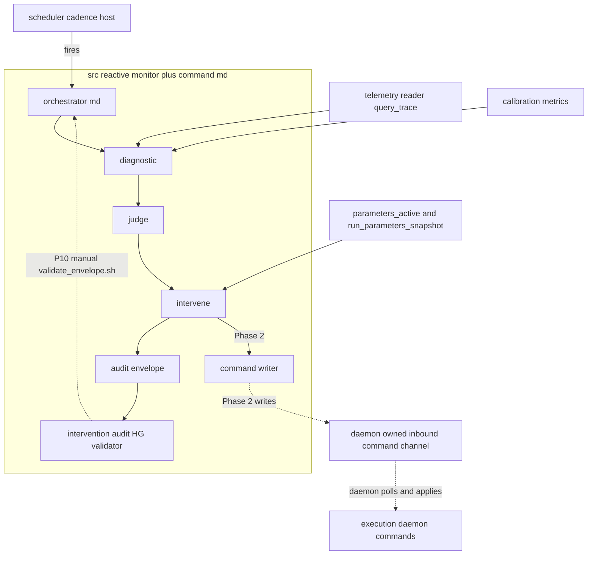
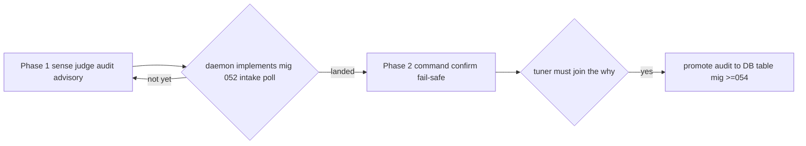

# Design Document — in-session-monitor

> Source: requirements.md (9 EARS reqs) + research.md (gap analysis, Option C adopted). Light discovery (Extension / complex integration); no external dependencies to verify — all reuse is in-repo. Background lives in `research.md`; this document is the self-contained contract.

> **Reconciled 2026-05-30 vs `execution-daemon` design Revision 2 + 2.1 (commits `2920570`, `480f0a6` — APPROVED).** The daemon **closed the command-transport gap**: the inbound channel is the daemon-owned `execution_daemon_command_intake` table (mig 052), polled first each cycle, applied through the gated seams, marked `applied_at` / `status` / `reject_reason`. Consequences folded in below: (1) **Phase 2 contract exists** — gates only on the daemon *implementing* mig 052 + the intake poll (build-order). (2) **Toward-safer guard is daemon-enforced** (resolves OQ #5); the monitor keeps its own guard as defense-in-depth (P6). (3) **Only three command types — no restart/clear-state seam** (OQ #6): wedged-component → engage-kill-switch + operator-surface. (4) Confirm (R6.1) = poll `applied_at` / `status` / `reject_reason`. (5) The monitor MAY take a **read-only event view** of `execution_daemon_event_queue` (never draining). **From Rev 2.1:** (6) **Command-intake write-authorization** — the intake is a control channel into a levered session; the monitor (the *commander*) stamps `issued_by`, the daemon validates it against an allowlist at apply-time, and a **dedicated DB role/grant is mandated before any live cutover** (v0.1 paper accepts a permissive default; residual halt-DoS via spurious `engage_kill_switch` accepted eyes-open). (7) The daemon mints `run_id` from its own `execution_daemon_epoch` table (not `run_parameters_snapshot`) — so the audit's 4 correlation keys are the **daemon epoch keys read from the analyzed trace**, distinct from the monitor's own orchestration run_id; and the monitor's `MonitorParams` pin **must not** write a `run_parameters_snapshot` row either (same anti-contamination rationale).

## Overview

**Purpose**: The In-Session Monitor is the scheduled, in-session supervisory LLM loop of the reactive CFD layer (§15). On a regular cadence it reads the model's decision-trace telemetry, judges whether the model is behaving inside its calibrated envelope (derived from calibration diagnostics, P15), and — when it drifts while still inside hard-survival limits — intervenes by commanding the **existing** deterministic mechanisms (kill switch / safe mode / versioned-config selection), then resumes. It never fits (fitting is after-market, §14.4) and is never the survival mechanism (the deterministic reflex fires first, independently).

**Users**: the operator (unattended paper supervision); the after-market `walkforward-tuning-loop` (joins the monitor's intervention audit to the model trace via the 4 keys).

**Impact**: adds the first **scheduled supervisory orchestration** over the (in-build) fast reactive layer. It introduces no new decision logic in the live path — it senses, judges, audits, and (when the daemon channel exists) emits gated commands. v0.1 is **paper-only**.

### Goals
- Catch sub-survival behavioral drift (e.g. calibration breakdown) between the weeks-apart tuning boundaries.
- Express every intervention as a command into an existing mechanism (no new mutation path), conservative-only, reflex-second.
- Emit a falsifiable, key-correlated intervention audit (own surface, P11/P15).

### Non-Goals
- Fitting / validating / publishing any version (`walkforward-tuning-loop`).
- The deterministic survival reflex, the command *application*, and the atomic hot-swap (`survival-gate` / `execution-daemon`).
- Owning the kill-switch / safe-mode / config-select mechanisms or the model-trace schema (consumed, not owned).
- Real-time halt / gap detection (`survival-gate` R7, out of boundary).
- The cadence scheduler **host** infrastructure (harness-level; this spec defines the cadence requirement, not the cron).

### Why one spec, not two (phasing is rollout, not a missed boundary split)
Phase 1 (sense + judge + audit) and Phase 2 (command + confirm) are **one coherent capability** — a single sense→judge→act→audit loop sharing the same `types`, `judge`, and `audit` core; the only Phase-2 delta is wiring the already-decided `InterventionIntent` to a transport. They are roadmap-committed as one spec (§15). Phasing exists solely because Phase 2's transport target (`execution-daemon`) is not yet built — a rollout constraint, not two independent responsibility seams.

## Boundary Commitments

### This Spec Owns
- The scheduled supervisory loop (`.claude/commands/in-session-monitor.md`) and its run-level parameter pin (P2/P3).
- The **behavioral-judgment computation**: the calibration-drift diagnostic over telemetry, and the envelope verdict + anomaly classification (derived-only, P15).
- The **intervention-decision mapping**: verdict → `InterventionIntent`, bounded to §15 reading #2 (operational + select-pre-validated-config), conservative-only, never-fit.
- The **intervention-audit record**: its shape, its persistence (envelope), and its HG validator (`src/eval/gates/intervention_audit_shape.py`).
- The **writer-side command contract** (the `InterventionCommand` payload the monitor produces) — *not* the channel that carries it.

### Out of Boundary
- The **inbound command-channel table** (`execution_daemon_command_intake`, mig 052) and the daemon's poll-validate-apply-mark wiring — **owned by `execution-daemon`** (symmetric with its outbound `execution_daemon_event_queue`; the daemon is the single reader-applier; the **toward-safer guard is daemon-enforced**). Landed in the daemon design Revision 2 (`2920570`). This design owns only the writer-side row + the confirm read; no DDL or guard logic for it is specified here.
- The deterministic reflex, the command *application* (`commands.py`), the atomic hot-swap, persist-then-act — `execution-daemon` / `survival-gate`.
- The mechanisms' state (`survival_gate_state` / `_events`, migs 049/050) — `survival-gate`.
- The model-trace schema, the 4-key contract, the outcome ledger (mig 048) — `decision-trace-telemetry` (reader only).
- Version fitting/validation + the registry write — `walkforward-tuning-loop`.

### Allowed Dependencies
- **Import (pure)**: `src/calibration/metrics.py` (`brier_score`, `reliability_diagram`, `expected_calibration_error`); `src/calibration/scorer.py::Label` (P9).
- **Read**: `src/reactive/telemetry/reader.py::query_trace(filters, conn)` + `schema.py::CorrelationKeys` (the 4 keys); `parameters_active` view (mig 004) + `run_parameters_snapshot` (mig 034) for the validated-version menu.
- **Framework**: `src/eval/gates/` (register one new validator in `_registry.py`); `scripts/validate_envelope.sh` (P10 manual validate seam); the `_dsn()` + `.transaction()` + `conn=None` dry-run convention (`src/shared/regime_sidecar/persistence.py`); the per-`(run_id, agent)` cost ceiling (`orchestrator_step.py`).
- **Dependency direction (strict, left→right)**: `types → diagnostic → judge → intervene → {audit, command_writer}`; the orchestrator drives them; nothing imports a consumer. **Forbidden**: importing `execution-daemon` / `walkforward-tuning-loop`; writing `decision_process_trace` or `survival_gate_state`; minting a new mutation path.

### Revalidation Triggers
- The 4 correlation keys / `CorrelationKeys` shape change (telemetry) → diagnostic + audit re-check.
- **The `execution_daemon_command_intake` row shape (incl. `issued_by` + the allowlist/write-auth contract), the `applied_at`/`status`/`reject_reason` markers, or the `select-validated-config` semantics change** → `command_writer` re-check. The daemon design Revision 2.1 names this the **shared seam with `in-session-monitor`** (a rename either side is a cross-spec break). *(Phase 2 gates only on the daemon **implementing** mig 052 + the intake poll — the contract is approved; no further daemon design reopen required.)*
- **The validated-version "menu" contract (`walkforward-tuning-loop` → P2 registry) is not yet stable** — walkforward's design + the new `reactive-replay-harness` split are in progress (uncommitted at time of writing). Revalidate `intervene`'s `SELECT_SAFER_CONFIG` registry-read against the menu shape once walkforward's design lands.
- **Per-version `in_sample_baseline` ownership** — v0.1 has the monitor compute the baseline itself (Issue 1 decision). If `walkforward-tuning-loop` publishes a per-version validated baseline with the menu, **switch the monitor to read it** rather than recompute, to avoid two components deriving "the validated baseline" differently.
- The validated-version menu semantics in `run_parameters_snapshot` change (walkforward) → `intervene` re-check.
- `src/calibration/metrics.py` signatures change → diagnostic re-check.
- The daemon's three command seams change → `intervene` + `command_writer` re-check.

### Architecture Pattern & Boundary Map
Selected pattern: a **scheduled sense→judge→act→audit supervisory loop** — a markdown orchestrator driving pure leaf modules (P1; mirrors `src/reactive/daemon/`'s leaf decomposition). Rationale: P14 inner-ring testability of each pure stage; P1 leaf modules; no orchestration logic in Python.


Key decisions: the daemon-owned inbound channel (dashed) is **out of boundary** — the monitor only writes the `InterventionCommand` contract into it. The audit validator is invoked via the **P10 manual seam** (`scripts/validate_envelope.sh`), not the PostToolUse hook, because the monitor is a main-session orchestration with no `Agent()` to hook (exactly the `/research-company` §2.5.7 case).

### Technology Stack
| Layer | Choice | Role | Notes |
|-------|--------|------|-------|
| Orchestration | Claude Code slash-command (markdown) | the cadence loop | P1; fired by a scheduler (host out of boundary) |
| Leaf logic | Python 3 (type-hinted, pure dataclasses) | diagnostic / judge / intervene / audit | inner-ring testable, no LLM/MCP/DB in pure cores |
| Data / read | psycopg3 (`_dsn()` convention) | telemetry + version-menu reads | direct, `conn=None` dry-run |
| Validation | `src/eval/gates` HG framework | audit-envelope shape gate | presence-only (P13) + golden-shape unit test |

## File Structure Plan

### Directory Structure
```
.claude/commands/
└── in-session-monitor.md      # NEW: scheduled orchestration — cadence loop, run_id mint + P2 snapshot pin, sense->judge->intervene->audit, P10 validate seam, Phase-2 command+confirm
src/reactive/monitor/          # NEW subpackage (sibling to daemon/ and telemetry/)
├── __init__.py
├── types.py                   # EnvelopeVerdict, DriftDiagnostic, InterventionIntent, InterventionCommand, InterventionAudit, MonitorParams
├── diagnostic.py              # query_trace read + calibration metrics over a window -> DriftDiagnostic (1.2, 2.1, 9.1)
├── judge.py                   # pure: DriftDiagnostic + MonitorParams -> EnvelopeVerdict + anomaly classification, derived-only (2.2-2.4, 7.2)
├── intervene.py               # pure: verdict -> InterventionIntent; conservative-only; select-safer-validated; never-fit (3.1-3.3, 5.1, 9.3)
├── audit.py                   # build + persist InterventionAudit envelope; conn=None dry-run; 4-key tag (7.1-7.4)
└── command_writer.py          # Phase 2: write InterventionCommand to the daemon channel; confirm + fail-safe; Phase 1 = advisory no-op recording intent (4.x, 6.x, 9.2, 9.4)
src/eval/gates/
└── intervention_audit_shape.py # NEW: HG validator for the audit envelope (7.4; P11/P13 presence-only)
tests/unit/reactive/monitor/
├── test_diagnostic.py         # calibration over window; insufficient-data path
├── test_judge.py              # threshold->verdict; derived-only; insufficient-data verdict
├── test_intervene.py          # authority bounds; conservative-only never-loosen; select-safer; never-fit
├── test_audit.py              # envelope shape, 4-key tag, falsifiable fields, dry-run
└── test_command_writer.py     # Phase 1 advisory no-op; Phase 2 confirm-and-fail-safe, reject-direct-mutation
tests/unit/eval/gates/
└── test_intervention_audit_shape.py  # HG validator presence/shape (golden envelope)
```

### Modified Files
- `src/eval/gates/_registry.py` — register the runner: append to `REGISTRY["intervention_audit"]` (pure data edit per the registry's contract).

### Out-of-boundary dependency (NOT modified here — requires a separate `execution-daemon` amendment)
- The daemon-owned **inbound command channel** (table + the daemon `loop` poll that builds a `CommandRequest` and routes it through `commands.py`). Phase 2 is blocked until this lands. This design specifies only the **writer-side `InterventionCommand` contract** the monitor produces.

## System Flows

**Per-cadence supervisory tick (single pass):**
```mermaid
sequenceDiagram
    participant S as Scheduler
    participant O as Orchestrator md
    participant D as diagnostic
    participant J as judge
    participant I as intervene
    participant A as audit
    participant C as command_writer Phase2
    S->>O: fire cadence tick (run_id minted, params pinned)
    O->>D: read recent trace plus calibration
    D-->>O: DriftDiagnostic (or insufficient)
    O->>J: classify envelope
    J-->>O: EnvelopeVerdict
    alt in-envelope or insufficient data
        O->>A: emit audit (no-intervention) and stop
    else drifted and actionable
        O->>I: map to InterventionIntent (conservative-only)
        I-->>O: InterventionIntent
        O->>C: Phase2 write command and await confirm
        C-->>O: applied or fail-safe escalate-to-halt
        O->>A: emit audit (why plus command_ref)
    end
    O->>O: P10 validate_envelope.sh on audit; patch on RETRY
```
Gating notes: insufficient telemetry → no verdict, no intervention (2.4). Drift is acted on only while inside hard-survival limits — the deterministic reflex owns the survival band and has already fired independently (5.3). In Phase 1, `command_writer` records the would-be intent advisorily (no live channel); the audit still emits.

## Requirements Traceability

Phase column is load-bearing: **Phase 2 rows are gated on an `execution-daemon` amendment that does not yet exist** — they are design-complete, not yet implementable.

| Req | Summary | Components | Phase |
|-----|---------|------------|-------|
| 1.1 | scheduled cadence dispatch | orchestrator | 1 |
| 1.2 | read trace + calibration | diagnostic | 1 |
| 1.3 | not in survival hot path | orchestrator (invariant) | 1 |
| 1.4 | never fit in-session | intervene (guard) | 1 |
| 2.1 | derived diagnostic | diagnostic | 1 |
| 2.2 | classify sub-survival drift | judge | 1 |
| 2.3 | derived-only, falsifiers (P15) | judge | 1 |
| 2.4 | insufficient-data → no verdict | diagnostic, judge | 1 |
| 3.1 | operational authority (halt/tighten; restart = operator-surfaced, no daemon seam) | intervene → command_writer + audit operator_action_required | 1 intent / 2 act |
| 3.2 | select-pre-validated-config | intervene | 1 intent / 2 act |
| 3.3 | never fit / never select-unvalidated | intervene (guard) | 1 |
| 3.4 | never block a true exit | command_writer, daemon (enforces) | 2 |
| 4.1 | command via existing mechanisms only | command_writer | 2 |
| 4.2 | no direct mutation | command_writer | 2 |
| 4.3 | daemon applies via hot-swap | command_writer + daemon | 2 |
| 5.1 | conservative-only | intervene (guard) | 1 guard / 2 enforced |
| 5.2 | don't relax engaged reflex | command_writer | 2 |
| 5.3 | reflex-first / second-line | orchestrator (invariant) | 1 |
| 6.1 | confirm command took effect | command_writer | 2 |
| 6.2 | fail-safe escalate on no-confirm | command_writer | 2 |
| 6.3 | verify healthy before resume | command_writer, orchestrator | 2 |
| 7.1 | emit intervention audit | audit | 1 |
| 7.2 | falsifiable + derived (P15) | audit, judge | 1 |
| 7.3 | tag 4 correlation keys | audit | 1 |
| 7.4 | own surface; separate from trace | audit, intervention_audit_shape | 1 |
| 8.1 | autonomous, no per-intervention sign-off | orchestrator | 1 |
| 8.2 | always under kill switch | orchestrator (invariant) | 1/2 |
| 8.3 | per-(run_id,agent) cost ceiling | orchestrator | 1 |
| 8.4 | paper-only | orchestrator (invariant) | 1 |
| 9.1 | read via landed surface + 4 keys | diagnostic | 1 |
| 9.2 | command only via daemon seams | command_writer | 2 |
| 9.3 | select only from published registry | intervene | 2 |
| 9.4 | defined channel; manual kill-switch interim backstop | command_writer (boundary) | 2 |
| 9.5 | revalidate on upstream contract change | boundary (all) | 1/2 |

## Components and Interfaces

| Component | Layer | Intent | Reqs | Key Deps (P0/P1) | Contracts |
|-----------|-------|--------|------|------------------|-----------|
| diagnostic | leaf | trace → calibration drift figure | 1.2, 2.1, 2.4, 9.1 | telemetry reader (P0), calibration metrics (P0) | Service |
| judge | leaf | drift figure → envelope verdict | 2.2-2.4, 7.2 | diagnostic (P0) | Service |
| intervene | leaf | verdict → bounded InterventionIntent | 3.1-3.3, 5.1, 9.3 | judge (P0), version menu (P1) | Service |
| audit | leaf | persist falsifiable audit envelope | 7.1-7.4 | intervene (P0) | State |
| command_writer | leaf | Phase 2 emit command + confirm/fail-safe | 4.x, 6.x, 9.2, 9.4 | daemon channel (P0, out-of-boundary) | Service, State |
| intervention_audit_shape | gate | presence-only HG validation of the audit | 7.4 | gate framework (P0) | Service |
| orchestrator | md | the cadence loop + P10 validate | 1.1, 1.3, 5.3, 8.x | all leaves (P0) | Batch |

### Leaf — `diagnostic`
**Responsibilities & Constraints**: read recent trace via `query_trace` **filtered to the active `(code_version, param_version)`** (Issue 1 — calibration is meaningless across a hot-swap; the keys + index exist in mig 048, and `query_trace` already filters on them), extract per decision-row the softmax `probability` + realized outcome **and the derived survival-proximity fields** (`liq_proximity`, `stop_out`, `gate_link`), compute calibration over the version-scoped window (`brier_score`, `reliability_diagram`, `expected_calibration_error`) **with the block-bootstrap CI**, and compare against **that version's** `in_sample_baseline` in `MonitorParams`. A window that would cross a hot-swap is **restricted to the current version** (the prior version's rows are not mixed in). Return a `DriftDiagnostic` (per-metric observed value + CI + survival-proximity summary, tagged with the analyzed version keys) or an explicit insufficient-data result when `N < min_observations` (2.4) — **note: immediately after a hot-swap the current-version window is below `min_observations`, so the monitor is correctly INSUFFICIENT/blind until it refills** (expected, not a defect). Pure read; no write; reuses landed metrics (no reimplementation).
```python
def compute_drift(filters: dict, params: MonitorParams, conn=None) -> DriftDiagnostic: ...
# DriftDiagnostic carries: per-metric (observed, ci_low, ci_high), baseline, window_n, in_survival_band: bool, sufficient: bool.
# Postconditions: sufficient is False when window_n < params.min_observations.
```

### Leaf — `judge`
**Responsibilities & Constraints**: pure map `DriftDiagnostic + MonitorParams -> EnvelopeVerdict {state: IN_ENVELOPE | DRIFTED | INSUFFICIENT, severity, binding_metric}`.
**Drift-decision rule (Issue 1 — structure fixed here; all numeric values are P2-pinned `MonitorParams`, never asserted, P15):** a metric is **DRIFTED** when its block-bootstrap CI **excludes the pinned in-sample baseline by at least margin `M`** over a rolling window of `W` closed decisions; the primary metric is reliability/Brier, with ECE corroborating. `severity` is the bootstrap-distance from baseline, banded by P2-pinned cutoffs (`mild` / `severe`). `INSUFFICIENT` when `diag.sufficient` is False (2.4) → no verdict, no intervention.
**Survival-band gate (Issue 2):** the judge produces an actionable verdict **only when `diag.in_survival_band` is False** — i.e. inside survival limits, determined from the trace's derived `liq_proximity` / `stop_out` / `gate_link` (already consumed by `diagnostic`), **never** from `survival_gate_state` (out of boundary). The survival band is the deterministic reflex's, not the monitor's (5.3).
Verdict figures are **derived** from the diagnostic only; no asserted probability (2.3, 7.2). `intervene` consumes `severity` for the verdict→intent mapping.
```python
def classify(diag: DriftDiagnostic, params: MonitorParams) -> EnvelopeVerdict: ...
```

### Leaf — `intervene`
**Responsibilities & Constraints**: pure map `EnvelopeVerdict -> InterventionIntent`, bounded to the §15 reading-#2 authority and the daemon's **three** intake command types: operational `HALT_NEW_ENTRIES` / `TIGHTEN_SAFE_MODE` (→ engage-kill-switch / set-safe-mode-grade) and configuration `SELECT_SAFER_CONFIG` (→ select-validated-config). **Verdict→intent mapping (severity-banded; cutoffs P2-pinned):** IN_ENVELOPE / INSUFFICIENT → `NONE`; `mild` DRIFTED → `SELECT_SAFER_CONFIG` if a safer registry version exists, else `TIGHTEN_SAFE_MODE` (least-disruptive that restores the envelope); `severe` DRIFTED (calibration collapse) → `HALT_NEW_ENTRIES`. **Conservative-only invariant** (5.1): an intent not equal-or-more-conservative than the active state is rejected (`NONE`) — a monitor-side guard that is **redundant with the daemon's toward-safer guard** (defense in depth, P6). `SELECT_SAFER_CONFIG` chooses only among versions in the validated-version menu (9.3), toward-safer; never fits (1.4, 3.3). **Wedged-component response** (3.1): the daemon exposes no restart/clear-state seam (Revision 2 reconciliation), so a wedged component maps to `HALT_NEW_ENTRIES` (engage-kill-switch) **plus a surface-to-operator flag** in the audit — the restart itself is operator-executed, not commanded.
```python
def decide(verdict: EnvelopeVerdict, active: ActiveState, menu: list[VersionRef], params: MonitorParams) -> InterventionIntent: ...
# Invariant: result.severity <= active.severity is forbidden to decrease conservatism.
```

### Leaf — `audit`
**Responsibilities & Constraints**: build the `InterventionAudit` (triggering diagnostic + falsifiable rationale + the 4 keys + `applied` + optional `command_ref`) and persist it as an envelope. **The 4 correlation keys are the daemon `execution_daemon_epoch` keys of the single analyzed `(code_version, param_version)`** (Issue 1 — one version per audit), read from the analyzed trace rows (Rev 2.1), so the audit joins the model trace + ledger (7.3) — distinct from the monitor's own orchestration run_id used only to name the envelope. **`applied: bool` is the unmistakable advisory-vs-live signal** (Issue 2): Phase 1 always `applied:false` with `command_ref:null` ("NO ACTION TAKEN"); Phase 2 sets `applied:true` + `command_ref` only after the intake row confirms `status=applied`. Owns the **why** only — the daemon emits the command **what** as a `command`/`safe_mode`/`kill_switch` event; the two join via the 4 keys (7.4). `conn=None` dry-run. Append-only by convention (one per tick).
```python
def emit_audit(audit: InterventionAudit, conn=None) -> dict: ...   # path: memos/envelopes/in-session-monitor__<run_id>.json
```

### Leaf — `command_writer` (Phase 2)
**Responsibilities & Constraints**: serialize an `InterventionCommand` (incl. **`issued_by`** = the monitor's commander identity, Rev 2.1 write-auth) and **INSERT it as a row into the daemon-owned `execution_daemon_command_intake`** (mig 052); **confirm it took effect by polling the row's `applied_at` / `status` / `reject_reason`** before treating it as applied (6.1); on no-confirm or `status=rejected`, **escalate to the always-available halt and surface to the operator** (6.2); never carry a direct-mutation payload (4.2 — also daemon-rejected).
**Idempotency vs. single-flight (Issue 2 — distinct mechanisms, both stated):**
- *Idempotency* (crash/retry safety): `command_id` is a stable `uuid5(version-epoch-keys + intent_type)` — hashed over **stable identity, NOT the rolling window edge** (which moves every tick) — so re-running the *same logical command* dedups via `ON CONFLICT (command_id) DO NOTHING` (mirrors `decision_process_trace.trace_id`).
- *Single-flight* (don't issue B while A is unconfirmed): **skip-if-outstanding** — before issuing, the writer reuses its confirm-read to check for its own unapplied row in the intake and **skips this tick if one exists**. Overlap is additionally benign: the daemon serializes intake and applies toward-safer, so a later `HALT_NEW_ENTRIES` simply supersedes an earlier `TIGHTEN_SAFE_MODE` — the worst case is bounded, not a double-mutation. *(No new `monitor_state` table — the intake read is sufficient.)* The daemon polls the intake first each cycle, validates `issued_by` against its allowlist, and enforces the toward-safer guard, so a just-issued command is observed before any admit. **Write-authorization (Rev 2.1):** v0.1 paper uses a permissive grant; a **dedicated DB role for the commander is mandated before live cutover** (§Security). **Phase 1**: an advisory no-op recording the would-be intent into the audit only (mig 052 not yet implemented). It is the single seam that breaks if the `execution_daemon_command_intake` row shape changes (Revalidation).
```python
def submit_command(cmd: InterventionCommand, conn=None) -> CommandResult: ...  # Phase 1: returns ADVISORY, writes nothing live
```

### Gate — `intervention_audit_shape`
**Responsibilities & Constraints**: presence-only HG validator (P13) for the audit envelope: requires the 4 keys, `trigger_diagnostic`, `verdict`, `intervention_intent`, `rationale` (with `falsifiers`), `event_ts`. Registered as `REGISTRY["intervention_audit"]`. Type-correctness is enforced by the dataclass + a golden-envelope unit test (P14), not by HG-23 (P13).
```python
def validate_intervention_audit_shape(audit: dict, run_id: str | None = None) -> InterventionAuditResult: ...
```

### Orchestration — `in-session-monitor.md`
**Responsibilities & Constraints**: mint `run_id` (P3); pin `MonitorParams` from `parameters_active` under REPEATABLE READ into a snapshot row (P2); run diagnostic→judge→intervene; emit audit; (Phase 2) submit command + confirm/fail-safe; then **validate the audit envelope via `scripts/validate_envelope.sh`** (P10 manual seam — the orchestrator's own LLM patches the envelope on RETRY, exactly as `/research-company` §2.5.7). Autonomous (8.1), under the operator kill switch (8.2), bounded by the per-`(run_id, agent)` cost ceiling (8.3), paper-only (8.4). Never participates in the order-fire decision (1.3).

## Data Models

### Owned — `InterventionAudit` (envelope on disk; Physical: JSON)
| Field | Type | Notes |
|-------|------|-------|
| keys | CorrelationKeys | run_id, code_version, param_version, walk_forward_window (7.3) |
| trigger_diagnostic | dict | metric, observed, threshold, window_n (derived; 7.2) |
| verdict | str | IN_ENVELOPE \| DRIFTED \| INSUFFICIENT |
| intervention_intent | str | NONE \| HALT_NEW_ENTRIES \| TIGHTEN_SAFE_MODE \| SELECT_SAFER_CONFIG (the 3 daemon command types + NONE) |
| operator_action_required | str \| null | e.g. `restart_wedged_component` — surfaced when the response needs an out-of-band operator action the daemon has no seam for (3.1) |
| rationale | dict | hypothesis + `falsifiers: list[str]` (P15) |
| applied | bool | Issue 2 advisory-vs-live signal: `false` in Phase 1 (NO ACTION TAKEN) and until confirmed; `true` only after the intake row reports `status=applied` |
| command_ref | str \| null | Phase 2: the intake `command_id` (the *what*); null in Phase 1 |
| event_ts | str | ISO 8601 |

**Persistence decision (P11 trigger)**: envelope-on-disk for Phase 1/v0.1 (reuses the agent-envelope + HG-validator pattern; no migration). **Promote to a DB table (migration ≥054) the moment a consumer must *join* the monitor's why to the trace/ledger** — i.e. when `walkforward-tuning-loop` reads intervention rationale across sessions (P11: cross-agent persistent state goes through DB tables). Coordinate the migration number with walkforward's "053+".

### Owned (writer-side only) — `InterventionCommand`
The row the monitor INSERTs into `execution_daemon_command_intake`: `{command_id, command_type: engage-kill-switch | set-safe-mode-grade | select-validated-config, args: dict (e.g. safe-mode grade, or the registry version_ref), run_id, issued_by, requested_at}` — `command_id = uuid5(version-epoch-keys + intent_type)` (stable identity for idempotent re-issue, deliberately **not** the rolling window); `issued_by` is the commander identity the daemon validates against its allowlist (Rev 2.1). The **table, the `applied_at`/`rejected` markers, the poll, and the toward-safer guard are all daemon-owned** (mig 052, Revision 2 — out of boundary). This design fixes only the row the writer emits and the marker it reads back to confirm (6.1). The `select-validated-config` `version_ref` must reference a member of the validated-version menu — the daemon rejects a non-member or a survival-loosening selection.

### Owned — `MonitorParams` (P2-pinned by value at run start; values calibrated empirically, never asserted — P15)
The drift-rule knobs the design references structurally but does not fix numerically: `min_observations` (window floor for sufficiency), `window_W` (rolling closed-decision count), `margin_M` (baseline-exclusion margin), `severity_cutoffs` (mild/severe bands), `in_sample_baseline` (the **per-version** reference), `cadence_seconds`. Resolved from `parameters_active` (a new `monitor.*` namespace) under REPEATABLE READ and consumed by value, never re-resolved mid-tick (P2). **It does NOT write a `run_parameters_snapshot` row** (Rev 2.1 anti-contamination, mirroring the daemon's `execution_daemon_epoch` decision): the monitor pins `monitor.*` into its own context/envelope so it never touches the `/research-company` LLM-run lifecycle (`run_status`) or the P6 orphan reconciler.

**Baseline-ownership decision (deliberate, Issue 1):** `in_sample_baseline` is **per `(code_version, param_version)`**. For **v0.1 the monitor computes it itself** from that version's own in-sample `counterfactual_ledger` rows (`WHERE code_version=? AND param_version=? AND event_ts <= the version's in-sample boundary`) — self-contained, with **no dependency on the still-unstable `walkforward-tuning-loop` menu**. The validated baseline logically belongs to the tuner (it promoted the version on its OOS calibration), so this is a **Revalidation Trigger**: switch to reading the tuner's *published* per-version baseline if/when walkforward's menu carries one, to avoid two components computing "the validated baseline" differently.

### Reused (read-only, not owned)
- `decision_process_trace` via `query_trace` (mig 048) — the behavioral substrate (incl. the derived `liq_proximity` / `stop_out` / `gate_link` used for the survival-band gate).
- `parameters_active` (mig 004) + `run_parameters_snapshot` (mig 034) — the validated-version menu (9.3). Menu semantics ("which row is validated-and-selectable") are deferred to `walkforward-tuning-loop` design — a Revalidation Trigger.

## Error Handling

### Strategy — fail toward halt + surface (mirrors the layer's fail-toward-minimum-exposure)
- **Insufficient telemetry** (2.4): no verdict, no intervention; emit a no-intervention audit recording the insufficiency.
- **Command unconfirmable** (6.2, Phase 2): escalate to the always-available halt and surface to the operator; never assume success. If even the halt is undeliverable (channel down), the operator's manual kill switch (§11.5) is the interim backstop (9.4).
- **Audit validation RETRY** (P10): the orchestrator's LLM patches the envelope per `validate_envelope.sh` stderr and re-validates (bounded), exactly as `/research-company` §2.5.7.
- **Conservative-only violation** (5.1): a non-conservative intent is a programmer/logic error → rejected to `NONE` in `intervene`, asserted in unit tests.

### Monitoring
The audit envelope is the monitor's record. The command *what* is the daemon's event-queue record. No separate logging contract.

## Security Considerations

The intake is a **control channel into a live levered session** (Rev 2.1, Issue 3). The monitor is the out-of-process commander, so:
- Every `InterventionCommand` carries `issued_by`; the daemon validates it against a configured allowlist at apply-time and rejects unknown issuers.
- **v0.1 paper**: a documented permissive DB grant is accepted (paper-only is enforced today by the broker/daemon `RuntimeMode` flag, not by this channel).
- **Documented pre-live precondition** (not an enforced gate — the repo has no automated paper→live cutover gate today; cutover is operator-manual per §11.5): before any live real-money run, the commander must run under a **dedicated `in_session_monitor_role`** with INSERT-only on `execution_daemon_command_intake`. The **enforcement mechanism** — a `BEFORE INSERT` auth trigger checking `current_user`/`issued_by` against a `daemon_authorized_writers` control table (mirroring the mig 003/048 append-only guard pattern) — is the **daemon's to build** (cross-spec suggestion to `execution-daemon`; out of this spec's boundary, which owns only the `issued_by` stamp + the operating-under-a-restricted-role precondition).
- **Residual (accepted eyes-open, paper)**: a spurious `engage_kill_switch` is a halt-DoS (it can only tighten/halt or select a registry member — never loosen, by the daemon's toward-safer guard), so blast radius is bounded to availability, not exposure.

## Testing Strategy

### Unit (inner-ring, no LLM/MCP/live-DB — `tests/unit/reactive/monitor/`)
- **diagnostic (1.2, 2.1, 2.4)**: calibration computed over a window from synthetic trace rows; **version-scoping — a window spanning two `(code_version, param_version)` epochs uses only the current version's rows**; baseline is the active version's; `sufficient=False` below `min_observations` (incl. the post-hot-swap blind window).
- **command_writer (3.x, 4.2, 6.1, 6.2)**: `command_id` stable across ticks for the same `(version-keys, intent_type)` but differs across intents; re-issue dedups (`ON CONFLICT`); **single-flight skip when an unapplied row exists**; advisory `applied:false`/`command_ref:null` in Phase 1; confirm reads `applied_at`/`status`; `status=rejected` → escalate-to-halt.
- **judge (2.2, 2.3, 2.4)**: threshold→verdict transitions; verdict figures derived-only (no asserted probability); INSUFFICIENT propagates.
- **intervene (3.1-3.3, 5.1, 9.3)**: authority bounded to the four intents; conservative-only — a loosening intent is rejected; `SELECT_SAFER_CONFIG` only from the menu and only toward-safer; never-fit.
- **audit (7.1-7.4)**: envelope carries all 4 keys + falsifiers; `conn=None` dry-run writes nothing; the why/what separation (no model-trace write).
- **intervention_audit_shape (7.4)**: golden-envelope presence pass; missing-key reject.

### Integration (`integration_live`, gated on the daemon — Phase 2)
- **command_writer round-trip (4.1, 6.1)**: write→daemon-applies→confirm, against the daemon's inbound channel when it lands.
- **fail-safe (6.2)**: unconfirmable command → escalate-to-halt path fires.

### Contract / boundary
- **consumption read-only (9.1, 9.2, 9.3)**: the monitor reads the trace + menu and writes only the audit (+ Phase-2 command) — never the trace or survival state.

## Migration / Rollout (phased — Option C)


- **Phase 1** (buildable now): sense+judge+audit against landed telemetry+calibration; intervention advisory; no migration; fully inner-ring tested.
- **Phase 2** (contract landed, awaiting daemon implementation): the inbound command-intake **design contract exists** (`execution-daemon` Revision 2 — `execution_daemon_command_intake`, mig 052); Phase 2 gates only on the daemon **implementing** mig 052 + the intake poll (a build-order dependency, **not** a design reopen). `/kiro-spec-tasks` must mark Phase-2 tasks as depending on that daemon implementation landing.
- **Audit→table promotion**: a later, consumer-driven trigger (P11), not part of Phase 1/2.
