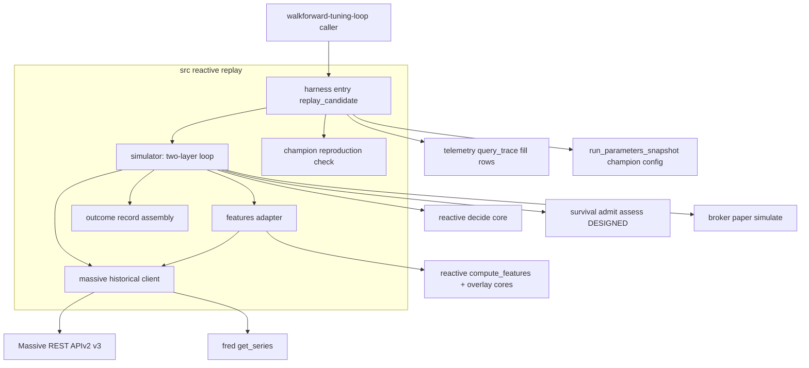

# Design Document — reactive-replay-harness

> Companion discovery notes in `research.md`. Self-contained for review. This spec is a **pure compute leaf** (`src/reactive/replay/`, sibling to `telemetry/`) — not an LLM orchestrator and not an MCP server. It drives the landed reactive cores + the (DESIGNED) survival cores + the landed paper-fill sim over a new Massive historical client.

## Overview

**Purpose**: The Replay Harness re-simulates one candidate trading config over one historical window to produce a per-period outcome record, so that `walkforward-tuning-loop`'s CPCV gate can score candidates out-of-sample without deploying them. Because a changed parameter makes a candidate take *different* decisions than the live system did, the harness is a **point-in-time counterfactual backtest engine**: it reconstructs the candidate's own decision-and-account path (re-fetching point-in-time data where it diverges), never replays recorded champion outcomes.

**Users**: `walkforward-tuning-loop` (primary — calls it per config per CPCV partition); potentially `in-session-monitor` and the eval-loop (the backtest primitive is reusable).

**Impact**: introduces the reactive layer's first backtest engine and its first deep-history market-data access. It reads existing surfaces only; it owns no live trading and no schema.

### Goals
- A deterministic, importable `replay_candidate(candidate, window) -> ReplayResult` primitive.
- Faithful counterfactual reconstruction: daily decisions (driven cores) + intraday account path (paper sim) + §16.1 flat-by-close + total-return P&L.
- A champion-reproduction fidelity precondition that gates trust in every number.

### Non-Goals
- CPCV partitioning, the survival-net metric, calibration scoring, the promotion gate, fit/trial-set, publish/audit (all `walkforward-tuning-loop`).
- Live/real-time trading and the real-time `massive` MCP path (`execution-daemon` / `/micro`).
- Reimplementing the reactive or survival decision logic (driven, never forked).
- Owning the decision-trace / `counterfactual_ledger` schemas (read-only).

## Boundary Commitments

### This Spec Owns
- The single-config, single-window backtest entry point and its `ReplayResult` / `OutcomeRecord` contract.
- The **two-layer simulation**: daily decision reconstruction (drive `decide`) + intraday account-path simulation (drive `paper.simulate` + survival `admit`/`assess`), honoring §16.1 intraday-flat.
- **Counterfactual** path reconstruction: re-fetch point-in-time inputs where the candidate diverges from the champion.
- A **direct Massive historical REST client** (bars/trades/quotes/grouped-daily/splits/dividends; `adjusted=false`; no look-ahead; pagination; delisted) + FRED rf-yield access.
- Total-return P&L with separate **dividend crediting**; fill realism at counterparty prices; intraday stop-hit determination.
- The **champion-reproduction fidelity** check (pass / fail / not-evaluable).

### Out of Boundary
- The CPCV partition scheme + which windows to replay; the survival-net metric + calibration; the DSR/PSR/PBO gate; fit; publish; audit (`walkforward-tuning-loop`).
- Live trading + the real-time `massive` MCP server (`execution-daemon` / `/micro`).
- The reactive + survival decision *logic* (driven via their landed/Designed cores, never reimplemented).
- The decision-trace + `counterfactual_ledger` schemas (read-only consumer; writes nothing).

### Allowed Dependencies
- **Drive (LANDED)**: `src.reactive.signal_model.decide`, `src.reactive.features.compute_features`, `src.reactive.params.ParamSnapshot`, `src.overlays.{tactical,flow,reversion}.bin_classifier`, `src.micro.indicators.atr`, `src.mcp.broker.paper.simulate` + `src.mcp.broker.mappers.map_decision_to_action`, `src.reactive.telemetry.reader.query_trace`, `src.calibration.scorer.Label`.
- **Drive (DESIGNED — stub in tests, revalidate on landing)**: `src.survival.gate.admit` / `assess` + `SurvivalParameters` / `AccountState` / `Position` / `OperationalState` / `ClockState`.
- **Read (LANDED)**: `decision_process_trace` (`kind=fill` rows) via `query_trace`; the champion's pinned config (`ParamSnapshot` + `SurvivalParameters`) from P2 `run_parameters_snapshot` by `param_version` (for champion re-sim); the `_dsn()` + `conn=None` dry-run convention; `src.mcp.fred` `get_series`. The harness does **not** read `counterfactual_ledger` — that table is the slow-layer 90d/1y/3y/5y Brinson-Fachler sector-excess scoring and structurally cannot express intraday-flat reactive P&L (§16.1); the fidelity baseline is fill rows only (see Data Models).
- **External**: Massive TradFi-stocks REST APIv2/v3 (`MASSIVE_API_KEY`, `MASSIVE_REST_URL` from `.env`); `httpx`. Mirror `src/mcp/broker/gate_client.py`'s structured-result / no-raise / rate-limit-from-headers transport pattern (apiKey auth, not HMAC).
- **Forbidden**: importing `walkforward-tuning-loop` / `execution-daemon` / `in-session-monitor`; the real-time `massive` MCP server; computing any metric/gate; writing any DB table; live order placement.

### Revalidation Triggers
- `decide` / `compute_features` / `ParamSnapshot` signature or `FeatureSet` shape change (`reactive-signal-model`).
- Survival `admit`/`assess` signature or `SurvivalParameters`/`AccountState`/`Position` shape change (`survival-gate`) — **the survival cores are DESIGNED-not-landed; this is the primary landing-revalidation**.
- `paper.simulate` interface or `map_decision_to_action` side-enum change (`broker-cfd-adapter`).
- `query_trace` filters, the fill-row payload fields (expected/actual_fill_price, fill_volume, counterparty_price), or the decision→fill `parent_trace_id` linkage (`decision-trace-telemetry`) — the fidelity baseline reconstruction depends on all three.
- Massive endpoint/param/auth shape (`/tradfi` is a moving product); the `adjusted` semantics; the per-request row cap.
- Decision vocabulary (LONG/SHORT/HOLD) or `Label` change; the §16.1 hold-lifecycle (intraday-flat) → the realized-outcome definition changes.

## Architecture

### Existing Architecture Analysis
Net-new (no generalized backtest engine exists; `scripts/backtest_reversion.py` + the overlay phase-1 harnesses are overlay-specific). It threads landed seams: the reactive decision + feature cores, the broker paper sim, the telemetry reader, the ledger, FRED. The only genuinely new code is the Massive historical client + the simulation/fidelity/outcome logic.

### Architecture Pattern & Boundary Map
Selected pattern: a **pure compute-leaf pipeline** with strict left→right dependency: `types → data_client → features_adapter → simulator → {outcomes, fidelity} → harness`. The `simulator` drives the landed/Designed cores; no leaf imports a consumer spec. The engine is pure relative to its fetched inputs (deterministic), enabling P14 inner-ring tests with stub cores + fixture data.



Key decisions (not restated from the diagram): decisions are **daily** (driven by the overlay feature cores), the account path is **intraday** (paper sim + survival), they meet in the `simulator`; the Massive client is a **direct REST leaf** (not MCP); fidelity reads the champion's recorded fills + the ledger read-only.

### Technology Stack
| Layer | Choice / Version | Role in Feature | Notes |
|-------|------------------|-----------------|-------|
| Compute leaf | Python 3.11 (`src/reactive/replay/`) | the backtest engine | pure relative to inputs; type-hinted; inner-ring testable |
| Driven cores | landed reactive + (DESIGNED) survival + landed broker paper sim | decisions, survival, fills | imported, never reimplemented |
| Data access | new direct Massive REST client (`httpx`) + landed FRED | point-in-time historical inputs | `gate_client.py` transport pattern; `adjusted=false` |
| Storage (read-only) | Postgres `decision_process_trace` (`kind=fill` rows) + `run_parameters_snapshot` | champion fill-rows baseline for fidelity; `counterfactual_ledger` NOT read (slow-layer sector-excess, §16.1) | `_dsn()` + `conn=None`; no writes |
| Test | pytest unit + `integration_live` | inner-ring (stub cores) + live Massive smoke | per `tests/conftest.py` marker |

## File Structure Plan

### Directory Structure
```
src/reactive/replay/              # NEW compute leaf (sibling to src/reactive/telemetry/)
├── __init__.py                   # exports replay_candidate (the harness entry)
├── types.py                      # Candidate, ReplayWindow, DataPort (protocol), OutcomeRecord, ReplayResult, FidelityResult (dependency root)
├── data_client.py                # implements DataPort: direct Massive historical REST client (bars/trades/quotes/grouped/splits/dividends; adjusted=false; pagination; no look-ahead) + FRED rf-yield; gate_client.py transport pattern
├── features_adapter.py           # assemble daily feature inputs (ticker daily adj-close + SPY + rf + OHLC) and call landed compute_features (caches param-independent features per day)
├── simulator.py                  # the two-layer loop: per day drive decide (candidate ParamSnapshot); on actionable, simulate intraday entry/fills via paper.simulate + survival admit/assess (candidate SurvivalParameters) + §16.1 flat-by-close; total-return P&L incl. dividends; reconstructs the divergent account path
├── outcomes.py                   # assemble per-period OutcomeRecord (decision, predicted prob, fills, total-return P&L, survival events, realized outcome/label); NO metric/gate
├── fidelity.py                   # champion-reproduction PURE COMPARATOR: compare simulated-champion records to recorded fills (FIFO-paired); pass / fail / not-evaluable (no I/O, no simulator import)
└── harness.py                    # replay_candidate(...) orchestrates leaves + the champion re-sim (reads P2 run_parameters_snapshot + champion fills, runs simulator, calls fidelity.compare); the contract walkforward calls

tests/
├── unit/reactive/replay/         # NEW per-module unit tests (stub cores + fixture data; no network/DB)
│   ├── test_data_client.py       # adjusted=false, point-in-time bound, pagination, fail-on-exceeds-depth (fixture transport)
│   ├── test_simulator.py         # daily decision + intraday path + §16.1 flat-by-close + divergence re-fetch (stub decide/survival/paper)
│   ├── test_outcomes.py          # record completeness; no metric computed
│   └── test_fidelity.py          # reproduce within tolerance -> pass; mismatch -> fail; sparse baseline -> not-evaluable
└── integration/test_replay_massive_live.py   # NEW integration_live: live Massive smoke (Advanced/Business tier) — the live-probe items
```

### Modified Files
- `.env.example` — document `MASSIVE_REST_URL` use by the historical client (the `MASSIVE_API_KEY` already exists for the real-time MCP).

> Dependency direction (strict, left→right): `types` (incl. the `DataPort` protocol) `→ data_client` (implements `DataPort`) `→ features_adapter → simulator → outcomes → harness`; `fidelity` is a **pure comparator** leaf (imports `types` only). `simulator` receives a `DataPort` **by injection** (the real `data_client` in prod, a fixture in tests) — preserving R9.2 isolation + enabling R2.2 on-demand divergent-name fetches; `simulator` imports the landed reactive `decide` + the DESIGNED survival cores + `broker.paper`/`mappers`. The **harness** orchestrates the champion re-sim: it reads the champion's pinned config from P2 `run_parameters_snapshot` (by `param_version`) + the champion fills via `telemetry.reader`, runs `simulator` on that config, then calls `fidelity.compare(...)`. `data_client` imports only `httpx` + FRED. Nothing imports a consumer spec, and **`fidelity` never imports `simulator`** (the harness orchestrates both).

## System Flows

### Two-layer replay (one config, one window)
```mermaid
sequenceDiagram
    participant H as harness
    participant D as data_client
    participant F as features_adapter
    participant S as simulator
    participant C as driven cores
    H->>D: prefetch daily bars (window + 252 lookback), splits/dividends, calendar
    loop each trading day in window
        S->>F: daily feature inputs as-of day D (point-in-time)
        F->>C: compute_features -> decide(candidate ParamSnapshot)
        C-->>S: ReactiveDecision (LONG/SHORT/HOLD + probability)
        alt actionable and survival admits
            S->>D: intraday bars/quotes for day D (re-fetch if divergent name)
            S->>C: paper.simulate fills + survival assess over the account path
            S->>S: §16.1 force-flatten before close; total-return P&L (credit dividends)
        end
        S-->>H: per-day OutcomeRecord
    end
    H->>H: fidelity check (champion version) before returning ReplayResult
```
Gating notes: the daily decision drives the candidate `ParamSnapshot`; the intraday account path drives the candidate `SurvivalParameters`; a HOLD or a survival reject yields a flat day. Intraday data is fetched only on actionable days (cost bound). The champion-reproduction fidelity is evaluated before trusting any candidate number.

## Requirements Traceability

| Requirement | Summary | Components | Contracts/Flows |
|-------------|---------|------------|-----------------|
| 1.1–1.3 | Single-config single-window; arbitrary window; param/code candidate | harness; types (Candidate, ReplayWindow) | Service |
| 2.1–2.3 | Counterfactual path; divergence re-fetch; sequential account + §16.1 | simulator; data_client (re-fetch) | replay flow |
| 3.1–3.3 | Drive reactive + survival cores; code track conditional; no reimplement | simulator; features_adapter | drives `decide`/`admit`/`assess` |
| 4.1–4.4 | Point-in-time, no look-ahead; split-unadjusted; fail-on-exceeds-depth; delisted + pagination | data_client | Massive client |
| 5.1–5.2 | Total-return P&L; separate dividend crediting; not dividend-adjusted | simulator; data_client (dividends) | P&L assembly |
| 6.1–6.2 | Fills at counterparty prices; intraday stop-hit | simulator (drives paper.simulate); data_client (quotes) | fill sim |
| 7.1–7.3 | Champion reproduction within tolerance; failure signal; not-evaluable on sparse baseline | fidelity; telemetry.reader (fill rows) | Service; State |
| 8.1–8.2 | Per-period outcome record; no metric/gate | outcomes; types (OutcomeRecord) | Service |
| 9.1–9.2 | Determinism; inner-ring isolation with stub cores | all leaves; tests | — |
| 10.1–10.3 | Read-only consumption; no CPCV/metric/gate/fit/publish; revalidate on shape change | harness boundary; data_client | — |

## Components and Interfaces

| Component | Layer | Intent | Req Coverage | Key Dependencies (P0/P1) | Contracts |
|-----------|-------|--------|--------------|--------------------------|-----------|
| harness | Leaf entry | Orchestrate leaves + the champion re-sim (reads P2 config + champion fills); `replay_candidate` | 1,7,10 | simulator (P0), fidelity (P0), run_parameters_snapshot (P1) | Service |
| data_client | Leaf | Point-in-time Massive historical REST + FRED | 4,5,6 | Massive REST (P0), httpx (P0), fred (P1) | Service |
| features_adapter | Leaf | Daily feature inputs + drive `compute_features` | 3 | reactive features+overlays (P0) | Service |
| simulator | Leaf | Two-layer loop; counterfactual path; P&L | 2,3,5,6 | decide (P0), survival admit/assess (P0, DESIGNED), paper.simulate (P0) | Service |
| outcomes | Leaf | Assemble the raw per-period record | 8 | types (P0) | Service |
| fidelity | Leaf (pure) | Champion-reproduction comparator (no I/O) | 7 | types (P0) | Service, State |

### simulator (the two-layer engine)
| Field | Detail |
|-------|--------|
| Intent | Reconstruct a candidate's counterfactual decision-and-account path over the window and produce per-day outcomes |
| Requirements | 2.1, 2.2, 2.3, 3.1, 3.2, 5.1, 6.1, 6.2 |

**Responsibilities & Constraints**
- **Daily layer**: for each trading day, drive `features_adapter` (point-in-time) then `decide(features, direction, candidate.snapshot)` → a `ReactiveDecision`. Param-independent features are cached and reused across candidates (only the aggregate→softmax→threshold recomputes).
- **Intraday layer**: on an actionable, survival-admitted decision, construct the `ProposedOrder`/`AccountState`, drive survival `admit` (candidate `SurvivalParameters`), simulate fills via `paper.simulate(intent, bid, ask, …)` against historical quotes (side via `map_decision_to_action`), drive `assess` across the account path, and **force-flatten before close (§16.1)** with a verifiable flat post-condition. Track position state across the day (the paper sim is stateless).
- **Counterfactual**: where the candidate's decision diverges from the champion's (e.g. champion HOLD, candidate LONG), re-fetch the diverging name's point-in-time intraday path via `data_client`; reuse champion-recorded inputs only where decisions do not diverge.
- **P&L**: total-return, crediting cash dividends separately (bars are never dividend-adjusted, R5.2).
- **Code track (3.2)**: where exercised (may be deferred for v0.1 per `walkforward-tuning-loop`), run the candidate code end-to-end instead of driving the standing `decide`.
- Pure relative to (candidate, window, fetched inputs); no live access, no LLM. **Never reimplements** the driven cores (R3.3).

**Dependencies**: Inbound: harness. Outbound: `types.OutcomeRecord` (per day). External: reactive `decide` (P0), survival `admit`/`assess` (P0, DESIGNED), `broker.paper.simulate` + `mappers` (P0).

**Contracts**: Service [x]
```python
def simulate(candidate: Candidate, window: ReplayWindow, data_port: DataPort) -> list[OutcomeRecord]: ...
```
- **Injected data port**: `data_port` is a `DataPort` protocol (point-in-time fetch methods) — the real `data_client` in production, a fixture provider in tests. R2.2 requires mid-loop fetches for divergent names *not known until decisions compute*, so the simulator pulls on demand through `data_port` rather than taking a pre-fetched bundle; this is also what lets R9.2 fixture-isolated unit tests run with no network.
- Preconditions: `data_port` serves point-in-time daily bars (+252 lookback), intraday bars/quotes on demand, splits/dividends, and the trading calendar; survival cores available (or stubbed in tests).
- Postconditions: one `OutcomeRecord` per trading day; no day uses data past its own instant for the decision (R4.1).
- Invariants: identical (candidate, window, **and `data_port` responses**) ⇒ identical records (R9.1 — determinism holds against a fixed/fixture port); driven-core logic never duplicated.

**Core algorithms (pinned to prevent incompatible/non-deterministic implementations):**
1. **Champion-decision prefetch + divergence detection.** At window start, `query_trace({code_version, param_version, walk_forward_window, kind:"decision", since, until})` once → index champion decisions by `(day, symbol)`. Per day: compute the candidate decision, then it **diverges** iff it differs from the champion's indexed decision for that `(day, symbol)` — *including* champion-HOLD/no-record vs candidate-actionable. Divergent + actionable ⇒ fetch that name's intraday path via `data_port`; non-divergent ⇒ reuse the champion's recorded intraday inputs. Champion decisions are pre-fetched once (no per-day DB round-trip), removing the ordering hazard.
2. **Decision→order construction.** `decision ∈ {LONG,SHORT}` + `sizing_hint` → `ProposedOrder{symbol, intent=BUY, direction, volume = size_from(sizing_hint, params.per_order_size_max), stop_loss}`; venue side via `map_decision_to_action`; `admit` may reduce to `advisory_max_volume`. HOLD or `admit=REJECT` ⇒ a flat day.
3. **§16.1 flatten.** At `flatten_lead_seconds` before close, emit the opposite-side close; verify a flat post-condition; the day's realized P&L = `(exit_fill − entry_fill) × filled_volume × dir(+1 LONG / −1 SHORT)` + any same-day cash dividend (R5.1).
4. **As-of split rule (point-in-time features, R4.2).** Feature-window closes are split-adjusted for ex-dates **≤ the as-of instant only** (in-window pre-T splits applied; post-T splits never): fetch `adjusted=false` raw + apply the splits reference up to T. This keeps momentum continuous across an in-window split without look-ahead — distinct from blanket `adjusted=true` (which folds in post-T splits = leakage).
5. **Champion P&L fill-pairing (fidelity baseline).** Per `(day, symbol)` under the §16.1 one-position invariant, **FIFO-pair** entry fills against that day's flatten fills (handling partial/multi-row fills by volume); matched legs → `(exit−entry) × min(volumes) × dir`. **If a day shows ambiguous pairing** (not one net round-trip — unmatched or surplus legs), the fidelity comparator **aborts with a pairing-ambiguity signal** (a revalidation trigger surfaced to the consumer), never a silent undercount.

### data_client (Massive historical REST)
**Responsibilities & Constraints**: fetch as-of-instant daily + intraday aggregate bars (`adjusted=false`), tick trades, NBBO quotes, grouped daily (universe), and splits/dividends/calendar reference; **never** return data timestamped after the requested instant for decision inputs (R4.1); **fail explicitly** if a window predates the account tier's lookback (R4.3, no silent truncation); retrieve delisted names; paginate past the per-request row cap (R4.4). Mirrors `gate_client.py`: structured `Result`/`Error` (never raises), rate-limit from response headers, `apiKey` auth from `.env`. FRED rf-yield via the landed `fred` access. **Contracts**: Service [x] — `fetch_daily_bars`, `fetch_intraday`, `fetch_quotes`, `fetch_corporate_actions`, `fetch_rf_yield` (signatures finalized at implementation; all point-in-time bounded).

### fidelity (champion-reproduction precondition — a pure comparator)
**Wiring (avoids a layering violation):** `fidelity` does **not** import `simulator`. The **harness** orchestrates the champion re-simulation — it fetches the champion's pinned config (`ParamSnapshot` + `SurvivalParameters`) from P2 `run_parameters_snapshot` by the champion's `param_version` (the config the champion actually ran under, so admit/flatten behavior is reproduced), runs `simulator` on it, and passes the resulting records + the champion's recorded fills to `fidelity`, which is a pure comparator `(simulated_records, recorded_fills) -> FidelityResult`.

**Responsibilities & Constraints**: compare the simulated-champion P&L to the champion's **recorded fills** (`kind=fill`, supplied by the harness) — the **sole** baseline. The comparator reconstructs the recorded-champion P&L from the fill rows via the FIFO entry/exit pairing pinned in the simulator's **Core-algorithms #5** (decision-linked, per-symbol, per-§16.1-day; no `position_id`, so it relies on the one-position invariant and **aborts on ambiguous pairing** rather than undercounting — a revalidation trigger if concurrent same-symbol positions are ever introduced). The `counterfactual_ledger` is **not** consulted (slow-layer sector-excess scoring, not reactive P&L). Returns **pass** (within configured tolerance), **fail** (engine distrust → consumer withholds promotion, R7.2), or **not-evaluable** (champion fill baseline absent/insufficient, e.g. paper cold-start — R7.3, distinct from fail). Pure (no I/O — the harness supplies both sides). **Contracts**: Service [x] State [x] — `compare(simulated_records: list[OutcomeRecord], recorded_fills: list[dict], tolerance: float) -> FidelityResult{status: pass|fail|not_evaluable, detail}`.

### outcomes + harness
**outcomes**: assemble the per-period `OutcomeRecord{period, decision, predicted_probability, fills, total_return_pnl, survival_events, realized_outcome, realized_label}` from simulator output; computes **no** survival-net metric, calibration, or gate (R8.2 — the consumer's). **harness**: `replay_candidate(candidate: Candidate, window: ReplayWindow, *, data_port=None, conn=None) -> ReplayResult{records, fidelity}` (the `window` arg is a `ReplayWindow{start, end, tickers}` — the caller supplies one per CPCV partition) — construct the production `DataPort` over `data_client` when none is injected (tests inject a fixture port), run `simulator`, attach the `fidelity` result; the single contract `walkforward-tuning-loop` calls per config per partition (R1).

## Data Models

### Read-only (not owned)
- `decision_process_trace` (`kind=fill` rows: `actual_fill_price`, `fill_volume`, `counterparty_price`, `parent_trace_id`) — the champion's recorded fills, the **sole** fidelity baseline; champion P&L is reconstructed by decision-linked, per-symbol, per-§16.1-day entry/exit pairing.
- `counterfactual_ledger` — **explicitly NOT read.** Its realized-return columns (`vs_sector_etf_return_pct`, etc.) are slow-layer Brinson-Fachler sector-excess scoring at 90d/1y/3y/5y horizons; they cannot represent intraday-flat reactive P&L, so they are not a valid baseline at any granularity.

### Owned (in-memory contracts only — no DB table; read-only consumer)
The cross-spec contract `walkforward-tuning-loop`'s `metric` consumes is `OutcomeRecord` — pinned here as an explicit shape so the harness↔tuner seam cannot drift:
```python
@dataclass(frozen=True)
class OutcomeRecord:
    period: str                  # ISO date of the trading day
    symbol: str
    decision: Decision           # Literal["LONG","SHORT","HOLD"] (src.reactive.types)
    predicted_probability: float # the softmax P at fire (calibration input)
    fills: list[Fill]            # Fill{side, price, volume, ts} at counterparty prices
    total_return_pnl: float      # price P&L + same-day cash dividends
    survival_events: list[str]   # e.g. ["admit_reject","stop_hit","flatten","safe_mode"]
    realized_outcome: float      # the day's realized round-trip return (calibration target)
    realized_label: Label        # src.calibration.scorer.Label (BUY/HOLD/TRIM/SELL)

@dataclass(frozen=True)
class Candidate:    # param_snapshot: ParamSnapshot | None; survival_parameters: SurvivalParameters | None; code_version: str | None
    ...
@dataclass(frozen=True)
class ReplayResult: # records: list[OutcomeRecord]; fidelity: FidelityResult
    ...
```
`walkforward-tuning-loop`'s `metric`/`oos` **import and reference `OutcomeRecord`** (no re-declaration) — this is the agreed seam. No migration (this spec writes no DB table). `DataPort` is a `typing.Protocol` (fetch methods), satisfied by `data_client` in prod and a fixture in tests.

## Error Handling

### Strategy
Fail toward not-trusting a candidate; never silently degrade data.
- **Window exceeds data depth** → explicit failure, no partial window (R4.3).
- **Look-ahead guard** → decision inputs are instant-bounded; a fetch that would return future data for a decision is rejected.
- **Missing intraday data on an actionable day** → mark the day unfillable and surface it (do not fabricate a fill).
- **Survival core unavailable (pre-landing)** → in tests, a stub; in production, a hard dependency error (revalidation signal).
- **Fidelity fail** → propagate as `FidelityResult.fail` so the consumer withholds promotion; **sparse baseline** → `not_evaluable` (distinct).
- **Massive transport error / rate-limit** → structured `Error` (no raise), retried with header-driven backoff (gate_client pattern).

### Monitoring
The `ReplayResult` carries the fidelity status + per-day records; correctness is observable through the fidelity precondition and determinism, not a separate log.

## Testing Strategy

Inner ring first (P14) — the harness is the highest-risk tuning component; prove it in isolation before any promotion relies on it.

### Unit (pure, stub cores + fixture data; no network/DB)
- `data_client`: appends `adjusted=false`; a fetch beyond the (fixture) tier depth raises an explicit failure not a truncation (4.3); paginates a >cap fixture (4.4); never returns post-instant rows for a decision (4.1).
- `simulator`: daily `decide` is driven (asserted via a stub core, not recomputed) (3.1, 3.3); a divergent-decision day triggers an intraday re-fetch (2.2); the account path force-flattens before close (2.3/§16.1); fills price at the historical bid/ask side via `map_decision_to_action` (6.1); a stop level inside the intraday range registers a stop-hit (6.2); total-return P&L credits a fixture dividend (5.1).
- `outcomes`: the record carries all R8.1 fields and **no** metric/gate (8.2).
- `fidelity`: champion replay within tolerance → pass; injected mismatch → fail (7.2); empty/sparse champion baseline → not-evaluable (7.3).
- determinism: identical (candidate, window, fixture inputs) → identical records (9.1).

### Integration (`integration_live`, requires Massive Advanced/Business)
- `test_replay_massive_live.py`: the four live-probe items — SPY + a sample S&P 500 symbol resolve; `/v3/trades` + `/v3/quotes` return for a past window; splits/dividends/market-holidays reference endpoints answer (200 not 403); a delisted name returns OHLC for its trading period.

### E2E (one config, one window)
- A seeded short window: prefetch → daily decisions → intraday fills + §16.1 flatten → outcome records → champion-version fidelity **pass** — the critical path that proves the engine reproduces known reality before any candidate is scored.

## Open Questions / Risks
- **Survival cores DESIGNED-not-landed** — `simulator` stubs `admit`/`assess` in unit tests; revalidate on landing (R10.3). This is the main blocker to full E2E.
- **Fidelity tolerance + fill-pairing** — the baseline is fill-level (`decision_process_trace`) only; champion P&L is reconstructed by decision-linked, per-symbol, per-§16.1-day entry/exit pairing (fill rows carry no `position_id`). The configured tolerance is a calibration-time decision; if concurrent same-symbol intraday positions ever become possible, the pairing assumption needs a `decision-trace-telemetry` revalidation (a `position_id` on fill rows).
- **Daily↔intraday reconciliation + §16.1 path fidelity** — the hardest correctness surface; the champion-reproduction precondition is the anchor.
- **Massive live-probe items** — SPY/S&P500 symbols, rate limits, reference-endpoint entitlement, delisted depth: confirm via the `integration_live` test before implementation commitment.
- **Cost** — trial-set × partitions × replay with no aggregate cap; mitigated by caching param-independent daily features + intraday fetch only on actionable days; the consumer sizes the trial set.
- **Shared Massive transport** — if historical access is later needed beyond replay, factor `data_client` into a shared module; for now it lives in `src/reactive/replay/` (simplification).
