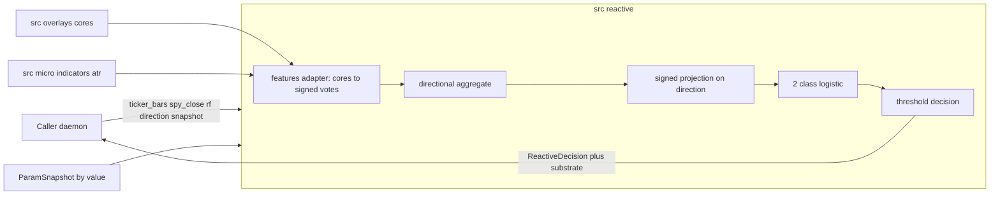
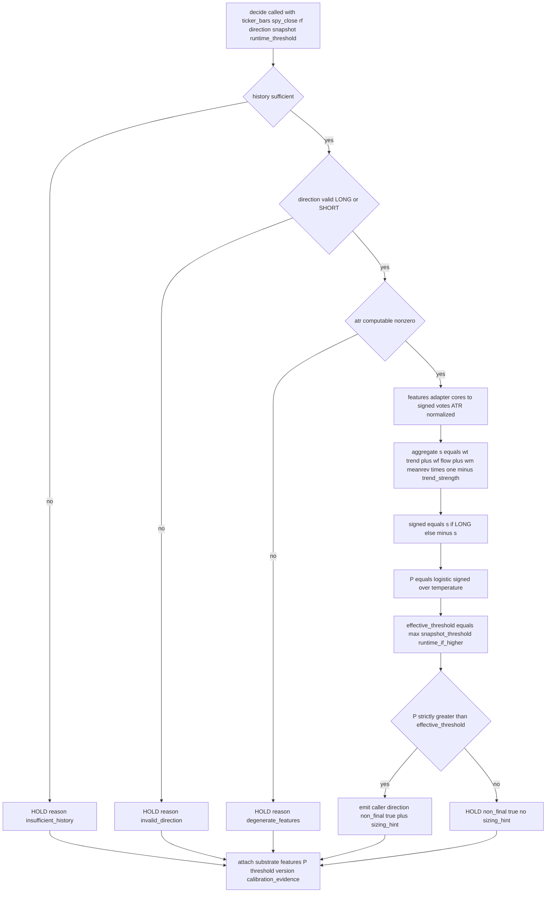

# Design Document

## Overview

**Purpose**: The Reactive Signal Model delivers the **Edge** link of the reactive CFD layer's lexicographic chain (exploration §13): on the fast clock it converts deterministic daily-bar features into a **model-derived probability that a caller-supplied direction is the correct side**, and a **thresholded LONG/SHORT/HOLD** decision the rest of the chain can veto and size against.

**Horizon semantics (prediction ≠ hold — clarified 2026-05-29, §16.1).** This model's *prediction* horizon is **days-to-weeks**: it estimates whether the caller-supplied direction is the correct side over a daily-ATR-anchored days-to-weeks band. It does **not** decide how long a position is *held* — under decision C (exploration §16.1) the reactive layer is **intraday-flat-by-close**, so the days-to-weeks view is *re-expressed via daily re-entry*, not held overnight. The hold lifecycle (flatten-before-close, re-entry) is owned by `execution-daemon`/`survival-gate`, not this model. The model is stateless and horizon-agnostic about hold duration; it emits one decision per call. **Consequence for calibration**: the realized outcome the `walkforward-tuning-loop` scores against must be the *intraday-with-daily-reentry* realization, not a days-to-weeks buy-and-hold P&L — whether a days-to-weeks edge survives intraday-only expression is an outer-ring empirical question (§12.5), not a property this model can assert. This is a named cross-spec revalidation trigger (below).

**Users**: `execution-daemon` (acts on the Edge decision at the lexicographic Edge step); `decision-trace-telemetry` (records the per-decision substrate); `walkforward-tuning-loop` (tunes threshold/weights/temperature against telemetry + ledger; computes calibration metrics).

**Impact**: introduces a new, reproducible non-LLM leaf module `src/reactive/` that **reuses** the existing deterministic overlay cores + `src/micro/indicators.py` math + the `signal_model.py` temperature-scaled-softmax *pattern*. The live `/micro` intraday module is untouched.

### Goals
- Emit, deterministically, a **model-derived** `P(caller-direction is the correct side)` and a thresholded LONG/SHORT/HOLD decision (calibration of that probability is established downstream, not here).
- Reuse the validated `src/overlays/*` sub-signal cores and `src/micro/indicators.py`; build no new feature math where a tested core exists.
- Be inner-ring unit-testable in isolation (no LLM/MCP/live-DB), against module-constant defaults, before any production param wiring.

### Non-Goals
- Choosing the directional side (caller-supplied, §12.3).
- Tuning/fitting threshold, weights, or temperature, or computing calibration metrics (`walkforward-tuning-loop`).
- The Survive/Preserve veto, position sizing/caps, the order-trigger, order routing, the hold/flatten lifecycle, and fetching market data (caller/daemon and sibling specs).

## Boundary Commitments

### This Spec Owns
- The daily-bar **feature adapter**: calling the reused overlay cores + `indicators.atr`, mapping each core's output to a **signed directional vote ∈ [−1,+1]** under an explicit, documented sign + vote-derivation convention (see §Feature adapter), and ATR-normalizing magnitude features.
- The **directional aggregation** (near-equal base weights, mean-reversion dampened by trend strength) and the **signed projection** onto the caller-supplied direction.
- The **2-class logistic** deriving `P(direction correct)` — derived from the `signal_model.py` temperature-softmax pattern but with a **deliberate drop**: the reference `_softmax3` carried an explicit hold-logit (conviction-deficit × liquidity), which this model **removes entirely**. HOLD comes *only* from `P`-vs-threshold; liquidity/survival is the gate's job (§13), not a term in the probability. (Direction is also caller-supplied, so the remaining long/short pair reduces to one logistic.) Plus the **thresholded decision** (LONG/SHORT/HOLD).
- The **advisory sizing-scalar hint** (Survive-capped downstream), the **non-final flag**, and the **decision-substrate** output (feature values incl. the reused continuous components, probability, effective threshold, consumed version, exposed calibration evidence).
- The **tighten-only** application of a runtime threshold override.

### Out of Boundary
- Direction selection; Survive/Preserve veto + survival-state inspection; sizing/cap enforcement + order-trigger; the hold/flatten-before-close lifecycle; order routing; market-data fetch; **tuning/fitting** and **computation** of calibration metrics; persistence of the trace (owned by `decision-trace-telemetry`).

### Allowed Dependencies
- `src/overlays/tactical/bin_classifier.py::classify`, `src/overlays/flow/bin_classifier.py::classify_flow`, `src/overlays/reversion/bin_classifier.py::classify_reversion` (pure cores) and `src/micro/indicators.py::atr` (pure math) — **import, pass arrays** (their MCP/DB I/O stays in the caller layer).
- Because the reused cores are **relative-to-market** (tactical + flow need SPY closes) and **rate-aware** (tactical needs the risk-free yield), the feature adapter's input contract carries **ticker OHLC bars + ticker adj-close + SPY adj-close + rf_yield_pct**. Fetching all of these stays caller-side (boundary unchanged); the model only consumes the passed arrays.
- A `ParamSnapshot` **passed by value** at call time (P2). No live `parameters_active` re-resolution inside the model.
- Dependency direction (strict, left→right): `types → params → features → signal_model`. `features` imports the overlay/indicator leaf libs; nothing imports upward.

### Revalidation Triggers
- `ParamSnapshot` shape change (weights/temperature/threshold/calibration-evidence/version) — `walkforward-tuning-loop`, `execution-daemon`.
- Decision-substrate field change — `decision-trace-telemetry` (`decision_process_trace`).
- Decision vocabulary change (P9 LONG/SHORT/HOLD).
- Any reused overlay core's return shape or sign change (esp. `flow.components.composite_score_normalized` and the reversion `bin` labels) — see §Feature adapter.
- **Calibration outcome-definition** — the `walkforward-tuning-loop` must score this model's probability against the **intraday-with-daily-reentry** realized outcome (not days-to-weeks hold), per the horizon-semantics note above. If the hold lifecycle changes (e.g. B pre-live instrument swap, §16.1), the outcome definition and thus the calibration target change.

## Architecture

### Existing Architecture Analysis
Reuse-by-import of three pure overlay cores + `indicators.py` (discovery 2026-05-29 confirmed zero I/O coupling — all take pre-fetched arrays). The cores expose heterogeneous outputs: **flow** returns a continuous `composite_score_normalized ∈ [−1,+1]` (direct vote); **tactical** returns only a categorical `bin` (its continuous 12mo momentum is computed then discarded → must map bin→vote, and it cannot supply a continuous strength); **reversion** returns a categorical `bin` plus exposed continuous components (v0.1 uses the bin for the vote, components feed the substrate). `signal_model.py` (intraday) supplies the temperature-scaled-softmax *pattern* but **not** its intraday-microstructure features, its liquidity hold-logit, or its slow-layer prior; `/micro` is left untouched (sibling module). Parameters: the project's `parameters`/`parameters_active` machinery resolves *live*; this model instead consumes a **pinned** snapshot by value (P2), with module-constant defaults for the inner ring.

### Architecture Pattern & Boundary Map
Selected pattern: a **pure deterministic pipeline** (feature adapter → directional aggregation → signed projection → 2-class logistic → threshold), wrapped by a by-value parameter contract. Rationale: P14 inner-ring testability + P1 leaf module; no orchestration.



### Technology Stack
| Layer | Choice / Version | Role in Feature | Notes |
|-------|------------------|-----------------|-------|
| Backend / Services | Python ≥3.11 (pure stdlib + project libs) | the deterministic leaf module | reuse `src/overlays/*`, `src/micro/indicators.py` |
| Data / Storage | none owned | consumes daily bars + SPY closes + rf + `ParamSnapshot` by value | market-data fetch + snapshot pinning are caller-side |
| Infrastructure / Runtime | imported leaf (and optional CLI) | daemon imports leaf funcs directly (not MCP, §14.10) | no service of its own |

## File Structure Plan

### Directory Structure
```
src/reactive/
├── __init__.py
├── types.py          # Bar (TypedDict OHLCV), Direction, Decision (LONG/SHORT/HOLD), ReactiveDecision, DecisionSubstrate, CalibrationEvidence, Weights, FeatureFailure
├── params.py         # ParamSnapshot dataclass + module-constant DEFAULTS + tighten-only resolver
├── features.py       # daily-bar adapter: imports overlay cores + indicators.atr; cores→signed votes (documented map); ATR-normalized raw features
└── signal_model.py   # aggregate -> signed projection -> 2-class logistic -> threshold -> ReactiveDecision (pure entry point)
tests/unit/reactive/
├── test_features.py        # core→vote mapping (incl. reversion sign), ATR normalization, insufficient-history, unavailable-core abstain
├── test_signal_model.py    # aggregation, projection, logistic, threshold, tighten-only, determinism, edge cases
└── test_params.py          # defaults + tighten-only resolver
```

### Modified Files
- None in `src/micro/` or `src/overlays/` (reuse-by-import; sibling module).
- The reused **reversion** core currently lacks an inner unit ring; its exercised paths get coverage under `tests/unit/reactive/test_features.py` (P14) before any outer-ring scoring is wired against this model.

## System Flows



Key decisions: the deterministic reflex order is *gate-then-derive* (history + direction validity + ATR computability before computing), so malformed inputs cost nothing and HOLD with a machine-readable reason. `effective_threshold` is **tighten-only** — a runtime override applies only when strictly higher than the snapshot threshold.

## Requirements Traceability

| Req | Summary | Components | Contracts |
|-----|---------|------------|-----------|
| 1.1–1.7 | daily-bar features, ATR normalization, exclusions, near-equal weighting, insufficient→HOLD+reason | `features` | feature-set + signed votes |
| 2.1–2.4 | derived probability, confidence-in-direction, expose snapshot calibration | `signal_model`, `params` | logistic; `CalibrationEvidence` |
| 3.1–3.7 | caller-supplied direction, strict-`>` threshold, LONG/SHORT/HOLD only, invalid→HOLD, non-final flag | `signal_model` | decision contract |
| 4.1–4.3 | non-final + vetoable, no survival inspection, no direction flip | `signal_model` | `ReactiveDecision.non_final` |
| 5.1–5.5 | advisory sizing hint scales above threshold, none on HOLD, no size/cap | `signal_model` | `ReactiveDecision.sizing_hint` |
| 6.1–6.5 | consume pinned snapshot, no live re-resolution, tighten-only, no fit | `params`, `signal_model` | `ParamSnapshot`; tighten-only resolver |
| 7.1–7.4 | expose calibration evidence + substrate; no metric computation | `signal_model`, `types` | `DecisionSubstrate` |
| 8.1–8.3 | determinism, no LLM/MCP/DB, isolatable leaf | all | pure-function contract |

## Components and Interfaces

| Component | Layer | Intent | Req | Key Deps | Contracts |
|-----------|-------|--------|-----|----------|-----------|
| `features` | feature adapter | daily-bar → signed family votes + trend_strength + raw | 1.x | overlays cores (P0), indicators.atr (P0) | Service |
| `signal_model` | decision core | aggregate → projection → logistic → threshold → `ReactiveDecision` | 2.x,3.x,4.x,5.x,7.x,8.x | features (P0), params (P0) | Service |
| `params` | config | `ParamSnapshot` + defaults + tighten-only resolver | 6.x | types (P0) | State/Service |
| `types` | types | enums + result/substrate dataclasses | 7.x | — | — |

### Feature adapter — `features`

**Responsibilities & Constraints**: compute the days-to-weeks feature set by calling the overlay pure cores and `indicators.atr`, and map each core's heterogeneous output to a **signed directional vote ∈ [−1,+1]** (convention `+1 ⇒ favors LONG`, `−1 ⇒ favors SHORT`). Express magnitude-type raw features (MA-distance, drawdown) in **daily-ATR units** for the substrate. Exclude intraday-microstructure inputs and any fundamental prior. Pure; raises no I/O.

**Vote-derivation convention (explicit — discovery 2026-05-29):**

| Family | Core output | → signed vote ∈ [−1,+1] | trend_strength contribution |
|--------|-------------|-------------------------|------------------------------|
| **trend** (tactical / Antonacci) | `bin ∈ {positive, neutral, negative, unavailable}` (BIN ONLY) | `positive→+1`, `neutral→0`, `negative→−1`, `unavailable→0 (abstain)` | none — bin-only, no continuous magnitude available |
| **flow** (CTA-proximity) | `components.composite_score_normalized ∈ [−1,+1]` (CONTINUOUS) | direct field read (already signed, already in range) | **`abs(flow_vote) ∈ [0,1]` is the designated `trend_strength`** |
| **meanrev** (reversion) | `bin ∈ {MR_OVERSOLD, MR_NEUTRAL, MR_OVERBOUGHT, MR_UNAVAILABLE}` (+ continuous components) | **`MR_OVERSOLD→+1` (oversold ⇒ expect bounce ⇒ bullish), `MR_OVERBOUGHT→−1`, `MR_NEUTRAL→0`, `MR_UNAVAILABLE→0`** | none |

- **Sign discipline (load-bearing):** mean-reversion is *contrarian* — `MR_OVERSOLD` is a **+1 (LONG-favoring)** vote, NOT −1. This is unit-tested (mirror test) because it is easy to invert.
- **`trend_strength ∈ [0,1]` = `abs(flow_vote)`.** Rationale: it must be a *continuous* measure of trend conviction to dampen mean-reversion smoothly; tactical is bin-only (degenerate as a strength) and reversion is the thing being dampened, so the flow composite's magnitude is the only continuous trend-conviction signal exposed. Economically coherent: strong CTA/TSMOM trend ⇒ suppress fading it. **Known v0.1 limitation:** `abs(flow_vote)` measures flow *conviction*, not trend *coherence* — when tactical and flow **disagree** (e.g. tactical `positive`/+1 vs flow `−0.7`), `trend_strength` still reads high (`0.7`) and damps mean-reversion even though the two trend signals are opposed (you'd want *low* strength there, letting mean-reversion speak). A tactical+flow agreement blend would fix this (refinement, not a v0.1 blocker); the v0.1 behavior is **pinned by a test** so it surfaces in review, not in calibration.
- **`raw`** carries the reversion continuous components (`rsi_14`, `drawdown_from_252d_high_pct`, `bollinger_band_position`, `ma_distance_200d_pct`), the flow composite, the tactical bin, and the ATR — these are the values logged in the substrate.
- **Abstain vs HOLD:** an individual `unavailable` core contributes a 0 vote (abstain); the decision proceeds on the remaining families. Global **insufficient_history** (→ HOLD) is when `len(ticker_bars) < LONGEST_WINDOW` (≥ 252 trading days, covering 252d drawdown / 200d MA / 12mo momentum) or SPY history is too short for the relative signals.

**Contracts**: Service.
```python
def compute_features(
    ticker_bars: Sequence[Bar],        # OHLC daily bars (for indicators.atr + close array)
    spy_close: Sequence[float],        # SPY adj-close (tactical + flow relative signals)
    rf_yield_pct: float | None,        # risk-free yield (tactical absolute-momentum gate)
    atr_period: int = 14,
) -> FeatureSet | FeatureFailure: ...
# FeatureSet: { trend_vote: float, flow_vote: float, meanrev_vote: float,   # each ∈ [−1,+1]
#               trend_strength: float,                                      # ∈ [0,1] = abs(flow_vote)
#               raw: dict[str, float] }                                     # substrate values
# FeatureFailure: { reason: "insufficient_history" | "degenerate_features" }
```
- Preconditions: `ticker_bars` chronologically ordered; `len(ticker_bars) ≥ LONGEST_WINDOW`; `len(spy_close)` sufficient for the relative windows. Bar keys are validated **here** at the boundary.
- Postconditions: votes ∈ [−1,+1]; `trend_strength ∈ [0,1]`; `raw` populated for the substrate.
- **Failure ownership (explicit):** `features` **owns** the history-length + ATR-computability checks and returns `FeatureFailure(reason ∈ {insufficient_history, degenerate_features})` — `degenerate_features` covers `indicators.atr → None` and zero-ATR. It never raises. `decide` **owns** `invalid_direction` and maps any `FeatureFailure` → HOLD with that `reason` (it does not re-check history/ATR — it trusts the discriminator). This keeps each reason single-owned and the HOLD-with-reason guarantee uniform.

### Decision core — `signal_model`

**Responsibilities & Constraints**: aggregate the family votes into a directional score, project onto the caller direction, derive the probability, apply the tighten-only threshold, emit `ReactiveDecision`. **Aggregation rule (explicit):** `s = w_t·trend_vote + w_f·flow_vote + w_m·(meanrev_vote · (1 − trend_strength))` with near-equal base weights `w_t≈w_f≈w_m` **normalized to `Σw=1`** (so `s ∈ [−1,+1]`; Req 1.5), the mean-reversion term **dampened by trend strength** (in strong trends mean-reversion recedes; in range it contributes). **Cross-family conflict that survives damping yields `s≈0 → P≈0.5 → HOLD` by design** — a *conservative Edge default* (trade only when families agree). This is an **Edge-link** prudence, **not** a Survive mechanism: Survive is enforced downstream and lexicographically above by `survival-gate` (§13). The model never inspects survival state; never flips direction.

**Contracts**: Service.
```python
def decide(features: FeatureSet, direction: Direction, snapshot: ParamSnapshot,
           runtime_threshold: float | None = None) -> ReactiveDecision: ...
```
- Preconditions: `direction ∈ {LONG, SHORT}` (else HOLD + `invalid_direction` — owned here); `features` is a `FeatureSet` (if a `FeatureFailure`, HOLD + its `reason`; `decide` trusts the discriminator and does not re-check history/ATR).
- Postconditions: `decision ∈ {LONG, SHORT, HOLD}`; `decision == direction` only when `P > effective_threshold`; `non_final == True` always; `sizing_hint` present only when actionable; `substrate` populated.
- Invariants: identical `(features, direction, snapshot, runtime_threshold)` → identical output (P14); `effective_threshold = snapshot.threshold if runtime_threshold is None else max(snapshot.threshold, runtime_threshold)`.

**Probability derivation** (P15): `P = 1 / (1 + exp(−signed / snapshot.temperature))` where `signed = s if direction==LONG else −s`. This is a **model-derived** probability (a 2-class logistic; P15 option (a)), monotonic in `signed`, **not asserted** from qualitative reasoning. Its *calibration* is **established downstream** by `walkforward-tuning-loop` (which fits `temperature`/`weights` against realized outcomes and computes Brier/reliability); under inner-ring `DEFAULTS` the temperature is an un-fit prior, so the output is a model-derived score whose calibration is **unestablished** — it is not claimed to be calibrated until the tuning loop closes the loop.

**Implementation Notes**
- Integration: imported directly by `execution-daemon`; its output substrate is the source of `decision-trace-telemetry`'s "signal values + softmax/logistic probs at fire" (§14.8).
- Validation: gate-then-derive (history + direction + ATR before compute).
- Risks: the conflict→HOLD damping is intended but watched in calibration (too-aggressive damping could suppress real edges) — a tuning concern, not a correctness one.

### Parameters — `params`

**Contracts**: State + Service.
```python
@dataclass(frozen=True)
class Weights: w_trend: float; w_flow: float; w_meanrev: float   # near-equal base weights (Req 1.5); normalized: w_trend + w_flow + w_meanrev == 1
@dataclass(frozen=True)
class CalibrationEvidence: brier: float | None; reliability: float | None
@dataclass(frozen=True)
class ParamSnapshot:
    weights: Weights; temperature: float; threshold: float
    calibration: CalibrationEvidence; code_version: str; param_version: str
DEFAULTS: ParamSnapshot  # module-constant; near-equal weights, prior temperature, calibration=None — for the inner ring
def effective_threshold(snapshot: ParamSnapshot, runtime: float | None) -> float: ...  # tighten-only
```
- Invariants: frozen (immutable); `effective_threshold` never returns below `snapshot.threshold`; the model never re-resolves parameters from live state (P2). `calibration` is **exposed**, never computed here (Req 7.4); `DEFAULTS.calibration == None` (calibration is unestablished at the inner ring). **Weights are normalized (`Σw == 1`)** ⇒ the aggregate `s ∈ [−1,+1]` (each vote ∈ [−1,+1], dampening factor ≤ 1). (Normalization is interpretive only — `temperature` would otherwise absorb the scale; fixing `Σw=1` keeps `s` and the votes on one comparable scale.)

### Types — `types`
`Bar = TypedDict("Bar", {"open": float, "high": float, "low": float, "close": float, "volume": float})` — **structurally a `dict`**, so a `Sequence[Bar]` is passed straight to `indicators.atr(Sequence[dict])` / `indicators.closes(...)` with no adapter; keys are validated once at the `compute_features` boundary (no parallel type that can drift from `indicators`). Chosen over bare `dict` because this design is a **cross-session contract surface** (the §14.11 fork reads these shapes) — the input deserves a named type. `Reason = Literal["insufficient_history","invalid_direction","degenerate_features"]`. `FeatureFailure{ reason: Reason }` — the discriminated features-failure (below). `Direction = Literal["LONG","SHORT"]`; `Decision = Literal["LONG","SHORT","HOLD"]`; `ReactiveDecision{ decision, direction_in, probability, sizing_hint: float|None, non_final: bool, reason: Reason|None, substrate: DecisionSubstrate }`; `DecisionSubstrate{ feature_values: dict, probability, effective_threshold, code_version, param_version, calibration: CalibrationEvidence }`.

## Data Models

The model owns no persistent storage. Its **output data contract** is `ReactiveDecision` (above); its **input parameter contract** is `ParamSnapshot` (by value). The `DecisionSubstrate` is the cross-spec payload that `decision-trace-telemetry` persists into `decision_process_trace` (JSONB `trace` blob + typed `code_version`/`param_version` columns per that spec) — field names must stay aligned (revalidation trigger). `feature_values` carries the reused continuous components (reversion `rsi_14`/`drawdown`/`bollinger`/`ma_distance`, flow `composite_score_normalized`, tactical `bin`, `atr`) so a fire is reconstructable.

## Error Handling

### Error Strategy
Single, uniform strategy: **degrade to HOLD with a machine-readable `reason`** rather than raise. Categories: `insufficient_history` (ticker/SPY history shorter than the longest reused window), `invalid_direction` (missing/non-`{LONG,SHORT}`), `degenerate_features` (e.g. zero/uncomputable ATR → cannot normalize). No exceptions cross the leaf boundary; the caller never crashes on bad input. There are no 4xx/5xx (pure function, no I/O).

### Monitoring
The model emits no telemetry itself; the `DecisionSubstrate` (incl. `reason`) is the observability surface the daemon hands to `decision-trace-telemetry`.

## Testing Strategy

### Unit Tests (inner-ring, golden-vector, no mocks — `tests/unit/reactive/`)
- **Core→vote mapping (1.x, discovery convention):** tactical `bin`→{+1,0,−1,0}; flow `composite_score_normalized` passed through; **reversion `MR_OVERSOLD→+1` / `MR_OVERBOUGHT→−1` (sign mirror test — guards against inversion)**; `unavailable`/`MR_UNAVAILABLE`→0 abstain.
- **trend_strength (1.x design rule):** `trend_strength == abs(flow_vote)`; at `|flow_vote|→1` the mean-reversion term is fully suppressed; at `|flow_vote|→0` it contributes at full weight. **tactical–flow opposition case:** tactical `+1` with flow `−0.7` → `trend_strength=0.7` damps mean-reversion despite the two trend signals being opposed — **documents the v0.1 `abs(flow)` behavior** (flow-conviction, not trend-coherence) so it is asserted, not discovered in calibration.
- **Probability derivation (2.x, P15):** `P` monotonic in `signed`; `signed=0 → P=0.5`; symmetric for LONG vs SHORT on mirrored inputs.
- **Threshold decision (3.x):** `P > threshold` (strict) → caller direction; `P == threshold` → HOLD; sub-threshold → HOLD; `non_final` always true.
- **Tighten-only (6.3/6.4):** runtime higher → applied; runtime lower → rejected (snapshot retained); runtime None → snapshot.
- **Conflict aggregation (1.5, design rule):** opposing trend vs mean-reversion (post-damping) → `s≈0 → HOLD`; aligned families → decisive `s`; strong-trend (`|flow|` high) damps mean-reversion as specified.
- **Edge cases (1.6/1.7, 3.6):** short ticker/SPY history → HOLD + `insufficient_history`; invalid direction → HOLD + `invalid_direction`; zero/uncomputable ATR → HOLD + `degenerate_features`.
- **Sizing hint (5.x):** scales with `P − threshold` above threshold; absent on HOLD; marked advisory.
- **Determinism (8.x):** identical inputs+snapshot → byte-identical `ReactiveDecision`; no LLM/MCP/DB import in the module.
- **Substrate (7.x):** every decision carries feature_values (incl. reused continuous components), probability, effective_threshold, versions, and the snapshot's calibration evidence; the model computes no Brier/reliability itself.
- **Reversion inner-ring (P14):** the reversion core paths exercised here get coverage (the core lacked a unit ring) before any outer-ring scoring is wired.

## Open Questions / Cross-Spec Contracts
- **Horizon outcome-alignment (Issue 1, §16.1):** the `walkforward-tuning-loop` must compute calibration against the **intraday-with-daily-reentry** realized outcome, not days-to-weeks buy-and-hold. Confirm at that spec's design; this model only *exposes* the substrate, it asserts no realized horizon. Whether the days-to-weeks edge survives intraday expression is the §12.5 outer-ring test, not a property of this model.
- **Req 1.2 (2026-05-29):** ATR anchors normalization + horizon, not the reused window lengths — the reused cores retain their canonical fixed windows. Surfaced for operator ratification (reversible only by dropping the reuse stance).
- **`ParamSnapshot.calibration` is produced by `walkforward-tuning-loop`** and pinned/passed by `execution-daemon` (P2). Until those land, the inner ring runs on `DEFAULTS` (calibration = None). Contract shape to confirm at those specs' design.
- **`DecisionSubstrate` field alignment** with `decision-trace-telemetry`'s `decision_process_trace` — confirm at that spec's design (shared correlation keys: `code_version`, `param_version`).
- **Vote-derivation v0.1 limitations (refinement path, not blockers):** (a) tactical is *bin-only* — it can only emit ±1/0, not "weak positive" momentum; exposing its continuous 12mo momentum would require a change to the tactical overlay (out of this spec's boundary). (b) reversion uses the *categorical bin* for its vote in v0.1 (honors the AND-gate design); a continuous vote from the exposed components is an available refinement the tuning loop could evaluate. (c) `trend_strength = abs(flow_vote)` is a single-source v0.1 choice; a tactical+flow agreement blend is a candidate refinement.
