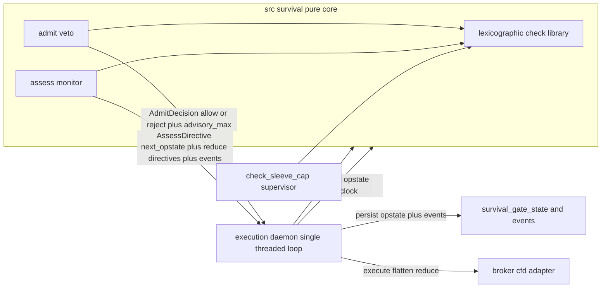
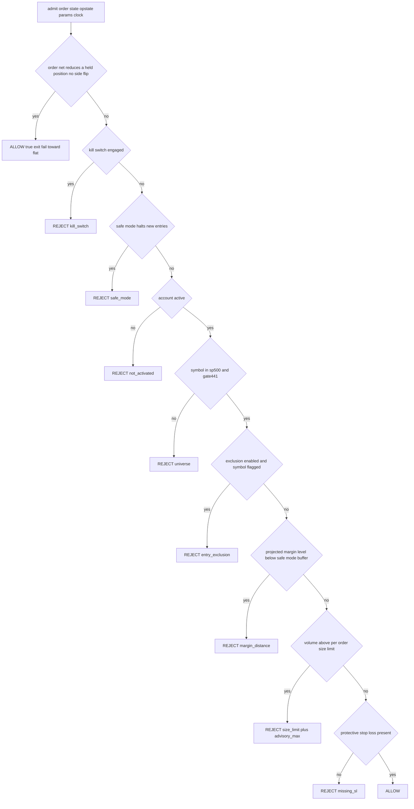
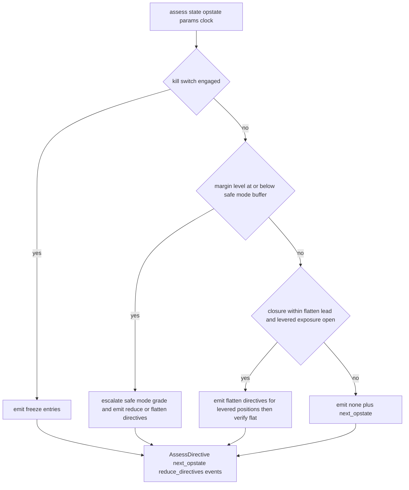

# Design Document

## Overview

**Purpose**: The Survival Gate is the deterministic top of the reactive CFD layer's lexicographic chain (§13: **Survive ⊳ Preserve ⊳ Edge ⊳ Return**). It keeps a levered, cross-margin Gate TradFi account alive: nothing below Survive may act until the gate says yes. It is the **highest-blast-radius node in the repo** (§11.5).

**Users**: `execution-daemon` calls it on **two paths** — `admit(order, …)` before routing any order (the veto), and `assess(state, …)` on every evaluation tick **whether or not an order exists** (the standing monitor). Its emitted decisions/events feed `decision-trace-telemetry`; its parameters come pinned from `walkforward-tuning-loop`.

**Impact**: introduces a new pure-decision module `src/survival/`, a `survival.*` parameter namespace, and append-only event/state tables. The decision core is **greenfield but inner-ring-testable now** against a synthetic `AccountState`; the *live wiring* (broker readout, halt source, daemon, op-state persistence) is **Phase 2**, blocked on unbuilt deps and explicitly out-of-scope for this spec's tasks.

### Goals
- A pure, deterministic Survive evaluator that **vetoes** unsafe orders (`admit`) and **monitors** standing exposure (`assess`) — both isolatable with no LLM/MCP/live-DB (P14).
- Encode §13 as a lexicographic walk that stops at the first binding constraint and **only ever reduces exposure**, never increases it (P7).
- Reuse `check_sleeve_cap`, the HG-validator convention, the pinned-parameter pattern, and the append-only ledger pattern.

### Non-Goals
- The order *trigger* and *sizing* decision, and the timed flatten *action* (`execution-daemon`).
- Order placement / broker transport, including attaching the stop-loss to the venue order (`broker-cfd-adapter`).
- Fitting/tuning survival parameters or computing calibration (`walkforward-tuning-loop`).
- Core/thematic sleeve allocation across the whole book (slow layer — the Gate account *is* the speculative sleeve, §16.1).
- **Phase-2 live wiring** (see Boundary): not part of this spec's task surface.

## Boundary Commitments

### This Spec Owns
- The two pure decision entry points — `admit` (order veto) and `assess` (standing monitor) — and the **lexicographic walk** they share.
- The account-level margin-distance computation (margin level vs stop-out + safe-mode buffer) **as a function of a supplied `AccountState`**.
- The **veto semantics**: ALLOW / REJECT(+binding-constraint, +advisory max); never a mutated order.
- The **safe-mode state machine** (NONE → TIGHTEN → HALT_NEW → FLATTEN) and **kill-switch** *logic* — as op-state transitions emitted as output (monotonic-tighten; loosening only via the after-market/operator path).
- The **flat-before-closure invariant + its verifiable post-condition**, the **toggleable ex-ante exclusion** decision, the **per-order size + mandatory-SL** checks, the **universe** check, and the **funding/sleeve-cap precondition** (checked at **capitalization time**, not in the per-order walk). (Real-time halt detection is **out of boundary**, R7 — see Out of Boundary.)
- The **`AccountState` / `OperationalState` / `SurvivalParameters` / `ClockState` input contracts** and the **`AdmitDecision` / `AssessDirective` / `SurvivalEvent` output contracts**. (No HG-NN validator — P11's HG-validator rule is an *agent* rule; this is a deterministic leaf whose typed output is guaranteed by the dataclass + unit tests. See File Structure.)

### Out of Boundary
- **Real-time per-instrument trading-halt detection** (R7, operator 2026-05-29): no feed exists; `broker-cfd-adapter` confirmed not the source (`c79738f`). The gate has no `trading_status`/halt input, no halt branch, no halt-triggered freeze/alert/de-risk. The intraday-halt/reopen residual is accepted, bounded by the account-level margin monitor + venue stop-out + §16 funding cap. Ex-ante base-rate reduction (entry-exclusion stage + universe) stays in scope; a future real-time halt feed is a separate spec + R7 revalidation.
- Reading account/positions from the venue; **executing** flatten/reduce directives; the order trigger + sizing (`execution-daemon`, `broker-cfd-adapter`).
- Attaching the SL to the venue order (the gate *requires* an SL be present on the proposed order; the broker *places* it).
- **Persisting** op-state / events to the DB (the gate emits transitions + events; the caller persists). The gate performs **no I/O**.
- Parameter fitting/tuning; the after-market loosening decision (`walkforward-tuning-loop` / §14.4).

### Allowed Dependencies
- `src/supervisor/conviction_rollup.py::check_sleeve_cap(tier, current_aggregate_pct, projected_aggregate_pct)` — pure; reused for the funding/sleeve-cap precondition (capitalization-time).
- The `parameters` / `parameters_active` / `run_parameters_snapshot` machinery (P2) — a new `survival.*` namespace; consumed as a pinned snapshot **by value**.
- The append-only ledger pattern (mig 003 `counterfactual_ledger_guard()`) — template for `survival_gate_events`.
- Dependency direction (strict, left→right): `types → params → gate`. `gate` imports the `check_sleeve_cap` leaf; nothing imports upward.

### Revalidation Triggers
- `AccountState` / `Position` shape change — must stay aligned with `broker-cfd-adapter` `get_account_assets` / `get_positions` (the seam). **Reconciled 2026-05-29 vs broker design `72020a0`+`c79738f`: `Position` is now 1:1 with broker `get_positions` (no `trading_status` — real-time halt detection out of boundary, R7). See research.md "Seam reconciliation".** Re-fires on any further broker `Position`/`AccountAssets` change, or if a real-time halt feed is ever introduced (R7 revalidation).
- `OperationalState` or `SurvivalEvent` shape change — `decision-trace-telemetry`, the persistence layer, the daemon.
- `SurvivalParameters` shape change — `walkforward-tuning-loop`.
- The kill-switch / op-state **freshness guarantee** (below) — any daemon concurrency-model change.
- Decision vocabulary (BUY/HOLD/TRIM/SELL, P9) or sleeve-cap vocabulary change.

## Architecture

### Existing Architecture Analysis
Greenfield decision logic (grep confirmed no existing margin/liquidation/kill-switch/safe-mode code). Reuses proven patterns: `check_sleeve_cap` (a pure core in `src/supervisor/`) and the pinned-parameter + append-only-ledger DB patterns. The decision core lives in a new `src/survival/` (like `src/supervisor/conviction_rollup.py`). **No HG-NN validator is added**: P11's own-envelope-+-HG-validator rule targets *agents* (HG validators are presence-only checks for LLM-emitted JSON, P13); this is a deterministic leaf whose typed dataclass output is guaranteed by the type system + unit tests. If the persisted `survival_gate_events`/`state` JSONB needs shape enforcement, that is a DB CHECK/trigger, not a research-pipeline gate. **The gate is an execution-path gate, not a `/research-company` validator.**

### Architecture Pattern & Boundary Map
Selected pattern: a **pure deterministic two-entry-point evaluator** wrapped by by-value parameters + fresh op-state. `admit` is provoked by an order; `assess` runs every tick regardless of orders. Both share the lexicographic check library. Rationale: §13 survival actions are **not all order-triggered** — margin breach, closure-imminence, and held-name halts must fire while the book sits still.



**Op-state freshness guarantee (load-bearing).** Parameters are pinned by value at run start (P2 — they do not change mid-run). **`OperationalState` is the opposite: it is read fresh and authoritative at the start of every `admit`/`assess` call and is never folded into the pinned snapshot.** The `execution-daemon` runs survival evaluation as a **single-threaded loop** (one evaluation at a time), so the read-modify-write of op-state is atomic per evaluation and a just-engaged kill switch is observed by every subsequent `admit` — an in-flight order cannot bypass it. (If daemon concurrency is ever introduced, the fallback is a DB-level guard — advisory lock / `SELECT … FOR UPDATE` on `survival_gate_state`. This is a revalidation trigger.)

**Daemon contracts the gate relies on (load-bearing, cross-spec).** The pure core is only as safe as the loop that drives it, so two contracts on `execution-daemon` are part of the design (revalidation triggers if the daemon model changes):
- **Persist-then-act.** When `assess` emits a `next_op_state` transition (e.g. FLATTEN-grade, or a kill-switch latch), the daemon must **persist it durably before executing any directive or admitting any order**. Otherwise an in-flight action races the not-yet-persisted transition — the freshness guarantee above is necessary but not sufficient without this ordering.
- **`assess` invocation cadence.** A pure `assess()` cannot self-schedule; "runs every tick" is undefined. The daemon must invoke `assess` **at least every `assess_max_latency_seconds` and on every margin-material event**. Without a bounded cadence the no-order monitor is hollow — a margin breach could mature into liquidation in the gap between calls.

**Fail direction = minimum exposure (not monolithic reject).** The safe failure differs by **effect on net exposure**, not by disposition label: for an **open/add** (any order that opens or increases net exposure), any malformed input / param error → **REJECT** (fail toward not-adding); for a **true exit** (an order that net-reduces a held position — opposite-side, volume ≤ held, no flip) or any `assess` reduce directive, any error → **proceed to reduce/flatten** (fail toward less exposure). A true exit is **never** blocked by the kill switch or safe-mode — those freeze *new* exposure; getting flat must always be possible. An order that opens or increases net exposure is **not** an exit regardless of its label and is blocked normally.

### Technology Stack
| Layer | Choice / Version | Role in Feature | Notes |
|-------|------------------|-----------------|-------|
| Backend / Services | Python ≥3.11 (pure stdlib + project libs) | the deterministic decision core | reuse `check_sleeve_cap`; no service of its own |
| Data / Storage | Postgres (append-only) | `survival_gate_events` (append-only) + `survival_gate_state` (monotonic) + `survival.*` params seed | persistence is caller-side; the core is pure |
| Infrastructure / Runtime | imported leaf | daemon imports `admit`/`assess` directly (not MCP) | single-threaded eval loop (op-state freshness) |

## File Structure Plan

### Directory Structure
```
src/survival/
├── __init__.py
├── types.py          # AccountState, Position, ClockState, ProposedOrder, SurvivalParameters,
│                     #   OperationalState, AdmitDecision, AssessDirective, ReduceDirective,
│                     #   SurvivalEvent, BindingConstraint, SafeModeGrade
├── params.py         # resolve SurvivalParameters from a pinned survival.* snapshot + DEFAULTS
│                     #   + tighten-only runtime-override resolver
└── gate.py           # admit(...) + assess(...) + check_capitalization(...) + shared lexicographic check library (pure)
tests/unit/survival/
├── test_admit.py     # walk order; opens-reject vs exits-allow; advisory_max; kill-switch freshness; missing-SL
├── test_assess.py    # margin→safe-mode escalation; closure→flatten+verify-flat; no-halt-branch (R7 out of boundary)
└── test_params.py    # tighten-only override; defaults; malformed-param fail-closed
```

### Modified / New Files
- **No HG-NN validator / no `src/eval/gates/` changes.** P11's own-envelope-+-HG-validator rule targets *agents* (HG validators are presence-only checks for LLM-emitted JSON, P13). This is a deterministic leaf: the typed dataclass + unit tests guarantee emission shape. Shape enforcement of the persisted `survival_gate_events`/`state` JSONB, if needed, is a **DB CHECK/trigger**.
- `db/migrations/049_survival_gate_state_and_events.sql` — **NEW** `survival_gate_state` (monotonic op-state) + `survival_gate_events` (append-only; mig-003 trigger pattern). (Task 2.1; pinned **049** — the first free number above the landed 048 `decision_process_trace`.)
- `db/migrations/050_survival_params_seed.sql` — **NEW** seed of the `survival.*` namespace (pattern: mig 038/039). (Task 2.2; **050**, the distinct number after 2.1's 049.)

> Phase-2 wiring files (broker `AccountState` mapper, halt-source adapter, daemon invocation, op-state persistence, screen-predicate extraction) are **out of scope for this spec's tasks** — see Open Questions.

## System Flows

**`admit` — order veto (lexicographic; opens vs exits differ):**

Key decisions: a **true exit short-circuits to ALLOW** (fail-toward-flat). **Exit is classified by effect on the held position, not by the disposition label** (P7 — never trust the upstream label): an order short-circuits *iff* it is opposite-side to a held position in the same symbol **and** its volume ≤ that position's held volume (it strictly reduces net |exposure| without flipping side). Any order that opens or increases net exposure — a `SELL`/short on an unheld name, a same-side add, or an opposite-side order whose volume exceeds the held position (flatten-then-flip) — is treated as an **open** and takes the full walk, so it is blocked by kill-switch / safe-mode. For opens, the walk stops at the first binding constraint and emits it for audit. `admit` returns REJECT + an **advisory** max volume on a size breach; it never returns a resized order (the daemon resizes + re-submits). **The funding cap is not in this per-order walk**: once funded, the account cannot be un-funded at runtime, so the ≤8%-of-book bound is a **capitalization-time precondition** (`check_capitalization`, below) checked when wiring/adding funds — not per order. The runtime walk enforces margin-distance + size + SL + universe + exclusion. (No held-name-halt step — real-time halt detection is out of boundary, R7.)

**`assess` — standing monitor (no order required):**

Key decisions: safe-mode grade is **monotonic-tighten** within a run (NONE→TIGHTEN→HALT_NEW→FLATTEN by severity band); it never auto-loosens (loosening is the after-market/operator path, §14.4 / R10.4). **Flat-before-close** emits flatten directives, then re-checks the post-condition — if levered positions remain as the closure nears, it escalates to FLATTEN safe-mode (the "am-I-flat?" guarantee, P6). **Real-time halt detection is out of scope** (R7, operator 2026-05-29): `assess` has **no halt branch**. An intraday halt manifests only as its account-level consequence — margin moving against the book on reopen → caught by the margin / safe-mode path above, bounded by the venue stop-out + §16 funding cap. Post-hoc `forced_liquidation` (broker `get_history`) is recorded to the event log only.

## Requirements Traceability

| Req | Summary | Components | Flow |
|-----|---------|------------|------|
| 1.1–1.5 | account-level margin model; funding-cap = hard loss bound; safe-mode buffer | `gate.admit` (proj. margin), `gate.assess` (buffer→safe-mode), `types.AccountState`, `params` | both |
| 2.1–2.5 | mandatory veto; reject-never-upsize; lexicographic; tighten-only | `gate.admit`, `AdmitDecision` | admit |
| 3.1–3.4 | funding cap = **capitalization-time precondition** (not per-order); shared vocabulary; core/thematic out | `gate.check_capitalization` (reuse `check_sleeve_cap`) | capitalization (pre-funding) |

> **R3.2 reconciliation (intentional reinterpretation):** R3.2 is phrased per-order ("an order that would cause aggregate exposure to exceed the cap → reject"). The §16 funding cap is on **funded capital** (the defined-risk envelope), fixed at capitalization — it cannot be breached per-order because the account holds only the funded ≤8%. So R3.2's intent is realized by **the capitalization-time cap (`check_capitalization`) + the per-order margin-distance (R1) and size (R4) checks**, not a standalone per-order sleeve-exposure check in the admit walk.
| 4.1–4.4 | per-order size limit; mandatory SL; SL ≠ gap protection | `gate.admit` (size, SL), `advisory_max` | admit steps 9–10 |
| 5.1–5.4 | universe restrict; toggleable exclusion; consume existing screens | `gate.admit`, `params.exclusion_enabled` | admit steps 4–5 |
| 6.1–6.4 | flat-before-closure + verifiable post-condition + escalation; action is daemon's | `gate.assess` (closure path), `ClockState` | assess |
| 7.1–7.4 | real-time halt detection **out of boundary** (R7); residual bounded by margin monitor + stop-out + §16 cap; post-hoc forced-liquidation logged; ex-ante reduction via R5 | account-level paths only (`gate.admit` margin, `gate.assess` margin/safe-mode); **no halt branch** | assess + admit |
| 8.1–8.3 | reproducible safe-mode; anomaly queue; deterministic entry | `gate.assess` (op-state), `SurvivalEvent`, `survival_gate_events` | assess |
| 9.1–9.3 | kill switch halts new routing; retained under autonomy; operator-only re-enable | `OperationalState.kill_switch`, freshness guarantee | admit step 1 + assess |
| 10.1–10.4 | pinned params by value; no fit; tighten-only override | `params`, op-state read fresh | both |
| 11.1–11.3 | determinism; isolatable; inspectable decision | pure core; typed dataclass + unit tests | both |

## Components and Interfaces

| Component | Layer | Intent | Req | Key Deps | Contracts |
|-----------|-------|--------|-----|----------|-----------|
| `types` | types | input/output dataclasses + enums | all | — | State |
| `params` | config | pinned `SurvivalParameters` + tighten-only resolver | 10 | types (P0) | State/Service |
| `gate` | decision core | `admit` veto + `assess` monitor + `check_capitalization` + lexicographic library | 1–11 | params (P0), `check_sleeve_cap` (P0) | Service |
| DB schema | storage | `survival.*` seed; `survival_gate_state`; `survival_gate_events` | 8,10 | parameters/ledger patterns (P1) | State/Batch |

### Decision core — `gate`

**Responsibilities & Constraints**: the two pure entry points + the shared lexicographic walk. No I/O; raises only on programmer error (never on market input). Reads op-state fresh (passed in). Emits transitions + directives + events; persistence is the caller's. **Fail toward minimum exposure** (opens→reject, exits/reduces→allow).

**Contracts**: Service.
```python
def admit(order: ProposedOrder, state: AccountState, op_state: OperationalState,
          params: SurvivalParameters, clock: ClockState) -> AdmitDecision: ...
def assess(state: AccountState, op_state: OperationalState,
           params: SurvivalParameters, clock: ClockState) -> AssessDirective: ...
def check_capitalization(funded_balance: float, total_book_equity: float,
                         params: SurvivalParameters) -> AdmitDecision: ...  # capitalization-time precondition; reuses check_sleeve_cap; NOT per-order
```
- `admit` preconditions: `op_state` is freshly read (never pinned). Postconditions: returns `ALLOW` or `REJECT(binding_constraint, advisory_max_volume|None, reason)`; **never mutates `order`**; a **true exit** — opposite-side to a held position with volume ≤ held (net-reducing, no side flip) — **always returns ALLOW** (fail-toward-flat); an order that opens or increases net exposure (incl. a `SELL`/short on an unheld or same-side position) is **classified as an open** and takes the full walk. Invariant: identical `(order, state, op_state, params, clock)` → identical `AdmitDecision` (P14); the walk stops at the first binding constraint.
- `assess` postconditions: returns `AssessDirective(next_op_state, reduce_directives, events)`; `next_op_state.safe_mode_grade` is **≥** the input grade (monotonic-tighten, **latched**: a tripped grade — even from a transient margin blip — stays until an explicit operator/after-market clear, matching R9.3's operator-only re-enable; a brief dip that trips FLATTEN halts new entries until manual clear, **by design**); there is **no halt path** (real-time halt detection out of boundary, R7); closure path emits flatten directives + a verify-flat escalation. Invariant: deterministic in all inputs (P14).

**Implementation Notes**
- Integration: imported by `execution-daemon`; the daemon executes the directives (via `broker-cfd-adapter`) and persists `next_op_state` + `events`. The gate itself touches neither broker nor DB.
- Validation: the lexicographic order is fixed and audited via `binding_constraint`.
- Risks: the **kill-switch freshness** guarantee depends on the daemon's single-threaded eval loop — a revalidation trigger if concurrency changes.

### Parameters — `params`

**Contracts**: State + Service.
```python
@dataclass(frozen=True)
class SurvivalParameters:
    stop_out_level_pct: float          # venue stop-out (≤50), from AccountState/params
    safe_mode_buffer_pct: float        # margin-level buffer above stop-out
    per_order_size_max: float          # per-order volume/exposure cap
    speculative_sleeve_cap_pct: float  # funding cap (8.0)
    flatten_lead_seconds: float        # closure lead time for flat-before-close
    assess_max_latency_seconds: float  # max gap between assess invocations (daemon-honored cadence bound)
    exclusion_enabled: bool            # toggleable ex-ante exclusion stage
    code_version: str; param_version: str
DEFAULTS: SurvivalParameters           # module-constant; for the inner ring
def resolve(snapshot: dict) -> SurvivalParameters: ...           # from a pinned survival.* snapshot, by value
def tighten_only(pinned: SurvivalParameters, override: dict) -> SurvivalParameters: ...  # loosen→reject, retain pinned
```
- Invariants: frozen; `tighten_only` rejects any loosening override (retains the pinned value); the core never re-resolves from live state (P2). Op-state is **not** part of this snapshot (it is read fresh — see Architecture).

### Types — `types`
`SafeModeGrade = Literal["NONE","TIGHTEN","HALT_NEW","FLATTEN"]`; `BindingConstraint = Literal["kill_switch","safe_mode","not_activated","universe","entry_exclusion","margin_distance","funding_cap","size_limit","missing_sl"]` (no `halt_freeze` — real-time halt detection out of boundary, R7).
- `Position{ position_id, symbol, direction, volume, avg_open_price, used_margin, unrealized_pnl }` — mirrors `broker-cfd-adapter` `get_positions` **1:1 (seam reconciled 2026-05-29 vs broker design `72020a0`+`c79738f`; `avg_open_price` renamed from `open_price` to match the broker field)**. **No `trading_status`/halt field**: real-time halt detection is out of boundary (R7, operator 2026-05-29) — the broker carries no halt field and survival-gate does not sense one. The broker's only halt-adjacent signal is the **post-hoc** `close_reason: forced_liquidation` via `get_history`, recorded to the event log; it is not a live input to `admit`/`assess`.
- `AccountState{ activated: bool, equity, used_margin, free_margin, margin_level, balance, stop_out_level, positions: list[Position] }` — composed by the Phase-2 adapter from broker `get_account_assets` (equity / used_margin / free_margin / margin_level / balance / stop_out_level) **+** `get_positions`; `activated` ← broker mt5-account `status`. `stop_out_level` now also has a **venue readout** (broker `AccountAssets`) alongside the pinned `survival.stop_out_level_pct`; the gate uses the **tighter** of the two (P7 tighten-only). (Total-book equity is **not** a per-call field — the funding cap is a capitalization-time precondition taking an operator/config-supplied total-book figure; see `check_capitalization`.)
- `ClockState{ session_open: bool, seconds_to_next_closure: float|None }` — closure-imminence + session are **inputs** (the pure core cannot read the clock).
- `ProposedOrder{ symbol, intent: Literal["BUY","TRIM","SELL"], direction, volume, stop_loss: float|None }`.
- `OperationalState{ kill_switch_engaged: bool, safe_mode_grade: SafeModeGrade, entered_at, triggered_by }` — read fresh per call.
- `AdmitDecision{ decision: Literal["ALLOW","REJECT"], binding_constraint: BindingConstraint|None, advisory_max_volume: float|None, reason: str|None }`.
- `AssessDirective{ next_op_state: OperationalState, reduce_directives: list[ReduceDirective], events: list[SurvivalEvent] }`; `ReduceDirective{ kind: Literal["FLATTEN","REDUCE","FREEZE_ENTRIES"], symbol: str|None, target_volume: float|None, reason: str }` (no `FLATTEN_AT_REOPEN` — the halt path is removed, R7); `SurvivalEvent{ event_type, ticker: str|None, detail, account_snapshot }`.

## Data Models

The core owns no persistent storage; the caller persists what the core emits.

**`survival_gate_state`** (monotonic op-state, one current row per gate scope): `safe_mode_grade` (enum), `kill_switch_engaged` (bool), `entered_at`, `triggered_by_event_id` (FK). Transitions: tighten/engage allowed; loosen/disengage **only** via an explicit operator/after-market path (DB-level guard or a single-threaded writer enforces no race — the freshness guarantee).

**`survival_gate_events`** (append-only; mig-003 `counterfactual_ledger_guard()` pattern): `event_id`, `run_id`, `ticker` (nullable), `event_type` (margin_breach / forced_liquidation / safe_mode_entered / kill_switch_engaged / flatten_directive / flat_verify_failed) — `forced_liquidation` is the post-hoc broker `get_history` record, not a real-time halt signal (R7), `account_snapshot` (JSONB), `created_at`. INSERT only; no UPDATE/DELETE.

**`survival.*` parameters** (seed migration, pattern mig 038/039): `survival.stop_out_level_pct`, `survival.safe_mode_buffer_pct`, `survival.per_order_size_max`, `survival.speculative_sleeve_cap_pct`, `survival.flatten_lead_seconds`, `survival.exclusion_enabled`. Pinned into `run_parameters_snapshot` and consumed by value.

## Error Handling

### Error Strategy — fail toward minimum exposure
- **`admit` of an open/add** (any order that opens or increases net exposure — incl. a `SELL`/short on an unheld or same-side position): malformed `AccountState`, missing/NaN margin fields, unparseable params → **REJECT** with a `reason` (fail toward not-adding). Never raises across the boundary.
- **`admit` of a true exit** (opposite-side to a held position, volume ≤ held — net-reducing, no flip): always **ALLOW** — it reduces exposure; a transient input error must not block getting flat. Classification is by **effect on the held position, not the disposition label**: a `SELL` that is not net-reducing is an open, not an exit.
- **`assess`:** on degraded/partial `AccountState`, **escalate toward reduce/flatten + safe-mode**, never toward "all clear." (There is no `trading_status`/halt input — real-time halt detection is out of boundary, R7; degraded or missing account/margin fields still escalate via the margin / safe-mode path.)
- Programmer errors (unknown tier, contract violation) raise — these are bugs, surfaced in tests, not market conditions.

### Monitoring
The core emits `SurvivalEvent`s + the `binding_constraint`/decision; the daemon hands these to `decision-trace-telemetry` and persists the event log. Emission shape is guaranteed by the typed dataclass + unit tests (no HG validator); persisted-JSONB shape, if enforced, is a DB CHECK/trigger.

## Testing Strategy

### Unit Tests (inner-ring, golden-vector, no mocks — `tests/unit/survival/`)
- **`admit` lexicographic order (2.x):** each binding constraint fires in the specified order; first-binding short-circuits; `binding_constraint` reported.
- **Opens vs exits (3.x error-direction, 2.3):** an open with bad input → REJECT; a **true exit** (opposite-side, volume ≤ held) → ALLOW even under kill-switch/safe-mode (fail-toward-flat). **Classification-by-effect guard:** a `SELL` on an **unheld** name (opens a short) and a `SELL` whose volume **exceeds** the held long (flatten-then-flip) are **REJECTED** under an engaged kill-switch — a `TRIM`/`SELL` label alone must not short-circuit. **This is the catastrophe-guard test.**
- **Kill-switch freshness (9.x):** an `op_state` with `kill_switch_engaged=True` → every `admit(BUY)` REJECTs; toggling op-state between calls flips the result (proves op-state is read per-call, not pinned).
- **Margin model + safe-mode (1.x, 8.x):** projected margin ≤ buffer → REJECT(margin_distance) in `admit` and safe-mode escalation in `assess`; monotonic-tighten (grade never decreases); deterministic entry.
- **Flat-before-close (6.x):** closure within `flatten_lead_seconds` + open levered position → flatten directives; verify-flat failure → FLATTEN-grade escalation + `flat_verify_failed` event.
- **No halt branch (7.x):** `assess` exposes no `trading_status` input and emits no halt-triggered freeze / flatten / alert (R7, real-time detection out of boundary); a synthetic mid-session halt is invisible to the gate except via its account-level margin consequence, which routes through the margin / safe-mode path. A post-hoc `forced_liquidation` (`get_history`) is recorded as an event.
- **Capitalization precondition (3.x):** `check_capitalization` (via `check_sleeve_cap`) rejects a funded balance > 8% of the supplied total-book figure — pre-funding, **not** per-order.
- **Size/SL/universe (4.x,5.x):** size breach → REJECT + advisory_max (no mutated order); missing SL → REJECT; off-universe → REJECT; exclusion toggle on/off.
- **Tighten-only params (10.x):** loosening override rejected, pinned retained; malformed param → fail-closed.
- **Determinism (11.x):** identical inputs → identical `AdmitDecision`/`AssessDirective`; no LLM/MCP/DB import in `src/survival/`.

## Open Questions / Cross-Spec Contracts

- **Phase-2 wiring is out-of-scope for this spec's tasks.** Tasks generate only the pure core (`admit` / `assess` / `check_capitalization`) + `survival.*` seed + the two tables + inner-ring tests (no HG validator). Live wiring — populating `AccountState` from `broker-cfd-adapter`, the daemon invocation + op-state persistence, and the **screen-predicate extraction** (catalyst/quality memos → `exclusion_enabled` predicates) — is **blocked** on those unbuilt specs and is deferred (gap analysis, `research.md`). (Real-time halt detection is **out of boundary**, not a deferred wiring item — R7.)
- **Daemon contracts [cross-spec, load-bearing]:** the daemon must (a) **persist-then-act** — durably persist an emitted op-state transition before executing any directive or admitting any order (no kill-switch TOCTOU), and (b) **honor the `assess` cadence** — invoke `assess` at least every `assess_max_latency_seconds` and on every margin-material event. Both are revalidation triggers; both belong in the `execution-daemon` spec.
- **Trace correlation-key contract [cross-spec]:** when the daemon persists the gate's emitted decisions/events into `decision-trace-telemetry`'s `decision_process_trace`, the full **four-key** correlation set binds: `run_id` (NOT NULL), `code_version` (NOT NULL), `param_version` (NOT NULL), `walk_forward_window` (nullable). The gate sources `run_id` (on `survival_gate_events`) + `code_version`/`param_version` (on `SurvivalParameters`); `walk_forward_window` is **injected by `execution-daemon`** (P3 — the daemon mints `run_id`/window). Note the gate's own `survival_gate_events` log is a **separate, gate-owned table (P11)** that carries only `run_id` **by design** — the four-key contract binds the *trace* write, not the event log, so the gate's leaner event schema is not an under-enumeration.
- **Total-book-equity source [research]:** the funding-cap precondition's denominator spans the slow-layer book + the Gate account — no single system feeds it; it is an operator/config figure supplied at capitalization time. Source/refresh cadence TBD.
- **HG-validator consistency [RESOLVED 2026-05-30]:** checked `reactive-signal-model`'s design — it carries **no** HG validator (clean pure leaf: `types`/`params`/`features`/`signal_model` + unit tests; output is a typed `ReactiveDecision` dataclass). No "agent-rule applied to a non-agent" inconsistency exists: both specs take the same deterministic-leaf / no-HG-validator stance (P11 targets agents; P13 HG is presence-only).
- **Real-time halt detection [OUT OF BOUNDARY — resolved 2026-05-29, R7]:** no feed exposes per-instrument intraday halt and `broker-cfd-adapter` is confirmed not the source (`c79738f`). Rather than carry a `trading_status` contract field with a deferred population source, real-time halt detection is **removed from scope entirely**: the gate has no halt input/branch; the intraday-halt/reopen residual is bounded by the account-level margin monitor + venue stop-out + §16 funding cap. A real-time halt feed, if ever built (separate spec), is an R7 revalidation trigger.
- **`AccountState` seam:** finalize field names jointly with `broker-cfd-adapter`'s design so Phase-2 is a thin mapper, not a refactor.
- **S&P 500 universe list source [research]:** R5.1 needs the membership set (∩ Gate-441). Source/refresh cadence TBD at Phase-2.
- **Op-state concurrency:** the freshness guarantee assumes a single-threaded daemon eval loop; if concurrency is introduced, add the DB-level guard (revalidation trigger).
