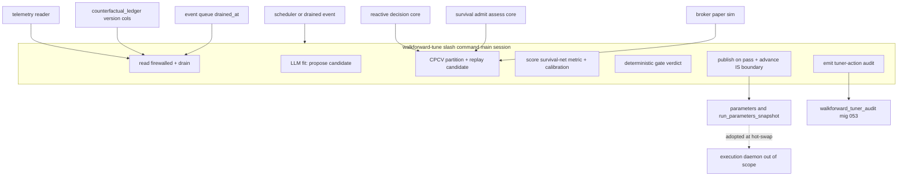

# Design Document — walkforward-tuning-loop

> Companion discovery notes in `research.md`. Self-contained for review. Per P1 + §14.10 this spec is a **markdown slash-command orchestrator** with Python only as leaf skill-helpers + an HG validator — NOT a Python orchestrator, NOT a daemon.
>
> **Architecture decision (operator, 2026-05-30):** out-of-sample evidence is generated by **in-process CPCV replay** — re-simulating each candidate over purged cross-validation partitions of realized history — NOT by deploying a live-forward paper window. This **amends §14.6** (promotion is no longer earned on a single live forward window). The chosen path is the only one that satisfies the mandated PBO diagnostic (R5.1), which needs multiple IS/OOS partitions a single live window cannot supply. The `walk_forward_window` correlation key (LANDED, mig 048) is retained; the spec name + the §14.6 doc edit are an operator follow-up (Open Questions).
>
> **⚠️ SPLIT IN PROGRESS (operator decision, 2026-05-30 — /kiro-validate-design):** the **replay engine is extracted into its own spec — `reactive-replay-harness`** (a point-in-time counterfactual backtest engine; brief written 2026-05-30 at `.kiro/specs/reactive-replay-harness/brief.md`). Until that spec reaches design, the `replay` component / file-plan entries below describe the **to-be-consumed dependency**, not code this spec owns. **The extraction rewrite (move `replay` to Out of Boundary + a consumed dependency; drop `src/skills/walkforward_tune/replay.py`; re-point 4.1/4.2/4.6 traceability) lands when `reactive-replay-harness` reaches design.**
>
> **✅ DATA-FEASIBILITY GATE CLEARED (deep-research, 2026-05-30):** the Massive API serves all required historical types on the **Advanced/Business tier** (1-sec intraday bars, tick trades, NBBO quotes, grouped daily, split-unadjusted bars, delisted coverage, to 2003-09-10) — the CPCV-replay architecture is feasible; the evidence-generation fork does **not** reopen. **Modeling caveat now owned by `reactive-replay-harness`:** Massive bars are split-unadjustable but **never dividend-adjusted**, so total-return P&L must credit cash dividends separately. Task generation for this spec remains gated on `reactive-replay-harness` reaching at least design (so the consumed contract is concrete).

## Overview

**Purpose**: The Walk-Forward Tuning Loop is the after-market **slow clock** (§14) that lets the reactive CFD model improve between sessions. Fired at a boundary, it reads how the model behaved (decision-trace + version-attributed ledger) up to an in-sample boundary, fits a **trial set** of candidate configs (the §14.2 grid-search/optimizer role), **re-simulates each over CPCV partitions of realized history (an in-process point-in-time backtest)**, scores them on the **survival-net risk-adjusted return** metric, and — through an overfitting-corrected gate (DSR/PBO deflated over the trial set) with **no human sign-off** — selects and promotes the best by publishing a validated version into the existing P2 parameter machinery the `execution-daemon` later adopts at hot-swap.

**Users**: the **Operator** (schedules/monitors it, holds the kill switch); the **reactive CFD system** (consumes promoted versions); itself as producer of the validated config menu `in-session-monitor` later selects from (§15).

**Impact**: introduces the only component that *fits* new reactive/survival parameters and code. The fast clock stays apply-only (§14.4); fitting never enters the hot path.

### Goals
- A reproducible after-market cycle: firewall-bounded read → fit → CPCV replay → autonomous gate → publish + audit.
- A deterministic, inner-ring-tested promotion gate (DSR + PSR/MinTRL + PBO over the CPCV matrix; survival-net metric; never IS-Sharpe).
- A falsifiable, correlation-keyed tuner-action audit owned by this spec (P11/P15).

### Non-Goals
- Deploying/hot-swapping versions or the version-pinned position lifecycle (`execution-daemon`).
- In-session selection among validated versions, or any halt/tighten (`in-session-monitor`).
- Owning the decision-trace schema, correlation-key contract, or ledger version dimension (`decision-trace-telemetry`).
- Runtime/live fitting or application of parameters (§14.4 — fitting is after-market only).
- Reimplementing the softmax/threshold model or survival logic (the replay *drives* their landed cores).

## Boundary Commitments

### This Spec Owns
- The after-market **cycle controller** (the slash command) and its checkpoint/resume.
- The **leakage firewall** as CPCV purge/embargo on its own reads (no OOS partition leaks into the fit).
- The **fit** of candidate `ParamSnapshot` (reactive, rolling) + `SurvivalParameters` (survival, anchored) values and structural code candidates → a hashed, versioned snapshot.
- The **CPCV partition scheme** and the **in-process replay harness** (re-simulate a candidate by driving the landed reactive + survival cores + paper-fill sim over historical inputs).
- The **survival-net risk-adjusted return** metric + calibration scoring over the OOS partitions.
- The **deterministic promotion gate** (DSR + PSR/MinTRL + PBO + MinBTL + decision-rule + §13 guard).
- The **publish** of a validated version into the P2 parameter machinery + the **in-sample-boundary advance**.
- Its own **tuner-action audit**: table (mig 053), envelope, writer, and HG validator (P11).

### Out of Boundary
- Deploy / atomic hot-swap / version-pinned position lifecycle (`execution-daemon`; this loop publishes — daemon adopts at hot-swap).
- In-session selection / halt / tighten + that audit (`in-session-monitor`).
- The decision-trace schema, correlation-key contract, ledger version dimension, trace write primitives (`decision-trace-telemetry`, landed — read-only here).
- The event queue's **emit** side and its table DDL (`execution-daemon`, mig 051 — this loop drains + sets `drained_at`).
- The runtime survival one-way **tighten-only** guarantee (`survival-gate`/§13 — this loop fits anchored survival params; it does not enforce the never-loosen-at-runtime rule).
- The reactive/survival decision *logic* — the replay imports and drives those cores; it never re-implements them.

### Allowed Dependencies
- **Read (LANDED)**: `src.reactive.telemetry.reader.query_trace(filters, conn=None)`; `counterfactual_ledger` version columns (mig 048); the `_dsn()` + `.transaction()` + `conn=None` dry-run convention.
- **Replay cores (DESIGNED — import the PURE leaf functions, like reactive-signal-model imports `src/overlays/*`)**: the reactive signal-model decision core (`classify`/decide) and the survival-gate `admit`/`assess` pure cores, driven with candidate params over historical arrays; the broker paper-fill simulator (`src/mcp/broker/paper.py`, LANDED) for P&L; `market_data`/`fred` for historical raw inputs not reconstructable from the trace.
- **Write (REUSE)**: the P2 `parameters` / `parameters_active` / `run_parameters_snapshot` machinery (mig 034); the `execution_daemon_event_queue.drained_at` watermark (mig 051, DESIGNED).
- **Patterns (ADOPT)**: `/research-company` orchestration (run_id P3, PARAMETERS_USED P2, envelope persistence P4, halt-and-degrade, `scripts/post_agent_validate.sh` + `orchestrator_step.py` cost/retry); the `src/eval/gates` HG-validator + `REGISTRY`; the mig 003/048 append-only guard.
- **Reuse (compute)**: `src/calibration/metrics.py` (Brier/reliability), `src/calibration/scorer.py` (`Label`).
- **Forbidden**: importing the `execution-daemon` / `in-session-monitor` modules, or the reactive/survival **I/O or orchestration** layers (only their pure decision cores + pinned-shape types); any Python that dispatches subagents (P1); writing to the trace/ledger schemas; live/in-session fitting.

### Revalidation Triggers
- Any change to `CorrelationKeys`, `query_trace` filters, or the ledger version columns (`decision-trace-telemetry`).
- The reactive signal-model decision-core signature / `ParamSnapshot` shape, or the survival-gate `admit`/`assess` signature / `SurvivalParameters` shape — **the replay drives these directly** (a signature change breaks replay).
- The broker paper-sim interface (`paper.py`); the `parameters_active` resolver / `run_parameters_snapshot` columns; the `execution_daemon_event_queue` drain contract.
- Decision vocabulary (LONG/SHORT/HOLD) or the §13 ordering.
- The calibration outcome definition (intraday-with-daily-reentry, §16.1) → the survival-net metric's outcome target changes.
- Migration-number reassignment (this loop claims **053**; coordinate if 049–052 shift).

## Architecture

### Existing Architecture Analysis
Seventh node of the two-clock build and the first resident of `src/skills/`. It threads existing seams: the landed telemetry reader, the P2 machinery, the `/research-company` orchestration conventions, the `src/eval/gates` registry, the numbered-migration guard, and — newly — it **drives the landed reactive + survival pure cores** for replay (the same import pattern reactive-signal-model uses for `src/overlays/*`). The genuinely new code is (a) the CPCV scheme + replay harness, (b) the statistical gate (no repo precedent), (c) the audit table/validator.

### Architecture Pattern & Boundary Map
Selected pattern: **markdown orchestrator + pure leaf-tool pipeline**. The slash command holds all control flow; leaf helpers in `src/skills/walkforward_tune/` perform computation and bounded I/O and communicate only through `types` dataclasses passed by the orchestrator. The cycle is **intra-cycle** (no cross-boundary ratify state): a candidate is fit, replayed over CPCV partitions, gated, and published — all in one invocation. Rationale: P1 (markdown orchestrates), P14 (each leaf inner-ring testable), and the CPCV-in-process decision (no live-forward wait).



Key decisions (not restated from the diagram): the replay **imports and drives** the reactive/survival cores (no reimplementation); PBO/DSR are computed over the CPCV partition matrix (not a single window); the gate is deterministic and separate from the evaluator; publish writes to P2 (no bespoke registry); the daemon's adoption is out of scope (dashed).

### Technology Stack
| Layer | Choice / Version | Role in Feature | Notes |
|-------|------------------|-----------------|-------|
| CLI / Orchestration | Claude Code slash command (markdown) | Control flow, LLM fit + audit hypothesis | `.claude/commands/walkforward-tune.md`; adopts `/research-company` conventions |
| Backend / Compute | Python 3.11 leaf helpers (`src/skills/walkforward_tune/`) | CPCV, replay, metric, gate, fit, read/drain, publish, audit | Pure where possible; `conn=None` dry-run for DB leaves |
| Replay cores | landed reactive + survival pure cores; `broker/paper.py` | Re-simulate a candidate over history | Imported, not reimplemented (R4.2) |
| Data / Storage | Postgres (append-only) | `walkforward_tuner_audit` (mig 053); reuses `parameters`/`run_parameters_snapshot`, `counterfactual_ledger`, `execution_daemon_event_queue` | hand-applied numbered migration; guard trigger |
| Validation | `src/eval/gates` registry | HG validator for the audit envelope | `tuner_action_audit_shape.py` |
| Infra / Runtime | external cron or `/schedule` | fires the command at the boundary | no new scheduler framework |

## File Structure Plan

### Directory Structure
```
.claude/commands/
└── walkforward-tune.md          # NEW: orchestrator (cycle control flow, LLM fit + audit-hypothesis prompts,
                                 #      firewall enforcement, checkpoint/resume, code-track inner-ring gate)

src/skills/walkforward_tune/      # NEW: first resident of src/skills/ (P1 skill-helpers)
├── types.py                     # dataclasses: ReadSet, Candidate, TrialSet, Partition, ReplayResult, OOSMatrix, GateVerdict, TunerActionAudit (dependency root)
├── read.py                      # firewall-bounded reads (reader.query_trace + ledger SELECT) + event-queue drain
├── fit.py                       # assemble the TRIAL SET of candidate configs (search) + rolling/anchored windowing + snapshot hashing
├── cpcv.py                      # combinatorial purged cross-validation partition scheme + purge/embargo
├── replay.py                    # point-in-time backtest engine: reconstruct each candidate's divergent decision+account path via reactive + survival cores + paper sim -> per-partition performance
├── metric.py                    # survival-net risk-adjusted return + calibration over OOS partitions
├── gate.py                      # DSR + PSR/MinTRL + PBO + MinBTL + decision-rule + §13 guard over the CPCV matrix -> GateVerdict
├── publish.py                   # write validated values to P2 parameters + advance IS-boundary label
└── audit.py                     # assemble tuner-action-audit envelope + append-only write (conn=None dry-run)

src/eval/gates/
└── tuner_action_audit_shape.py  # NEW: HG validator for the audit envelope (registered in _registry.py); enforces P15 falsifiability + derived-metrics + 4 keys

db/migrations/
└── 053_walkforward_tuner_audit.sql  # NEW: append-only walkforward_tuner_audit table + guard triggers

tests/
├── unit/skills/walkforward_tune/    # NEW: pure-unit tests per leaf (cpcv purge/embargo, replay determinism, gate math, metric, fit, audit shape)
└── integration/test_walkforward_tuner_audit_migration.py  # NEW: append-only guard + publish round-trip (integration_live)
```

### Modified Files
- `src/eval/gates/_registry.py` — append a `GateRunner` for `artifact_type="tuner_action_audit_envelope"` (data-only edit).

> Dependency direction (strict, left→right): `types → {read, fit, cpcv, replay, metric, gate, publish, audit}`. `replay` additionally imports the landed reactive/survival **pure cores** + `broker/paper.py`; `metric` imports `calibration`; the orchestrator sequences and threads dataclasses; **no leaf imports another leaf**, and nothing imports a consumer spec.

## System Flows

### Cycle (process)
```mermaid
sequenceDiagram
    participant S as scheduler
    participant O as walkforward-tune
    participant R as read leaf
    participant F as fit leaf (LLM-driven)
    participant C as cpcv + replay + metric
    participant G as gate leaf
    participant P as publish + audit
    S->>O: fire at boundary (run_id minted)
    O->>R: read trace+ledger up to IS-boundary; drain event queue
    R-->>O: ReadSet (firewall-bounded) + drained events
    O->>F: propose a trial set of configs (param and/or code) from behavior + anomalies
    F-->>O: TrialSet (N hashed candidate configs)
    O->>C: partition history (CPCV, purge+embargo); replay each config + incumbent per partition; score survival-net + calibration
    C-->>O: OOSMatrix (per-config per-partition performance + incumbent)
    O->>G: run gate over the matrix (select best, deflate by trial-set effective_N)
    G-->>O: GateVerdict (selected best + promote or decline + metrics + effective_N)
    alt promote (stats + §13 + falsifiability + code: inner-ring)
        O->>P: publish version to P2 + advance IS boundary; emit audit (promoted)
    else decline (any gate fails or MinTRL not met)
        O->>P: emit audit (declined); retain incumbent
    end
```
Gating: PSR/MinTRL sufficiency first (insufficient ⇒ decline); the §13 guard, the falsifiability gate, and (for code) the full inner-ring suite are mandatory; failure anywhere ⇒ retain incumbent (P7). Each phase persists its artifact under `run_id` for resume (R9.1).

## Requirements Traceability

| Requirement | Summary | Components | Contracts/Flows |
|-------------|---------|------------|-----------------|
| 1.1–1.4 | After-market cycle, async, IS-boundary advance | orchestrator; publish (1.4) | Cycle flow; Batch |
| 2.1–2.3 | Firewall = CPCV purge/embargo | read leaf; cpcv leaf | partition scheme |
| 3.1–3.5 | Fit param+code, rolling/anchored, hashed, never live | fit leaf; orchestrator (3.3 code, 3.5 never-live) | Candidate type |
| 4.1–4.6 | CPCV replay of a trial set (point-in-time backtest), drive cores not reimplement, survival-net, calibration, never IS-Sharpe, champion-repro fidelity | fit (trial set); cpcv + replay + metric leaves; gate (4.5 select-best) | OOSMatrix type |
| 5.1–5.7 | Autonomous gate (DSR+PSR/MinTRL+PBO over matrix), effective-N, MinBTL, insufficient⇒no-promote, decision-rule, no sign-off, paper-only | gate leaf; orchestrator (5.6 kill-switch, 5.7 paper) | GateVerdict; State |
| 6.1–6.4 | Code track full inner-ring; param track gate; §13 not traded; not enforce runtime tighten-only | orchestrator (6.1 pytest); gate leaf (6.2–6.3) | Inner-ring suite; §13 guard |
| 7.1–7.3 | Publish to P2, no deploy, advanced boundary discoverable at hot-swap | publish leaf | P2 write; Batch |
| 8.1–8.4 | Tuner-action audit: emit, falsifiable+derived, 4-key tagged, own surface | audit leaf; `tuner_action_audit_shape.py`; mig 053 | Envelope; State |
| 9.1–9.3 | Checkpoint/resume, scheduled dispatch, no aggregate cost cap | orchestrator; phase artifacts | Batch; cost-hook |
| 10.1–10.5 | Reader-only consumption, drain not own emit, drive-not-reimplement cores, revalidate on shape change, incorporate anomalies | read leaf; replay leaf (10.3); fit leaf | drain contract |

## Components and Interfaces

| Component | Layer | Intent | Req Coverage | Key Dependencies (P0/P1) | Contracts |
|-----------|-------|--------|--------------|--------------------------|-----------|
| walkforward-tune | Orchestration | Sequence cycle; LLM fit + audit hypothesis; enforce firewall/gates; checkpoint | 1,2,3,5,6,7,9 | leaves (P0), post_agent_validate (P1) | Batch, State |
| read | Leaf | Firewall-bounded trace/ledger read + event drain | 2,10 | reader.query_trace (P0), ledger (P0), event_queue (P0) | Service |
| fit | Leaf | Assemble the trial set of candidate configs + windowing + hash | 3 | types (P0), ParamSnapshot/SurvivalParameters shapes (P1) | Service |
| cpcv | Leaf | Combinatorial purged partition scheme + purge/embargo | 2.2, 4.1 | types (P0) | Service |
| replay | Subsystem | Point-in-time backtest: reconstruct each candidate's divergent path via landed cores + paper sim | 4.1, 4.2, 4.6, 10.3 | reactive core (P0), survival core (P0), paper sim (P0), market_data (P0) | Service |
| metric | Leaf | Survival-net risk-adjusted return + calibration | 4.3, 4.4 | calibration.metrics (P1) | Service |
| gate | Leaf | Select best config + deterministic promotion verdict over the CPCV matrix | 4.5,5,6.2,6.3 | metric output (P0) | Service |
| publish | Leaf | Write validated version to P2 + advance IS boundary | 1.4,5.7,7 | parameters/run_parameters_snapshot (P0) | Batch |
| audit | Leaf | Assemble + append-only-write tuner-action audit | 8 | mig 053 (P0) | Event, State |
| tuner_action_audit_shape | Validation | HG validator for the audit envelope | 8.4 | gates registry (P0) | Service |

### Evaluation Leaves

#### replay (point-in-time counterfactual backtest engine)
| Field | Detail |
|-------|--------|
| Intent | Produce each candidate's OOS performance series over CPCV partitions by re-simulating its own divergent path, without reimplementing the model |
| Requirements | 4.1, 4.2, 4.6, 10.3 |

**Responsibilities & Constraints** (the largest net-new subsystem; every autonomous promotion's validity rests on it)
- Re-simulate a candidate over a partition by **driving the landed cores**: the reactive decision core (candidate `ParamSnapshot`) and the survival `admit`/`assess` cores (candidate `SurvivalParameters`), feeding the broker paper-fill sim for realized P&L; for a code candidate, run the candidate code end-to-end. **Never reimplements** those cores (R10.3, R4.2).
- **Counterfactual path, not outcome replay**: a changed parameter yields *different decisions*, so the candidate walks a path the champion never walked. Replay reconstructs the candidate's own decision-and-account sequence, **re-fetching point-in-time market inputs (no look-ahead)** for any name/instant where the candidate diverges from the champion (e.g. champion HOLD, candidate LONG → that name's intraday path is absent from the trace and must be fetched). Param-independent trace features may be reused **only** where decisions do not diverge.
- **Sequential account path**: positions → margin → survival behavior → fills are order-dependent and simulated forward per partition, honoring the §16.1 intraday-flat invariant.
- **Fidelity precondition (4.6)**: replaying the champion's own version must reproduce its realized ledger P&L within tolerance, else the cycle does not promote — no candidate number is trustworthy if the engine cannot reproduce the known path.
- Deterministic given (candidate, partition, point-in-time inputs); no live market access, no LLM.

**Dependencies**: Inbound: orchestrator. Outbound: `types.ReplayResult`. External: reactive core, survival core, `broker/paper.py`, `market_data`/`fred` point-in-time inputs (all P0).

**Contracts**: Service [x] — `def replay_candidate(candidate: Candidate, partition: Partition, hist: PointInTimeInputs) -> ReplayResult`.

**Cost note**: |trial set| × |CPCV partitions| × replay is the dominant cost; under T4's no-aggregate-cap (9.3) this is the runaway-risk locus — trial-set size + partition count are the operator-tunable knobs.

#### cpcv (partition scheme) + metric (scoring)
**cpcv** — `def make_partitions(history, n_groups, k_test, embargo) -> list[Partition]`: combinatorial purged splits with purge of label-overlapping observations + embargo after each test block (the firewall realization, R2.2/2.3). Pure.
**metric** — `def score(replay_results) -> OOSSample`: survival-net risk-adjusted return (reflecting §13 — survival breaches/stop-outs dominate the ranking) + calibration (Brier/reliability via `calibration.metrics`). Pure.

#### gate (the deterministic promotion gate)
| Field | Detail |
|-------|--------|
| Intent | Select the best config from the trial set and turn the CPCV OOS matrix into a reproducible promote/decline verdict |
| Requirements | 4.5, 5.1, 5.2, 5.3, 5.4, 5.5, 6.2, 6.3 |

**Responsibilities & Constraints**
- **Select best**: pick the highest survival-net OOS config from the trial set, then deflate its significance by the trial set's **effective_N** (the whole point of running a trial set — DSR/PBO are degenerate with a single config).
- Run, in order over the CPCV matrix: PSR/MinTRL sufficiency (skew/kurtosis-aware, vs a non-trivial benchmark Sharpe) → DSR + PBO/CSCV (overfitting-corrected over the trial set; deflate by `effective_N`; MinBTL caps the trial-set breadth to available history → reduce correlated configs to an effective trial count) → decision-rule (margin / consecutive cycles / anti-churn hysteresis) → §13 lexicographic guard (no Edge/Return gain at the cost of a worse Survive/Preserve).
- **Never** consults an in-sample Sharpe (5.5). Pure + deterministic (P14/P15); no I/O, no LLM.
- Fail-safe: any insufficiency/uncertainty (incl. a degenerate trial set) ⇒ `promote=false` (retain incumbent, P7).

**Contracts**: Service [x]
```python
def evaluate_gate(matrix: OOSMatrix, params: GateParams) -> GateVerdict: ...
# OOSMatrix: per-config x per-partition survival-net returns for the trial set + incumbent
# GateVerdict{promote: bool, selected_config: str | None, reasons: list[str], dsr: float,
#   psr: float, min_trl_met: bool, pbo: float, effective_n: int, lexicographic_ok: bool}
```
- Preconditions: `matrix` carries per-config per-partition survival-net returns for the trial set + incumbent + skew/kurtosis + trial metadata.
- Postconditions: `promote=true` only if every sub-check passes for `selected_config`; `reasons` cite the binding sub-check.
- Invariants: identical inputs ⇒ identical verdict; IS-Sharpe never consulted.

### I/O & Audit Leaves

#### read (firewall-bounded read + drain)
**Responsibilities & Constraints**: the **only** read path into fit + replay. Wraps `reader.query_trace(filters={...,'until': is_boundary})` and a `counterfactual_ledger` SELECT bounded by the IS boundary; supplies realized history (incumbent rows + param-independent features) to replay. Drains `execution_daemon_event_queue` (`SELECT … WHERE drained_at IS NULL` → process → `UPDATE … SET drained_at=NOW()`), surfacing anomaly events (safe_mode/kill_switch/lifecycle) for the fit's behavioral analysis (R10.5). `conn=None` dry-run supported.

**Contracts**: Service [x] — `read_firewalled(keys, is_boundary, conn=None) -> ReadSet`; `drain_events(conn=None) -> list[Event]`.

#### fit (trial-set assembly)
**Responsibilities & Constraints**: validate the LLM-proposed **trial set** of `ParamSnapshot`/`SurvivalParameters` configs against their pinned shapes; apply rolling (edge/return) vs anchored (tail/risk) in-sample memory; produce one hashed `Candidate` (with a `param_version`) per config. The *judgment* (which configs to explore — the §14.2 grid-search/optimizer role — and the falsifiable hypothesis) is the orchestrator's LLM step; this leaf is the deterministic assembler. The trial set must be non-trivial (≥2 configs) so the gate's deflation is non-degenerate (5.2/5.3). Code candidates (3.3) are produced as diffs by the orchestrator and gated by the inner-ring suite (6.1) — not assembled here. **Contracts**: Service [x] — `assemble_trial_set(proposed_configs, base, memory) -> TrialSet`.

#### publish (version handoff)
**Responsibilities & Constraints**: on a promote verdict, write the validated values into the `parameters` rows (reactive + survival namespaces) so `parameters_active` resolves to them (5.7: paper track only while paper-phase), and stamp the advanced `walk_forward_window` label so the daemon re-sources it at its next hot-swap (7.3, 1.4). **Never** deploys/hot-swaps (7.2). Idempotent on `run_id`. **Param vs code**: this leaf handles the **param-config** publish (the §14.1 two-clock meeting point is the param table); a promoted **code** candidate's deploy (git-landed diff + `code_version` bump + clean-boundary load + rollback, §14.4/§14.5) is a seam shared with `execution-daemon` — v0.1 owns the code candidate + its full-inner-ring gate + the audit; code-deploy mechanics are an Open Question. **Contracts**: Batch [x] — Trigger: gate `promote=true`. Idempotency: keyed on `run_id`.

#### audit + tuner_action_audit_shape (HG validator)
**Responsibilities & Constraints**: assemble the audit envelope — gate metrics (derived, P15), the **falsifiable** promotion hypothesis + observable falsifiers, the four correlation keys — persist append-only to `walkforward_tuner_audit` (mig 053) + `memos/envelopes/walkforward-tune__<run_id>.json` (P4). Emitted on **both** promote and decline (8.1). The HG validator (registered `artifact_type="tuner_action_audit_envelope"`) enforces envelope shape + the **falsifiability/derived-metrics check (P15)** + the 4 keys. **Note on "the evaluator" (R6):** the existing `/evaluate` hard gates are output-type-specific (HG-4 every claim needs an Evidence-Index reference) and do **not** apply to a statistical audit; R6's evaluator obligation is realized by this HG validator's falsifiability gate. A richer `/evaluate` rubric for `tuner_action_audit` is a noted follow-on, not v0.1-required. **Contracts**: Event [x] State [x] — `write_audit(audit, conn=None) -> dict`; `validate_tuner_action_audit(env) -> TunerActionAuditResult`.

## Data Models

### Physical — `walkforward_tuner_audit` (migration 053)
Append-only; one row per cycle (promote or decline).

| Column | Type | Notes |
|--------|------|-------|
| audit_id | UUID PK | client-minted |
| run_id | UUID | correlation key |
| code_version | TEXT | correlation key |
| param_version | TEXT | the candidate's version |
| walk_forward_window | TEXT | the IS-boundary label advanced (null until promoted) |
| promoted | BOOLEAN | verdict |
| track | TEXT | param \| code \| both |
| gate_metrics | JSONB | dsr, psr, min_trl_met, pbo, effective_n, lexicographic_ok |
| hypothesis | JSONB | falsifiable statement + observable falsifiers (P15) |
| created_at | TIMESTAMPTZ | default NOW() |

**Integrity**: all columns immutable after insert (no mutable column); guard = BEFORE UPDATE/DELETE row trigger + BEFORE TRUNCATE statement trigger sharing one RAISE function (mig 003/048 pattern). The 4 correlation keys make every audit row joinable to `decision_process_trace` and `counterfactual_ledger`.

### Reused (not owned)
- `counterfactual_ledger` version columns (mig 048) — read for realized history; never written here.
- `parameters` / `run_parameters_snapshot` (mig 034) — written on publish (the P2 handoff).
- `execution_daemon_event_queue` (mig 051) — only `drained_at` is set by this loop.

## Error Handling

### Strategy
Conservative-by-default (P7): every failure path retains the incumbent and records the reason in the audit.
- **Insufficient OOS data** (MinTRL not met) → `promote=false`, audit `insufficient_oos` (5.4).
- **Fit/LLM failure or cost-ceiling hit** → no candidate; audit `fit_failed`; the per-(run_id,agent) $60 ceiling + 3-strike from `orchestrator_step.py` apply (no aggregate cap, 9.3).
- **Replay error / core-signature mismatch** → abort that candidate; audit `replay_failed` (a revalidation signal — the driven core changed shape).
- **Gate exception / malformed matrix** → `promote=false` (fail toward not-promoting).
- **Publish failure** → do not advance the boundary; audit `publish_failed`; next cycle re-attempts (idempotent on run_id).
- **Crash mid-cycle** → resume re-fires same run_id; phases with a persisted artifact are skipped (9.1).
- **Code-track inner-ring red** → `promote=false` for the code candidate (6.1); a param candidate in the same cycle may still promote on its own gates.

### Monitoring
Every cycle emits a `walkforward_tuner_audit` row + envelope; the HG validator gates the envelope before release; promote/decline + binding reason are the primary observability signal. Drained anomaly events are reflected in the audit's behavioral-analysis section.

## Testing Strategy

Inner ring first (P14) — outer-ring (eval-loop) scoring of promoted versions only after these land.

### Unit Tests (pure, no LLM/MCP/DB)
- `cpcv.py`: purge removes label-overlapping observations; embargo follows each test block; no OOS observation appears in the matching IS set (2.2, 4.1).
- `replay.py`: deterministic given (candidate, partition, point-in-time inputs); drives the reactive/survival cores (asserted via stub cores) and never recomputes their logic (4.2, 10.3); **champion-version replay reproduces a seeded ledger P&L within tolerance, and a divergent-decision case (champion HOLD → candidate LONG) triggers a point-in-time re-fetch rather than reusing the champion's (absent) trail (4.6)**.
- `gate.py`: selects the highest survival-net config; DSR rises with trial count; **a degenerate trial set (N=1) ⇒ no-promote rather than a spurious pass**; PSR/MinTRL grows with negative skew/kurtosis; IS-Sharpe never changes the verdict; insufficient-data ⇒ no-promote; §13 guard rejects an Edge gain that lowers Survive (5.x, 6.2, 6.3).
- `metric.py`: survival-net metric reflects §13 ordering; calibration uses `calibration.metrics` (4.3, 4.4).
- `read.py`: firewall predicate excludes `event_ts > is_boundary`; drain marks `drained_at`, idempotent (2.1, 10.2).
- `fit.py`: produces a non-trivial trial set (≥2 configs); rolling vs anchored windowing; rejects shape-invalid configs; deterministic per-config hash (3.x).
- `tuner_action_audit_shape.py`: rejects an envelope missing the 4 keys / hypothesis / falsifiers (8.x).

### Integration (`integration_live`)
- `test_walkforward_tuner_audit_migration.py`: mig 053 guard rejects UPDATE/DELETE/TRUNCATE; an audit row joins to a seeded `decision_process_trace` row by the 4 keys.
- publish round-trip: a promote writes resolvable `parameters_active` rows + stamps the boundary label (dry-run + live).

### E2E (cycle)
- Seeded read → fit → CPCV replay → gate **decline** (MinTRL not met) → audit `insufficient_oos`, incumbent retained — the conservative path, the most important to prove first.

## Open Questions / Risks
- **§14.6 amendment + spec rename** — the validator is now CPCV (not a live walk-forward window); the §14.6 doc edit + a possible spec/command rename are an operator follow-up. The `walk_forward_window` correlation key (landed) is retained regardless.
- **Replay reconstruction fidelity** — the replay is a point-in-time backtest engine: it reuses param-independent trace features only where decisions do not diverge, and re-fetches point-in-time inputs wherever a candidate's decisions diverge (and end-to-end for code candidates). The exact reuse-vs-refetch boundary + sequential account-path reconstruction is an implementation/research follow-up; the champion-reproduction precondition (4.6) is the correctness anchor.
- **Trial-set sizing vs cost** — |trial set| × |CPCV partitions| × replay is the dominant cost and, under T4's no-aggregate-cap (9.3), the runaway-risk locus. The trial-set size + partition count are operator-tunable knobs set provisionally; calibrate against run cost.
- **Driven-core dependency** — replay imports the reactive + survival pure cores, both DESIGNED-not-landed; inner-ring tests use stub cores; revalidate when they land (signature change ⇒ replay break).
- **Decision-rule knobs** (margin / consecutive partitions / hysteresis) set provisionally in `GateParams`, calibrated empirically.
- **Code-track deploy mechanics** — git-landed diff + `code_version` bump + clean-boundary load + rollback (§14.4/§14.5) is a seam with `execution-daemon` not fully nailed in either spec; v0.1 may exercise the param track first. Candidate production + full-inner-ring gate + audit are in-scope regardless.
- **Historical point-in-time intraday data (next-phase viability gate)** — the replay needs intraday inputs at arbitrary past instants where a candidate diverges (absent from the trace). **Verify at the top of task-implementation** that `market_data`/the provider serves historical intraday at that granularity; if not, the CPCV-replay architecture is infeasible and the evidence-generation fork reopens. Single highest-leverage thing to de-risk early.
- **effective_N vs LLM-proposed configs (calibration-time)** — PBO/DSR assume the trial count reflects *independent* trials; an LLM proposing the trial set after seeing all in-sample history may not yield independent trials, so `effective_N` must be estimated conservatively. Calibration-time concern, not a design fix.
- **Migration 053** assumes 049–052 land first; coordinate if numbering shifts.
- **Evaluator rubric** — R6's "evaluator" is realized by the HG-validator falsifiability gate; a dedicated `/evaluate` tuner_action_audit rubric is a noted follow-on (the existing per-output-type hard gates do not fit a statistical audit).
